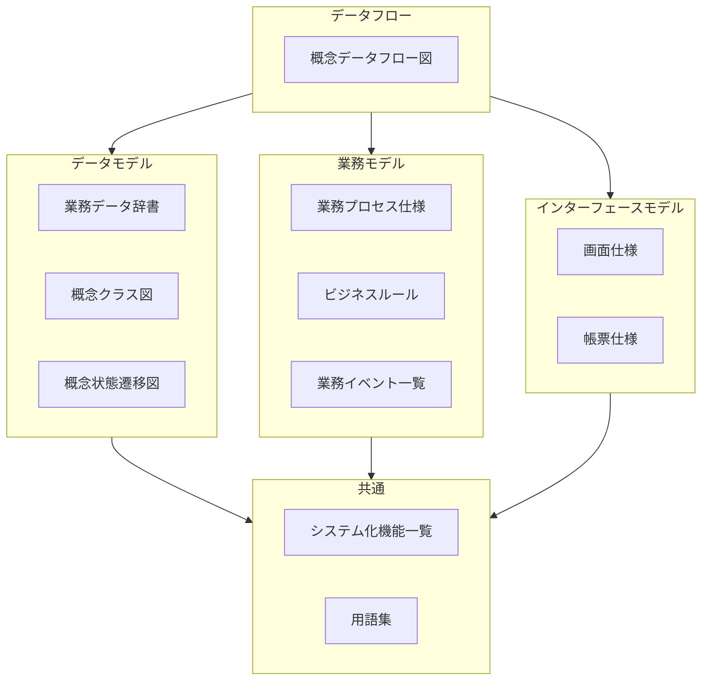

# ドキュメント内容ガイド

Document Contents Guide

SpecDojoで扱うドキュメントの内容について、以下のガイドラインを示します。

## 1. プロジェクト

プロダクトの構築や改修時に、何を達成したいかを関係者で共有します。各ドキュメントの目的と主な内容は以下の通りです。

### 1.1. 業務要求

<!-- prettier-ignore -->
| ドキュメント | 略称 | 目的 | 主な内容 |
| --- | --- | --- | --- |
| プロジェクト概要 |PRJ| プロジェクトの背景と狙いを共有する | 背景・目的・必要性・期待効果・前提条件 |
| プロジェクトスコープ |PRJ| 対象範囲／対象外を明確にする | 対象業務、対象システム、対象期間、スコープ外 |
| プロジェクト課題と解決アプローチ |PRJ| 取り組むべき課題と解決策の方針を整理する | 課題一覧、原因、解決策候補、選択したアプローチと理由 |

サンプル（抜粋イメージ）

<!-- prettier-ignore -->
| ドキュメント | サンプル（抜粋イメージ） |
| --- | --- |
| プロジェクト概要 | 本プロジェクトは、店舗在庫の欠品率を年間○％削減することを目的とする。 |
| プロジェクトスコープ | 対象：店舗〜本部の在庫・発注業務／対象外：仕入先側システム改修 |
| プロジェクト課題と解決アプローチ | 課題：欠品が多い／解決策案：安全在庫見直し、自動発注導入… 採用：自動発注＋見直し（理由：効果とコストのバランス） |

### 1.2. プロジェクトマネジメント

プロジェクトの計画・管理・実行に関するドキュメントです。

#### 1.2.1. 管理計画

<!-- prettier-ignore -->
| ドキュメント | 略称 | 目的 | 主な内容 |
| --- | --- | --- | --- |
| プロジェクト管理計画 | PM | プロジェクト全体の管理方針・プロセスを定義する | スコープ管理、スケジュール管理、コスト管理、品質管理、リスク管理、コミュニケーション管理の方針 |
| コミュニケーション計画 | PM | 報告・連絡・会議体の計画を定義する | 報告頻度、会議体一覧、連絡系統、エスカレーションルール |
| 品質管理計画 | PM | 品質目標・レビュー方針・品質基準を定義する | 品質目標、レビュープロセス、品質メトリクス、検査基準 |
| 組織体制と RACI | PM | 体制図と責任分担マトリクスを定義する | プロジェクト体制図、RACI マトリクス、役割定義 |

#### 1.2.2. 管理台帳

<!-- prettier-ignore -->
| ドキュメント | 略称 | 目的 | 主な内容 |
| --- | --- | --- | --- |
| リスク登録簿 | PM | 識別済みリスクと対応策を管理する | リスクID、発生確率、影響度、対応策、担当、ステータス |
| 課題ログ | PM | 発生した課題と対応状況を管理する | 課題ID、発生日、内容、優先度、対応策、担当、期限、ステータス |
| 変更要求ログ | PM | 変更要求の申請・審査・決定を管理する | 変更ID、要求内容、影響範囲、審査結果、決定日 |

#### 1.2.3. レポート

<!-- prettier-ignore -->
| ドキュメント | 略称 | 目的 | 主な内容 |
| --- | --- | --- | --- |
| 進捗報告 | PR | 定期的な進捗状況を報告する | 報告期間、完了タスク、遅延・リスク、次期予定、課題・依頼事項 |
| 議事録 | MM | 会議の決定事項・アクションを記録する | 会議名、日時、参加者、議題、決定事項、アクションアイテム |

#### 1.2.4. WBS・スケジュール

<!-- prettier-ignore -->
| ドキュメント | 略称 | 目的 | 主な内容 |
| --- | --- | --- | --- |
| WBS 定義 | WBS | スコープ単位の作業分解構造を定義する | 作業パッケージ、成果物、担当、見積（YAML 形式） |
| マイルストーン定義 | SCH | プロジェクト全体のマイルストーンを定義する | マイルストーン名、期日、判定基準（YAML 形式） |
| スケジュール定義 | SCH | スコープ単位の詳細スケジュールを定義する | タスク、開始日、終了日、依存関係、担当（YAML 形式） |

#### 1.2.5. 実行管理

<!-- prettier-ignore -->
| ドキュメント | 略称 | 目的 | 主な内容 |
| --- | --- | --- | --- |
| タスク実行ワークスペース | EXEC | dojo コマンドによるタスク実行とイベント記録を管理する | タスク定義、実行結果、イベントログ |
| 自動生成成果物 | EXEC | タスク実行結果から自動生成された成果物を出力する | 生成されたドキュメント、レポート |

サンプル（抜粋イメージ）

<!-- prettier-ignore -->
| ドキュメント | サンプル（抜粋イメージ） |
| --- | --- |
| プロジェクト管理計画 | スコープ変更はPOの承認を必須とする。週次で進捗会議を実施。 |
| リスク登録簿 | R-001：外部API仕様確定遅延／確率：高／影響：中／対策：モック先行開発 |
| 進捗報告 | 2026-03-10〜03-14：業務仕様7件完了／遅延なし／次週：外部IF仕様着手 |
| 議事録 | 2026-03-14 定例：決定：認証方式はOAuth2.0／AI：山田さん3/21までにPoC |
| WBS 定義 | wbs-sales: 販売管理スコープ／作業：業務仕様→外部IF→設計→実装→テスト |

### 1.3. 決定記録

<!-- prettier-ignore -->
| ドキュメント | 略称 | 目的 | 主な内容 |
| --- | --- | --- | --- |
| 決定記録 | ADR | 重要な設計・技術選択の決定理由を残す | 背景、決定した内容、検討した選択肢、採択理由、影響範囲 |

サンプル（抜粋イメージ）

<!-- prettier-ignore -->
| ドキュメント | サンプル（抜粋イメージ） |
| --- | --- |
| 決定記録 | ID: adr-0001／DBとしてPostgreSQL採用／代替：MySQL／理由：既存資産・チーム経験・機能要件 |

## 2. 業務仕様

業務仕様は、渡辺幸三先生が提唱する[三要素分析法](https://dbc.in.coocan.jp/methodology.html)に基づく業務・システム設計を念頭に構成しています。

三要素分析法とは、企業システムに特化した設計方法論で、業務をデータフロー図を頂点に、(1)ER図（データモデル）、(2)アクションツリー図（業務モデル）、(3)機能展開図（機能モデル）の３つの要素で分析・設計する方法論です。三要素分析法を用いることで、業務とシステムの整合性を高め、効率的なシステム開発が可能となります。

現行の業務やあるべき業務を概念的なモデルとして整理・可視化します。三要素分析法のデータフロー図を中心に、データモデル、業務モデル、インターフェースモデル※の各要素を網羅的に記述します。各々のドキュメントとの関係は以下の通りです。

※本ドキュメントでは、「業務モデル」がやや曖昧な表現で誤解を招く可能性があるため、インターフェースモデルとして再定義しています。

### 2.1. データフロー

<!-- prettier-ignore -->
| ドキュメント | 略称 | 目的 | 主な内容 |
| --- | --- | --- | --- |
| [概念データフロー図](../rules/cdfd-rules.md) | CDFD | 対象となる業務の全体構成・流れを可視化し、定義する | 業務（プロセス）とその間の情報の流れ・物の流れ、業務のきっかけとなるイベント、業務主体 など |

サンプル（抜粋イメージ）

<!-- prettier-ignore -->
| ドキュメント | サンプル（抜粋イメージ） |
| --- | --- |
| [概念データフロー図](../rules/cdfd-rules.md) | 在庫不足 → 店員が在庫台帳を確認して発注 → 仕入先へ発注書送付 |

### 2.2. データモデル

<!-- prettier-ignore -->
| ドキュメント | 略称 | 目的 | 主な内容 |
| --- | --- | --- | --- |
| [業務データ辞書 / 業務データ辞書](../rules/bdd-rules.md) | BDD | データの意味や構造に関する共通理解を作る | 業務上の管理単位（エンティティ）とその属性（項目）の論理名・物理名・説明・制約 など |
| [業務データ辞書 / 概念データストア定義](../rules/cdsd-rules.md) | CDSD | 概念データストア（情報の保管場所）を一覧で定義する | データストア名、対応プロセス、内容、更新タイミング、粒度、主な用途 など |
| [業務データ辞書 / 保管場所定義](../rules/sld-rules.md) | SLD | 業務対象となる物の物理的な保管場所を一覧で定義する | 保管場所名、保管対象、内容・目的、関連プロセス、管理頻度 など |
| [業務データ辞書 / ステータス定義](../rules/stsd-rules.md) | STSD | 業務上のエンティティが取り得る状態（ステータス）を一覧で定義する | 対象、ステータス名、呼称、説明 など |
| [業務データ辞書 / 分類定義](../rules/cld-rules.md) | CLD | 業務上の分類（カテゴリ、種別、区分など）を一覧で定義する | 分類定義名、種別、分類名、説明など |
| [概念クラス図](../rules/ccd-mermaid-rules.md) | CCD | 業務上のエンティティ関係を図で定義する | 商品・在庫・発注・店舗などの概念と属性、関連（継承/親子/参照） など |
| [概念状態遷移図](../rules/cstd-rules.md) | CSTD | 業務オブジェクトの状態変化を図で定義する | 対象、状態、遷移、イベント、条件など |

サンプル（抜粋イメージ）

<!-- prettier-ignore -->
| ドキュメント | サンプル（抜粋イメージ） |
| --- | --- |
| [業務データ辞書](../rules/bdd-rules.md) | 項目名：発注点／説明：用語集T-001参照／単位：個数／許容値：0以上の整数 |
| [業務データ辞書 / 概念データストア定義](../rules/cdsd-rules.md) | データストア：在庫／対応プロセス：販売・入荷／内容：商品名、入庫数、出庫数、現在庫数、賞味期限 |
| [業務データ辞書 / 保管場所定義](../rules/sld-rules.md) | 保管場所：バックヤード／対象：商品在庫／内容・目的：店舗内在庫の一時保管／関連プロセス：調達・販売／管理頻度：毎日 |
| [業務データ辞書 / ステータス定義](../rules/stsd-rules.md) | エンティティ：お金／ステータス：レジ内のお金／呼称：レジ現金／説明：営業中に使う釣り銭と売上金の合算 |
| [業務データ辞書 / 分類定義](../rules/cld-rules.md) | 分類：商品区分／種別：業務分類／分類名：お菓子／説明：食品系商品 |
| [概念クラス図](../rules/ccd-mermaid-rules.md) | 伝票 "1" *-- "0..*" 明細 : 構成する／明細 "*" --> "1" 商品 : 商品を参照 |
| [概念状態遷移図](../rules/cstd-rules.md) | [*] --> 仕入前／仕入前 --> 仕入直後 : 納入商品の受入／仕入直後 --> 販売可能状態 : 検品 / 合格 |

### 2.3. 業務モデル

<!-- prettier-ignore -->
| ドキュメント | 略称 | 目的 | 主な内容 |
| --- | --- | --- | --- |
| [業務プロセス仕様](../rules/bps-rules.md) | BPS | 業務プロセスの処理内容を定義する | 業務プロセス概要、トリガー、前提、入力、処理、出力 など |
| [ビジネスルール](../rules/br-rules.md) | BR | 複数プロセスから参照される横断的な判断を定義する | ルール概要、入力、ルール、出力、例外 など |
| [業務イベント / 業務イベント仕様 全体構成](../rules/bes-index-rules.md) | BES Index | 業務上で発生する主要なイベントを一覧で定義する | イベントID、イベント名、何が起きたか、いつ、発生条件 など |
| [業務イベント / 業務イベント仕様](../rules/bes-rules.md) | BES | 業務上で発生する主要なイベントを個別に定義する | イベントID、イベント名、何が起きたか、いつ、発生条件 など |

サンプル（抜粋イメージ）

<!-- prettier-ignore -->
| ドキュメント | サンプル（抜粋イメージ） |
| --- | --- |
| [業務プロセス仕様](../rules/bps-rules.md) | bps-001: トリガー:在庫不足、入力:商品マスタ、処理:発注候補を生成、出力: 発注書 |
| [ビジネスルール](../rules/br-rules.md) | br-001: 在庫数＜発注点 の場合、自動発注候補を生成する。 |
| [業務イベント / 業務イベント仕様 全体構成](../rules/bes-index-rules.md) | 「bel-main: イベント名：会計確定（販売）／何が起きたか：販売の会計が確定された |
| [業務イベント / 業務イベント仕様](../rules/bes-rules.md) | 「bes-001: イベント名：納品登録（仕入れ）／何が起きたか：仕入れの納品が確定された |

### 2.4. インターフェースモデル

<!-- prettier-ignore -->
| ドキュメント | 略称 | 目的 | 主な内容 |
| --- | --- | --- | --- |
| [画面仕様](../rules/uis-rules.md) | UIS | 業務ユーザー視点の画面の利用目的や表示項目、操作を定義する | 画面概要、利用目的、表示項目、操作、遷移、エラー表示 など |
| [帳票仕様](../rules/bds-rules.md) | BDS | 業務ユーザー視点の帳票の利用目的や表示項目を定義する | 帳票概要、利用目的、表示項目、出力タイミング など |

サンプル（抜粋イメージ）

<!-- prettier-ignore -->
| ドキュメント | サンプル（抜粋イメージ） |
| --- | --- |
| [画面仕様](../rules/uis-rules.md) | 画面：在庫一覧／項目：商品コード、商品名、在庫数、在庫状態 |
| [帳票仕様](../rules/bds-rules.md) | 帳票：商品一覧／項目：商品コード、商品名、発注点 |

### 2.5. 共通

<!-- prettier-ignore -->
| ドキュメント | 略称 | 目的 | 主な内容 |
| --- | --- | --- | --- |
| [システム化機能一覧 / 全体構成](../rules/sf-rules.md) | SF Index | システムで実現する機能の全体構成と一覧を定義する | 機能ID、機能名、概要、関連プロセス、関連仕様ID など |
| [システム化機能一覧 / 個別](../rules/sf-rules.md) | SF | 個別のシステム化機能の概要・関連仕様を定義する | 機能概要、関連プロセス、関連画面、関連IF、関連ルール など |
| [用語集](../rules/gl-rules.md) | GL | 用語の意味を統一的に定義する | 用語、定義、別名、分類、関連用語 など |

サンプル（抜粋イメージ）

<!-- prettier-ignore -->
| ドキュメント | サンプル（抜粋イメージ） |
| --- | --- |
| [システム化機能一覧 / 全体構成](../rules/sf-rules.md) | 機能名：商品登録／関連プロセス：管理、販売 |
| [システム化機能一覧 / 個別](../rules/sf-rules.md) | 機能概要：商品情報を登録する／関連画面：商品登録画面／関連ルール：BR-001 |
| [用語集](../rules/gl-rules.md) | term: 発注点／definition: 在庫がこの数量を下回ったときに発注候補とみなす基準数量。 |

## 3. 外部I/F仕様

### 3.1. ドキュメント一覧と概要

<!-- prettier-ignore -->
| ドキュメント | 略称 | 目的 | 主な内容 |
| --- | --- | --- | --- |
| [外部システムI/F一覧](../rules/ifx-rules.md) | IFX | 外部システムとの連携を一覧(YAML)で定義する | 連携名、連携元、連携先（外部システム）、伝送方式、フォーマット、タイミング |
| [外部API仕様](../rules/ifx-api-rules.md) | IFX-API | 外部システムとのAPI連携をOpenAPI形式(YAML)で定義する | エンドポイント、HTTPメソッド、リクエスト／レスポンス、ステータスコード |
| [外部ファイル連携仕様](../rules/ifx-file-rules.md) | IFX-FILE | 外部システムとのファイル連携をYAMLで定義する | ファイル形式、伝送方法、スケジュール、ファイル項目一覧 |
| [外部メッセージ仕様](../rules/ifx-msg-rules.md) | IFX-MSG | 他システムとのイベント／キューのメッセージ連携をAsyncAPI + CloudEvents(YAML)で定義する | チャネル名、メッセージ構造、エンドポイント、プロトコル |

サンプル（抜粋イメージ）

<!-- prettier-ignore -->
| ドキュメント | サンプル（抜粋イメージ） |
| --- | --- |
| [外部システムI/F一覧](../rules/ifx-rules.md) | name: 発注データ送信／source: 発注管理／target:仕入先システム／direction: source_to_target |
| [外部API仕様](../rules/ifx-api-rules.md) | 「paths: /v1/payments／post: summary: 決済を作成する／response: '201' |
| [外部ファイル連携仕様](../rules/ifx-file-rules.md) | file: name: inventory.json／description: 在庫スナップショット |
| [外部メッセージ仕様](../rules/ifx-msg-rules.md) | 「channels: inventory.stock.changed: description: 在庫が変更された通知 |

## 4. アーキテクチャ

### 4.1. C4（構造・依存関係）

<!-- prettier-ignore -->
| ドキュメント | 略称 | 目的 | 主な内容 |
| --- | --- | --- | --- |
| [C4コンテキスト図](../rules/cxd-rules.md) | CXD | 対象システムと「境界外」の人・外部システムとの関係を俯瞰的に定義する | ユーザー、外部システム、本システムの関係図 |
| [C4コンテナ図](../rules/cnd-rules.md) | CND | 対象システムを主要実行/配備単位に分割し、利用者・外部システム・データストアとの関係を定義する | Webアプリ、API、バッチ、DB、メッセージ基盤など |
| [C4コンポーネント図](../rules/cpd-rules.md) | CPD | 対象コンテナ内の主要コンポーネントに分解し、外部要素との関係を定義 | 人/ロール、対象コンテナ境界、DB、外部システムなど、と主要コンポーネントとの依存関係 |

サンプル（抜粋イメージ）

<!-- prettier-ignore -->
| ドキュメント | サンプル（抜粋イメージ） |
| --- | --- |
| [C4コンテキスト図](../rules/cxd-rules.md) | 店員 -->\|"売上登録"\| 販売管理システム／店主 -->\|"商品・在庫管理"\| 販売管理システム |
| [C4コンテナ図](../rules/cnd-rules.md) | 店員 -->\|"売上登録"\| Webアプリ／Webアプリ -->\|"API呼び出し"\| API／API -->\|"売上データ"\| 販売DB　|
| [C4コンポーネント図](../rules/cpd-rules.md) | 売上受付 -->\|"売上データ"\| 販売DB／売上受付 -->\|"会計仕訳連携"\| 会計システム |

### 4.2. インフラ・技術選定（実行基盤）

<!-- prettier-ignore -->
| ドキュメント |  略称 | 目的 | 主な内容 |
| --- | --- | --- | --- |
| [インフラ構成図](../rules/ifd-mermaid-rules.md) | IFD | インフラの論理的な境界（環境 / ネットワーク / ゾーン）と、主要コンポーネント間の通信の流れを定義する | 実行環境、ネットワーク、論理ゾーン、Webアプリ、API Server、 DB など |
| [技術スタック一覧](../rules/tsd-rules.md) | TSD | システムで採用する技術（言語、フレームワーク、DB、メッセージ基盤、キャッシュ等）を、一覧として定義する | プログラミング言語、フレームワーク、ミドルウェア など |

サンプル（抜粋イメージ）

<!-- prettier-ignore -->
| ドキュメント | サンプル（抜粋イメージ） |
| --- | --- |
| [インフラ構成図](../rules/ifd-mermaid-rules.md) | 「インターネット --> ロードバランサー --> Web App --> API Server |
| [技術スタック一覧](../rules/tsd-rules.md) | 「言語: Java 21／Web FW: Spring Boot／DB: PostgreSQL |

## 5. システム設計

システム設計は **“コードに寄せる（Code as Spec）”** 方針とし、設計ドキュメントは最小限に留める。
本章では、実装詳細を文章で重複させず、以下のみを扱う。

- **System Design Index**：設計のSSOT（OpenAPI / AsyncAPI / migration / job定義 / config schema 等）への導線
- **Critical Flows**：事故や仕様誤解の原因になりやすい“重要フロー”だけを少数（最大5件）定義
- **Cross-cutting Rules**：エラー・冪等・リトライ・監査・トレーシング等の横断ルール（実装の共通前提）

### 5.1. ドキュメント一覧と概要（最小構成）

<!-- prettier-ignore -->
| ドキュメント | 略称 | 目的 | 主な内容 |
| --- | --- | --- | --- |
| 全体構成（リンク集） | SDI | システム設計のSSOTへの導線を1箇所に集約し、設計情報を迷子にしない | 内部API定義（OpenAPI等）/イベント定義（AsyncAPI等）/DBスキーマ（migration等）/バッチ定義（workflow/cron等）/設定スキーマ（config schema等）/コード配置規約（モジュール境界） |
| 重要フロー | SYSD Critical Flows | “読まないと事故る”フローだけを可視化し、実装・テスト・運用の共通理解を作る | 最大5フロー（冪等/補償/非同期/順序/整合性/外部I/F障害など）について、境界・永続化点・再実行性・失敗時挙動を図または箇条書きで定義 |
| 横断ルール | SCR | 実装全体に影響する共通ルールをSSOT化し、各所の実装ブレを防ぐ | エラー形式/例外分類、タイムアウト・リトライ、冪等キー、トランザクション境界、ログ/監査ログ、トレーシング、セキュリティ（認証・認可の実装原則）、バージョニング、設定の上書き階層 |

> 補足：従来の「実装データフロー図／実装クラス図／DB論理・物理／実装画面仕様／内部I/F／バッチ設計／設定一覧」は、
> **“SSOTをコード（定義ファイル）に寄せる”** 方針により、個別ドキュメントとしては作らない。
> 必要な場合は **SDI（リンク集）から一次情報へ到達**できる状態を維持する。

### 5.2. 記述方針（Code as Spec）

- **内部I/F**：OpenAPI / AsyncAPI / gRPC proto 等をSSOTとし、本章はリンクと横断ルールのみ記載する
- **DB**：migration / schema定義をSSOTとし、物理設計は“理由（意図）”のみ横断ルールまたは重要フローに残す
- **UI詳細**：画面の目的・項目は UIS をSSOTとし、実装構成（コンポーネント分割等）はコード参照とする
- **クラス図**：追随コストが高いため原則作らず、代わりに **モジュール境界（依存方向のルール）**を横断ルールに記載する
- **バッチ/ジョブ**：定義ファイル（workflow/cron/IaC）とコードをSSOTとし、運用上の重要事項のみ横断ルールに記載する
- **設定**：config schema とデフォルト設定をSSOTとし、運用が触る項目のみ一覧化する（SCRに記載 or SDIから参照）

### 5.3. サンプル（抜粋イメージ）

サンプル（抜粋イメージ）

#### 5.3.1 システム設計 / 全体構成（SDI）例

| 種別           | SSOT（一次情報）       | 参照先（例）        | 備考                      |
| -------------- | ---------------------- | ------------------- | ------------------------- |
| 内部REST API   | OpenAPI                | `api/openapi.yaml`  | CIでlint/差分検知         |
| 内部イベント   | AsyncAPI + CloudEvents | `api/asyncapi.yaml` | スキーマ互換性チェック    |
| DBスキーマ     | migration              | `db/migrations/*`   | schema dumpを自動生成     |
| ジョブ定義     | workflow/cron          | `ops/workflows/*`   | 失敗時通知も定義          |
| 設定           | config schema          | `config/schema.*`   | 既定値と範囲を型で担保    |
| モジュール境界 | ディレクトリ規約       | `src/*` + README    | 依存方向ルールをSCRに記載 |

#### 5.3.2 システム設計 / 重要フロー（SYSD Critical Flows）例（1件）

- **scf-001：売上確定→在庫更新→発注候補生成（非同期）**
  - 境界：`Sales API` → `Sales Service` → `Inventory Event` → `Reorder Batch`
  - 永続化点：売上確定（DB commit）、在庫更新イベント発行（outbox等）
  - 冪等：`sale_id` を冪等キーとし、二重送信時は二重計上しない
  - 失敗時：イベント発行失敗は再試行、復旧後に再送されること
  - 観測性：trace_id を全区間で引き回し、監査ログに `sale_id` を残す

#### 5.3.3 システム設計 / 横断ルール（SCR）例（抜粋）

- **エラー形式**：APIは共通エラーJSON（error_code / message / detail / trace_id）
- **タイムアウト**：外部I/Fは 3s、内部は 1s を基準（例外はADR）
- **リトライ**：外部I/Fは最大3回、指数バックオフ、冪等キー必須
- **トランザクション境界**：更新系はサービス層でcommit、跨ぎは非同期＋補償
- **ログ**：監査対象操作は who/when/what/before/after を必須
- **依存方向**：domain ← application ← interface（逆依存禁止）

## 6. 業務受入条件

<!-- prettier-ignore -->
| ドキュメント | 略称 | 目的 | 主な内容 |
| --- | --- | --- | --- |
| [業務受入条件](../rules/bac-rules.md) | BAC | 業務として受け入れ可能であることを示す条件を定義する | 業務シナリオ、受入条件、前提、操作、期待結果 など |

サンプル（抜粋イメージ）

<!-- prettier-ignore -->
| ドキュメント | サンプル（抜粋イメージ） |
| --- | --- |
| [業務受入条件](../rules/bac-rules.md) | bac-0001 商品販売：レジ会計時に、商品販売（会計確定）が業務として成立し、売上と在庫が正しく記録されること |

## 7. 非機能要件

<!-- prettier-ignore -->
| ドキュメント | 略称 | 目的 | 主な内容 |
| --- | --- | --- | --- |
| [非機能要件](../rules/nfr-index-rules.md) | NFR Index | 非機能要件を8カテゴリに分冊管理し、測定可能・検証可能な形で一元化する | 信頼性、可用性、保守性、完全性、機密性・安全性、性能、運用、操作性（各カテゴリの目的・代表指標・検証導線） |
| [非機能要件 / 信頼性](../rules/nfr-reliability-rules.md) | NFR-R | 障害抑止と誤動作防止を定義する | 故障率、平均故障間隔(MTBF)、エラー率、データ検証ルール |
| [非機能要件 / 可用性](../rules/nfr-availability-rules.md) | NFR-A | システム稼働の継続性を定義する | 稼働率、RTO/RPO、フェイルオーバー、冗長化、バックアップ |
| [非機能要件 / 保守性](../rules/nfr-maintainability-rules.md) | NFR-M | 変更容易性と復旧容易性を定義する | 平均修復時間(MTTR)、変更リードタイム、ログ粒度 |
| [非機能要件 / 完全性](../rules/nfr-integrity-rules.md) | NFR-I | データ正確性と改ざん防止を定義する | 整合性検証、監査証跡、トランザクション境界 |
| [非機能要件 / 機密性・安全性](../rules/nfr-security-safety-rules.md) | NFR-S | 不正利用防止とセキュリティを定義する | 認証・認可、脆弱性対応SLA、暗号化、アクセス制御 |
| [非機能要件 / 性能](../rules/nfr-performance-rules.md) | NFR-P | 応答性と処理能力を定義する | P95/P99レイテンシ、RPS(吞吐量)、リソース効率 |
| [非機能要件 / 運用](../rules/nfr-operations-rules.md) | NFR-O | 監視・手順・継続運用を定義する | アラート検知率、復旧達成率、運用手順充実度 |
| [非機能要件 / 操作性](../rules/nfr-usability-rules.md) | NFR-U | 使いやすさと誤操作防止を定義する | タスク完了率、誤操作率、エラーメッセージ明確性 |

サンプル（抜粋イメージ）

<!-- prettier-ignore -->
| ドキュメント | サンプル（抜粋イメージ） |
| --- | --- |
| [非機能要件](../rules/nfr-index-rules.md) | 在庫照会API：平常時P95 500ms以内、ピーク時100 RPS処理可能 |
| [非機能要件 / 信頼性](../rules/nfr-reliability-rules.md) | エラー率 0.1%以下、バリデーションエラーは即座に検知・ログ記録 |
| [非機能要件 / 可用性](../rules/nfr-availability-rules.md) | 稼働率 99.9%（月次）、RTO 1時間、RPO 15分、フェイルオーバー自動化 |
| [非機能要件 / 保守性](../rules/nfr-maintainability-rules.md) | MTTR 30分以内、変更リードタイム 1週間以内、ログ粒度 DEBUG以上 |
| [非機能要件 / 完全性](../rules/nfr-integrity-rules.md) | トランザクション境界明確化、監査ログ（who/when/what）7年保持 |
| [非機能要件 / 機密性・安全性](../rules/nfr-security-safety-rules.md) | OAuth 2.0認証、脆弱性対応SLA 24時間、通信TLS 1.2以上、参照・変更権限分離 |
| [非機能要件 / 性能](../rules/nfr-performance-rules.md) | P95 500ms、P99 1000ms、スループット 100 RPS、CPU使用率 70%以下 |
| [非機能要件 / 運用](../rules/nfr-operations-rules.md) | アラート検知率 95%以上、復旧達成率 99%、運用手順充実度 100% |
| [非機能要件 / 操作性](../rules/nfr-usability-rules.md) | タスク完了率 95%以上、誤操作率 1%以下、エラーメッセージ日本語で次のアクション明示 |

## 8. システム受入条件

<!-- prettier-ignore -->
| ドキュメント | 略称 | 目的 | 主な内容 |
| --- | --- | --- | --- |
| [システム受入条件](../rules/sac-rules.md) | SAC | システム全体としての合格基準を定義する | 機能・非機能・障害・移行などの受け入れ条件 |

サンプル（抜粋イメージ）

<!-- prettier-ignore -->
| ドキュメント | サンプル（抜粋イメージ） |
| --- | --- |
| [システム受入条件](../rules/sac-rules.md) | 主要な画面操作と主要 API が、平常時およびピーク時において業務上許容できる時間内で完了すること |

## 9. テスト

※ 個別仕様のサフィックスは、対象ドキュメントの目的に合わせて「用語集」のtermから命名します。リンクされる可能性も鑑みなるべく固定できる名前を選びます。

### 9.1. 共通

<!-- prettier-ignore -->
| ドキュメント | 略称 | 目的 | 主な内容 |
| --- | --- | --- | --- |
| [テスト戦略・方針](../rules/tsp-index-rules.md) | TSP | 全体テストの考え方を示す（要件） | テストレベルと目的、対象/対象外（スコープ）、品質目標、体制/役割、環境、使用ツール、テストデータ方針、入口/出口条件、進め方・優先度、リスクと対策 |

サンプル（抜粋イメージ）

### 9.2. 単体テストカタログ

<!-- prettier-ignore -->
| ドキュメント | 略称 | 目的 | 主な内容 |
| --- | --- | --- | --- |
| [単体テスト](../rules/utc-index-rules.md) | UTS | 単体テストとして確認する観点・条件と分配を定義する | 対象単位、テスト範囲と対象外、境界（モック/スタブ方針）、TPC の観点・条件の分配、合格基準とエビデンス（共通） |
| [単体テスト対象別](../rules/utc-rules.md) | UTS | 単体テスト仕様を対象ごとに分割して定義する | 個別対象の範囲、観点、代表条件（状態レベル）、合格基準とエビデンス（参照） |

サンプル（抜粋イメージ）

### 9.3. 内部結合テストカタログ

<!-- prettier-ignore -->
| ドキュメント | 略称 | 目的 | 主な内容 |
| --- | --- | --- | --- |
| [内部結合テスト](../rules/itc-index-rules.md) | ITS | 内部コンポーネント間の連携を確認する観点・条件を定義する | 対象コンポーネントと結合範囲、インターフェース（API/イベント/DB）観点、主要フロー/例外フロー、トランザクション・整合性、エラー処理、ログ/監視観点、合格基準 |
| [内部結合テスト対象別](../rules/itc-rules.md) | ITS | 内部結合テスト仕様を対象（機能/連携）ごとに分割して定義する | 個別結合範囲、前提、テスト条件（シナリオ）一覧、合格基準、関連する仕様ID/機能ID |

サンプル（抜粋イメージ）

### 9.4. 外部結合テストカタログ

<!-- prettier-ignore -->
| ドキュメント | 略称 | 目的 | 主な内容 |
| --- | --- | --- | --- |
| [外部結合テスト](../rules/etc-index-rules.md) | ETS | 外部システム連携を含む結合観点・条件を定義する（仕様） | 対象I/F（API/ファイル/メッセージ）、契約（スキーマ/コード/制約）、正常/異常（タイムアウト・リトライ・冪等・順序）、セキュリティ（認証/認可）、性能/レート制限、監査ログ、合格基準 |
| [外部結合テスト対象別](../rules/etc-rules.md) | ETS | 外部結合テスト仕様を連携単位で分割して定義する（仕様） | I/Fごとのテスト条件一覧（入力/期待/エラー）、前提（接続先・認証・テストデータ）、合格基準、関連する外部I/F仕様ID |

サンプル（抜粋イメージ）

### 9.5. 総合結合テストカタログ

<!-- prettier-ignore -->
| ドキュメント | 略称 | 目的 | 主な内容 |
| --- | --- | --- | --- |
| [総合テスト](../rules/stc-index-rules.md) | STS | システム全体として業務シナリオが成立することを定義する（仕様） | エンドツーエンドの業務シナリオ、画面/API/バッチ/外部連携の通し観点、運用観点（ジョブ・監視・障害時）、非機能の観点（代表値）、合格基準 |
| [総合テスト対象別](../rules/stc-rules.md) | STS | 総合テスト仕様をシナリオ/業務単位で分割して定義する（仕様） | 個別シナリオの前提、データ準備、テスト条件、期待結果、合格基準、関連する業務仕様ID/受入条件ID/入条件ID |

サンプル（抜粋イメージ）

### 9.6. 受入結合テストカタログ

<!-- prettier-ignore -->
| ドキュメント | 略称 | 目的 | 主な内容 |
| --- | --- | --- | --- |
| [受入テスト](../rules/atc-index-rules.md) | ATS | 業務として受け入れ可能であることを確認する観点・条件を定義する（仕様） | 業務受入シナリオ、受入条件（合格基準）、利用者視点の操作・期待結果、例外時の扱い、データ準備、役割分担、エビデンス要件、判定/承認フロー |
| [受入テスト対象別](../rules/atc-rules.md) | ATS | 受入テスト仕様を業務シナリオ/受入条件単位で分割して定義する（仕様） | 個別受入シナリオの前提、テスト条件、期待結果、合格基準、関連する業務受入条件ID/システム受入条件ID |

サンプル（抜粋イメージ）

<!-- prettier-ignore -->
| ドキュメント | サンプル（抜粋イメージ） |
| --- | --- |
| 010-テスト戦略・方針 | 「ドメインロジックは単体〜結合まで自動化、UIは主要シナリオのみE2E。」 |
| 020-テスト観点・テスト条件一覧 | 「TC-INV-001：在庫自動発注（条件：在庫＜発注点）」 |
| 030-単体テスト | 「StockService.adjust()：マイナス値禁止、0境界、正常加算…」 |
| 040-結合テスト | 「画面→API→Service→Repository→DB の一連動作確認。」 |
| 050-システムテスト | 「日次業務のシナリオ（販売→発注→入荷）の通しテスト。」 |
| 060-受け入れテスト | 「UC-01：OK／UC-02：アラート閾値調整要望あり」 |

## 10. 移行

<!-- prettier-ignore -->
| ドキュメント | 略称| 目的 | 主な内容 |
| --- | --- | --- | --- |
| [移行計画](../rules/mip-index-rules.md) | MIP | 移行全体を“1冊で”説明できる状態にし、関係者の合意・実行の基準点にする | 移行の背景/目的、前提・制約、移行方式（一斉/並行）と期間、**移行対象一覧（スコープ：業務/機能/IF/データ種別/非対象）**、成功条件・受入基準（停止許容時間/許容誤差/完了定義）、体制・役割（GO判断含む）、移行リスクと対策、移行後のハイパーケア方針 |
| [データ移行設計](../rules/dmd-rules.md) | DMD | 旧→新のデータ移行を再現可能に定義し、品質（正確性・完全性）を担保する | 対象データ詳細（テーブル/期間/抽出条件/概算件数）、データマッピング、変換ルール、除外ルール、移行手順（手動/バッチ/ツール）、性能/所要時間見積、ログ/再実行性、検証方法（件数照合/サンプル照合/重要値） |
| [移行テスト計画（リハーサル計画）](../rules/mtp-rules.md) | MTP | 移行手順と結果の妥当性を事前に検証し、当日の失敗確率を下げる | リハーサル回数とスケジュール、テスト環境/データ準備、検証観点（件数/差分/業務シナリオ）、合否基準、差異発生時の扱い（許容/修正/再実行）、結果報告フォーマット、GO/NO-GO判断プロセス |
| [カットオーバー計画（本番切替手順）](../rules/cop-rules.md) | COP | 本番切替を“分単位で”実行できる状態にし、責任分界とロールバックを明確にする | 当日タイムライン、作業手順チェックリスト、担当者/連絡系統、実施条件（事前完了条件）、切替判定ポイント、**ロールバック手順**、障害時判断・エスカレーション、周知（ユーザ通知/停止告知） |
| [運用切替計画（ハイパーケア含む）](../rules/otp-rules.md) | OTP | 切替後の運用を途切れさせず、初期不具合・問合せ増に耐える体制を作る | 監視/アラート、バックアップ/リストア、権限/アカウント移行、運用手順変更点、問合せ窓口/一次対応、障害対応フロー、初期増員体制（期間・当番・SLA）、旧システムの停止/参照方針、移行完了後のクローズ条件 |

サンプル（抜粋イメージ）

<!-- prettier-ignore -->
| ドキュメント | サンプル（抜粋イメージ） |
| --- | --- |
| [移行計画](../rules/mip-index-rules.md) | **移行方式**：並行稼働 4 週間（2026-04-01〜2026-04-30）、差異が許容範囲内であることを確認後に新系へ一本化。 **スコープ**：受注〜請求（販売管理）を対象、在庫引当は対象外（次フェーズ）。 **成功条件**：停止許容 2 時間、移行後の売掛残高差異 0、受注件数差異 0、重大障害 0。 **体制**：GO判断＝業務責任者＋運用責任者＋開発責任者（全員合意）。 |
| [データ移行設計](../rules/dmd-rules.md) | **対象**：旧 `ORDERS`（2019-01-01〜）→新 `sales_orders`、想定 12,000,000 行。 **マッピング**：`ORDERS.customer_cd` → `sales_orders.customer_id`（変換：CD→ID参照変換）。 **変換/除外**：`status='CANCEL'` は移行対象外、`amount` は税込→税抜に正規化。 **再実行性**：移行バッチは `run_id` 単位で冪等（同一 run_id は上書き禁止、差分は別run）。 **検証**：件数照合＋売上合計（期間別）＋重要顧客100件のサンプル照合。 |
| [移行テスト計画 （リハーサル計画）](../rules/mtp-rules.md) | **リハーサル**：全3回（R1: 2026-03-01、R2: 2026-03-15、R3: 2026-03-25）。 **合否基準**：移行所要時間 ≤ 120分、件数差異 0、売掛残高差異 0、検証観点の重大不備 0。 **差異時の扱い**：原因が「抽出条件」「変換」「マスタ参照」のいずれかを分類し、修正→再実行→再検証。 **GO/NO-GO**：R3結果をもって 2026-03-27 に判定会議。 |
| [カットオーバー計画 （本番切替手順）](../rules/cop-rules.md) | **T-120分**：旧システム新規受付停止（周知済み）→ジョブ停止確認。 **T-90分**：最終差分抽出（増分）開始、完了ログ確認。 **T-60分**：新DB投入開始（run_id=CO-20260401）、投入件数とチェックサム確認。 **T-15分**：アプリ接続先切替、監視アラート正常確認。 **T+0**：業務利用開始、初回ログイン/受注登録のスモーク実施。 **ロールバック条件**：重大障害 or 残高差異発生→旧系復帰（DNS/接続戻し、投入データ無効化）。 |
| [運用切替計画 （ハイパーケア含む）](../rules/otp-rules.md) | **ハイパーケア期間**：切替後 2 週間（2026-04-01〜2026-04-14）、平日 8:00-20:00 で即応。 **監視**：エラー率、応答時間、バッチ遅延、DB容量（閾値超過で通知）。 **問合せ**：一次窓口＝業務ヘルプデスク、二次＝運用、三次＝開発（SLA: 30分一次応答）。 **旧システム**：参照専用で 3 ヶ月保持、以降はアーカイブへ移行。 |

## 11. 運用

### 11.1. ドキュメント一覧と概要

| ドキュメント                            | 略称 | 目的                                                                                          | 主な内容                                                                                                                                                                                                                                                                                                                                                                                                                      |
| --------------------------------------- | ---- | --------------------------------------------------------------------------------------------- | ----------------------------------------------------------------------------------------------------------------------------------------------------------------------------------------------------------------------------------------------------------------------------------------------------------------------------------------------------------------------------------------------------------------------------- |
| [運用方針・設計](../rules/opd-rules.md) | OPD  | 切替後の恒常運用を「あるべき姿」として定義し、運用品質（SLO/SLA・責任分界・統制）をSSOT化する | 運用の範囲・前提／SLO・SLA・KPI／体制・責任分界（RACI・当番・エスカレーション）／監視・アラート方針（指標・閾値・通知先・初動）／障害対応方針（優先度・停止判断・周知）／変更管理（リリース・設定変更・承認・ロールバック）／バックアップ・リストア方針（RTO/RPO）／権限・アカウント運用（棚卸し・監査ログ）／定期運用方針（バッチ・点検）／問い合わせ運用方針（窓口・分類・SLA）／関連ドキュメント導線（**opr/otp/cop** 等） |
| [運用手順](../rules/opr-rules.md)       | OPR  | 運用作業を再現可能な手順として定義し、誰がやっても同じ結果になる状態を作る（属人化防止）      | 日次/週次/月次点検手順／障害対応手順（P1/P2…、切り分け、一次対応、復旧）／アラート対応手順（確認→暫定対応→恒久対応）／バックアップ確認・リストア手順（演習含む）／バッチ再実行・失敗時対応／運用変更作業（設定変更・デプロイ・ロールバック）／アカウント付与/剥奪手順／問い合わせ一次対応手順（テンプレ・ナレッジ）／証跡（ログ、チケット、チェックリスト、実施記録）／関連ドキュメント（**opd参照、mip/otp/cop連携**）       |

サンプル（抜粋イメージ）

| ドキュメント                         | サンプル（抜粋イメージ）                                                                                                                                                                                                                                                                                                                                         |
| ------------------------------------ | ---------------------------------------------------------------------------------------------------------------------------------------------------------------------------------------------------------------------------------------------------------------------------------------------------------------------------------------------------------------- |
| 運用方針・設計                       | **SLO/SLA/KPI（抜粋）**  - 可用性: 99.9%（月次）  - P1一次応答: 30分以内（24/7）  - 監視証跡: 月次監視レポートURL   **責任分界（抜粋）**  - RACI: Ops=R / Ops Lead=A / Dev=C / PO=I   **障害対応方針（抜粋）**  - P1: 影響拡大時は機能停止も許容、停止判断はOps Lead+PO  - 周知: P1は15分以内に一次周知（ステータスページ/メール） |
| 運用方針・設計 `monitoring`（例） | **監視・アラート方針（抜粋）**  - 対象: API 5xx率 / レイテンシ / キュー滞留 / DB接続数  - 閾値: 5xx>1%（5分平均）  - 通知先: #ops（P1）、#dev（P2）  - 初動: 影響判定→P判定→チケット起票→一次周知要否判断                                                                                                                                            |
| 運用手順                             | **日次点検（抜粋）**  - 監視ダッシュ確認（Ops当番）  - 完了条件: P1相当なし / ある場合は起票済み  - 証跡: 日次チェックシート（実施日/実施者/リンク）   **証跡ルール（抜粋）**  - チケット必須: 変更・障害・復旧演習  - 最低限: ticket_id / run_id / ログURL                                                                                 |
| 運用手順 `incident`（例）         | **P1障害対応（抜粋）**  1. 検知→影響範囲確認（5分）  2. 優先度確定（P1）→障害チケット起票  3. 一次対応（迂回/機能停止/スロットル）  4. エスカレーション（Ops Lead→PO）  5. 復旧確認（主要シナリオスモーク）  6. 証跡: 影響/時系列/暫定措置/復旧時刻/ログURL                                                                                    |
| 運用手順 `backup-restore`（例）   | **復旧演習（抜粋）**  - 四半期にstagingへリストア  - 検証: 件数照合/参照整合/主要画面スモーク  - RTO判定: 所要時間を記録し基準内か判定  - 証跡: 演習レポート（開始/終了/所要/ログURL）                                                                                                                                                               |

## 12. その他

| ドキュメント       | 略称 | 目的                             | 主な内容                                                     |
| ------------------ | ---- | -------------------------------- | ------------------------------------------------------------ |
| アクセス制御       |      | 認証・認可のルールを定義         | ロール、権限一覧、画面/APIごとのアクセス可否、権限変更フロー |
| エラー処理         |      | エラー時の挙動を統一する         | エラー分類、ユーザ向けメッセージ方針、ログ、リトライ         |
| 監査・モニタリング |      | ログ・監視・監査証跡の方針を定義 | 監査ログ項目、保持期間、監視メトリクス、アラート条件         |

| ドキュメント       | サンプル（抜粋イメージ）                                                              |
| ------------------ | ------------------------------------------------------------------------------------- |
| アクセス制御       | 「店舗スタッフ：自店舗在庫のみ閲覧可／店長：全店舗閲覧可。」                          |
| エラー処理         | 「外部APIタイムアウト：3回リトライ、失敗時はユーザに汎用メッセージ＋WARNログ出力。」  |
| 監査・モニタリング | 「監査ログ：誰が・いつ・どの商品を・どの値からどの値に変更したかを記録（7年保管）。」 |
