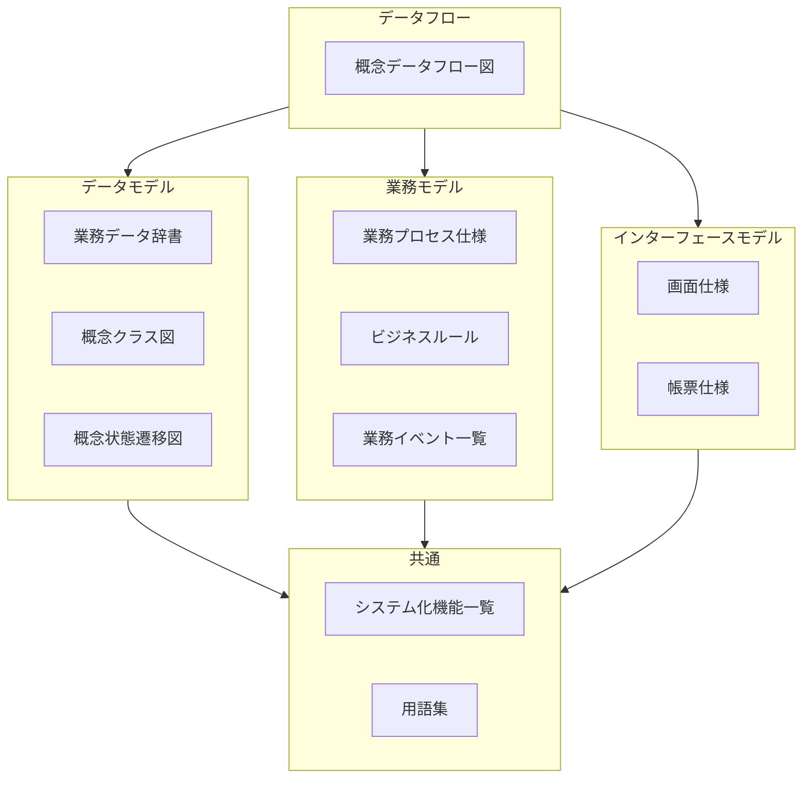

# ドキュメント内容ガイド

Document Contents Guide

SpecDojoで扱うドキュメントの内容について、以下のガイドラインを示します。

## 1. プロジェクト

プロダクトの構築や改修時に、何を達成したいか、どの範囲を対象にするか、どの成果物をどう管理するかを関係者で共有します。
`docs/ja/projects/<project-id>` 配下で扱う主なプロジェクト成果物の目的と主な内容は以下の通りです。

### 1.1. プロジェクト概要

<!-- prettier-ignore -->
| ドキュメント | 英語名称 | 推奨ファイル名 | 目的 | 主な内容 |
| --- | --- | --- | --- | --- |
| プロジェクト概要 | Project Overview | `prj-overview` | プロジェクトの背景・目的・ゴールを共有する | 背景、目的、必要性、期待効果、前提条件 |
| プロジェクト憲章 | Project Charter | `prj-charter` | プロジェクトの正式な認可と権限委譲を文書化する | プロジェクトの目的、スポンサー、権限、成功条件、承認事項 |
| ステークホルダー登録簿 | Stakeholder Register | `prj-stakeholder-register` | 関係者の役割・関心・影響度を整理する | 関係者一覧、役割、期待、影響度、コミュニケーション上の留意点 |

### 1.2. プロジェクトスコープ

<!-- prettier-ignore -->
| ドキュメント | 英語名称 | 推奨ファイル名 | 目的 | 主な内容 |
| --- | --- | --- | --- | --- |
| プロジェクトスコープ | Project Scope | `prj-scope` | 対象範囲と対象外を明確にする | 対象業務、対象システム、対象期間、スコープ外 |
| 成功基準と受入条件 | Success Criteria and Acceptance Criteria | `prj-success-criteria-and-acceptance-criteria` | プロジェクト成功の判定基準と受入条件を明確化する | 成功指標、完了定義、受入条件、判定方法、承認者 |
| 成果物カタログ | Deliverables Catalog | `prj-deliverables-catalog` | プロジェクト成果物の一覧と配置・派生関係を整理する | 成果物一覧、目的、配置先、生成元、派生関係 |

### 1.3. プロジェクト課題と解決アプローチ

<!-- prettier-ignore -->
| ドキュメント | 英語名称 | 推奨ファイル名 | 目的 | 主な内容 |
| --- | --- | --- | --- | --- |
| プロジェクト課題と解決アプローチ | Project Issues and Approach | `prj-issues-and-approach` | 主要課題と解決方針を整理する | 課題一覧、原因、解決策候補、選択したアプローチと理由 |
| 前提・制約・依存関係 | Assumptions, Constraints and Dependencies | `prj-assumptions-constraints-dependencies` | 実行上の前提条件・制約事項・外部依存を明示する | 前提条件、制約事項、依存先、影響、対応方針 |
| 代替案比較 | Comparison of Alternatives | `prj-comparison-of-alternatives` | 複数案を比較し、採択理由を残す | 比較対象、評価観点、メリット・デメリット、採択案、採択理由 |

### 1.4. プロダクト変更

#### 1.4.1. 現状定義

<!-- prettier-ignore -->
| ドキュメント | 英語名称 | 推奨ファイル名 | 目的 | 主な内容 |
| --- | --- | --- | --- | --- |
| 現状定義（As-Is） | As-Is Definition | `asis-<spec>-index` | 変更前のベースラインを定義し、比較の基準を固定する | 現行業務仕様の対象範囲、前提、参照元、凍結時点 |

#### 1.4.2. 影響調査

<!-- prettier-ignore -->
| ドキュメント | 英語名称 | 推奨ファイル名 | 目的 | 主な内容 |
| --- | --- | --- | --- | --- |
| 影響調査（業務） | Impact Analysis (Business) | `imp-business` | 変更要求が業務へ与える影響を整理する | 影響対象業務、変更要否、影響度、対応方針、未解決事項 |
| 影響調査（データ） | Impact Analysis (Data) | `imp-data` | 変更要求がデータへ与える影響を整理する | 影響対象データ、変更要否、影響度、対応方針、未解決事項 |
| 影響調査（I/F） | Impact Analysis (Interface) | `imp-interface` | 変更要求がインターフェースへ与える影響を整理する | 影響対象I/F、変更要否、影響度、対応方針、未解決事項 |
| 影響調査（テスト） | Impact Analysis (Test) | `imp-test` | 変更要求がテストへ与える影響を整理する | 影響対象テスト、変更要否、影響度、対応方針、未解決事項 |
| 影響調査（運用） | Impact Analysis (Operations) | `imp-operations` | 変更要求が運用へ与える影響を整理する | 影響対象運用、変更要否、影響度、対応方針、未解決事項 |

#### 1.4.3. トレーサビリティ

<!-- prettier-ignore -->
| ドキュメント | 英語名称 | 推奨ファイル名 | 目的 | 主な内容 |
| --- | --- | --- | --- | --- |
| トレーサビリティ（要求→仕様） | Requirements Traceability (Requirements to Specs) | `trc-requirements-to-specs` | 要求と仕様の対応を可視化し、漏れを防ぐ | 要求ID、対応仕様ID、充足状況、ギャップ |
| トレーサビリティ（要求→テスト） | Requirements Traceability (Requirements to Tests) | `trc-requirements-to-tests` | 要求とテストの対応を可視化し、漏れを防ぐ | 要求ID、対応テストID、充足状況、ギャップ |

#### 1.4.4. 移行

<!-- prettier-ignore -->
| ドキュメント | 英語名称 | 推奨ファイル名 | 目的 | 主な内容 |
| --- | --- | --- | --- | --- |
| 移行計画 | Migration Plan | `mip-index` | 変更対象の移行方針と全体計画を定義し、切替リスクを管理する | 移行範囲、移行方式、体制、スケジュール、リスクと対策 |
| データ移行設計 | Data Migration Design | `dmd-index` | データ移行の設計内容を定義し、移行時の整合性を確保する | 移行対象データ、変換方針、マッピング、検証方法、ロールバック方針 |
| 移行テスト計画（リハーサル計画） | Migration Test Plan | `mtp-index` | 移行リハーサルの実施計画を定義し、切替前に妥当性を検証する | テスト範囲、シナリオ、環境、判定基準、是正計画 |
| カットオーバー計画（本番切替手順） | Cutover Plan | `cop-index` | 本番切替の手順を定義し、停止時間と障害リスクを最小化する | 切替手順、実施順序、判定ポイント、エスカレーション、切戻し手順 |
| 運用切替計画（ハイパーケア含む） | Operations Transition Plan | `otp-index` | 切替後の運用移管計画を定義し、安定稼働へ移行する | 運用引継ぎ、体制、監視強化期間、問い合わせ対応、安定化完了条件 |

### 1.5. プロジェクトマネジメント

プロジェクトの計画・管理・実行に関するドキュメントです。

#### 1.5.1. 管理計画

<!-- prettier-ignore -->
| ドキュメント | 英語名称 | 推奨ファイル名 | 目的 | 主な内容 |
| --- | --- | --- | --- | --- |
| プロジェクト管理計画 | Project Management Plan | `pm-plan` | プロジェクト全体の管理方針・プロセスを定義する | スコープ管理、スケジュール管理、コスト管理、品質管理、リスク管理、コミュニケーション管理の方針 |
| コミュニケーション計画 | Communication Plan | `pm-communication-plan` | 報告・連絡・会議体の計画を定義する | 報告頻度、会議体一覧、連絡系統、エスカレーションルール |
| 品質管理計画 | Quality Management Plan | `pm-quality-management-plan` | 品質目標・レビュー方針・品質基準を定義する | 品質目標、レビュープロセス、品質メトリクス、検査基準 |
| 組織体制と RACI | Organization and RACI | `pm-organization-and-raci` | 体制図と責任分担マトリクスを定義する | プロジェクト体制図、RACI マトリクス、役割定義 |

#### 1.5.2. 管理台帳

<!-- prettier-ignore -->
| ドキュメント | 英語名称 | 推奨ファイル名 | 目的 | 主な内容 |
| --- | --- | --- | --- | --- |
| リスク登録簿 | Risk Register | `pm-risk-register` | 識別済みリスクと対応策を管理する | リスク ID、発生確率、影響度、対応策、担当、ステータス |
| 課題ログ | Issue Log | `pm-issue-log` | 発生した課題と対応状況を管理する | 課題 ID、発生日、内容、優先度、対応策、担当、期限、ステータス |
| 変更要求ログ | Change Request Log | `pm-change-request-log` | 変更要求の申請・審査・決定を管理する | 変更 ID、要求内容、影響範囲、審査結果、決定日 |

#### 1.5.3. レポート

<!-- prettier-ignore -->
| ドキュメント | 英語名称 | 推奨ファイル名 | 目的 | 主な内容 |
| --- | --- | --- | --- | --- |
| 進捗報告 | Progress Report | `pr-<yyyy-mm-dd>-<nn>` | 定期的な進捗状況を報告する | 報告期間、完了タスク、遅延・リスク、次期予定、課題・依頼事項 |
| 議事録 | Meeting Minutes | `mm-<yyyy-mm-dd>-<nn>` | 会議の決定事項・アクションを記録する | 会議名、日時、参加者、議題、決定事項、アクションアイテム |

#### 1.5.4. WBS・スケジュール

<!-- prettier-ignore -->
| ドキュメント | 英語名称 | 推奨ファイル名 | 目的 | 主な内容 |
| --- | --- | --- | --- | --- |
| WBS 定義 | Work Breakdown Structure | `wbs-<domain>` | スコープ単位の作業分解構造を定義する | 作業パッケージ、成果物、担当、見積（YAML 形式） |
| マイルストーン定義 | Milestones Definition | `sch-milestones` | プロジェクト全体のマイルストーンを定義する | マイルストーン名、期日、判定基準（YAML 形式） |
| スケジュール定義 | Schedule Definition | `sch-<domain>` | スコープ単位の詳細スケジュールを定義する | タスク、開始日、終了日、依存関係、担当（YAML 形式） |

#### 1.5.5. 実行管理

<!-- prettier-ignore -->
| ドキュメント | 英語名称 | 推奨ファイル名 | 目的 | 主な内容 |
| --- | --- | --- | --- | --- |
| タスク実行ワークスペース | Task Execution Workspace | `exec/` | `specdojo` コマンドによるタスク実行とイベント記録を管理する | タスク定義、実行結果、イベントログ |
| 自動生成成果物 | Generated Artifacts | `generated/` | タスク実行結果から自動生成された成果物を出力する | 生成されたドキュメント、レポート、ブリーフ |

### 1.6. 決定記録

<!-- prettier-ignore -->
| ドキュメント | 英語名称 | 推奨ファイル名 | 目的 | 主な内容 |
| --- | --- | --- | --- | --- |
| 決定記録 | Decision Log | `dec-<NNNN>-<topic>` | 重要な設計・技術選択の決定理由を残す | 背景、決定した内容、検討した選択肢、採択理由、影響範囲 |

## 2. 業務仕様

業務仕様は、渡辺幸三先生が提唱する[三要素分析法](https://dbc.in.coocan.jp/methodology.html)に基づく業務・システム設計を念頭に構成しています。

三要素分析法とは、企業システムに特化した設計方法論で、業務をデータフロー図を頂点に、(1)ER図（データモデル）、(2)アクションツリー図（業務モデル）、(3)機能展開図（機能モデル）の３つの要素で分析・設計する方法論です。三要素分析法を用いることで、業務とシステムの整合性を高め、効率的なシステム開発が可能となります。

現行の業務やあるべき業務を概念的なモデルとして整理・可視化します。三要素分析法のデータフロー図を中心に、データモデル、業務モデル、インターフェースモデル※の各要素を網羅的に記述します。各々のドキュメントとの関係は以下の通りです。

※本ドキュメントでは、「業務モデル」がやや曖昧な表現で誤解を招く可能性があるため、インターフェースモデルとして再定義しています。

### 2.1. データフロー

<!-- prettier-ignore -->
| ドキュメント | 英語名称 | 推奨ファイル名 | 目的 | 主な内容 |
| --- | --- | --- | --- | --- |
| [概念データフロー図](../rules/cdfd-rules.md) | Concept Data Flow Diagram | `cdfd` | 対象となる業務の全体構成・流れを可視化し、定義する | 業務（プロセス）とその間の情報の流れ・物の流れ、業務のきっかけとなるイベント、業務主体 など |

### 2.2. データモデル

<!-- prettier-ignore -->
| ドキュメント | 英語名称 | 推奨ファイル名 | 目的 | 主な内容 |
| --- | --- | --- | --- | --- |
| [業務データ辞書 / 業務データ辞書](../rules/bdd-rules.md) | Business Data Dictionary | `bdd` | データの意味や構造に関する共通理解を作る | 業務上の管理単位（エンティティ）とその属性（項目）の論理名・物理名・説明・制約 など |
| [業務データ辞書 / 概念データストア定義](../rules/cdsd-rules.md) | Conceptual Data Store Definition | `cdsd` | 概念データストア（情報の保管場所）を一覧で定義する | データストア名、対応プロセス、内容、更新タイミング、粒度、主な用途 など |
| [業務データ辞書 / 保管場所定義](../rules/sld-rules.md) | Storage Location Definition | `sld` | 業務対象となる物の物理的な保管場所を一覧で定義する | 保管場所名、保管対象、内容・目的、関連プロセス、管理頻度 など |
| [業務データ辞書 / ステータス定義](../rules/stsd-rules.md) | Status Definition | `stsd` | 業務上のエンティティが取り得る状態（ステータス）を一覧で定義する | 対象、ステータス名、呼称、説明 など |
| [業務データ辞書 / 分類定義](../rules/cld-rules.md) | Classification Definition | `cld` | 業務上の分類（カテゴリ、種別、区分など）を一覧で定義する | 分類定義名、種別、分類名、説明など |
| [概念クラス図](../rules/ccd-mermaid-rules.md) | Conceptual Class Diagram | `ccd` | 業務上のエンティティ関係を図で定義する | 商品・在庫・発注・店舗などの概念と属性、関連（継承/親子/参照） など |
| [概念状態遷移図](../rules/cstd-rules.md) | Conceptual State Transition Diagram | `cstd` | 業務オブジェクトの状態変化を図で定義する | 対象、状態、遷移、イベント、条件など |

### 2.3. 業務モデル

<!-- prettier-ignore -->
| ドキュメント | 英語名称 | 推奨ファイル名 | 目的 | 主な内容 |
| --- | --- | --- | --- | --- |
| [業務プロセス仕様](../rules/bps-rules.md) | Business Process Specification | `bps` | 業務プロセスの処理内容を定義する | 業務プロセス概要、トリガー、前提、入力、処理、出力 など |
| [ビジネスルール](../rules/br-rules.md) | Business Rule | `br` | 複数プロセスから参照される横断的な判断を定義する | ルール概要、入力、ルール、出力、例外 など |
| [業務イベント / 業務イベント仕様 全体構成](../rules/bes-index-rules.md) | Business Event Specification Index | `bes-index` | 業務上で発生する主要なイベントを一覧で定義する | イベントID、イベント名、何が起きたか、いつ、発生条件 など |
| [業務イベント / 業務イベント仕様](../rules/bes-rules.md) | Business Event Specification | `bes` | 業務上で発生する主要なイベントを個別に定義する | イベントID、イベント名、何が起きたか、いつ、発生条件 など |

### 2.4. インターフェースモデル

<!-- prettier-ignore -->
| ドキュメント | 英語名称 | 推奨ファイル名 | 目的 | 主な内容 |
| --- | --- | --- | --- | --- |
| [画面仕様](../rules/uis-rules.md) | UI Specification | `uis` | 業務ユーザー視点の画面の利用目的や表示項目、操作を定義する | 画面概要、利用目的、表示項目、操作、遷移、エラー表示 など |
| [帳票仕様](../rules/bds-rules.md) | Business Document Specification | `bds` | 業務ユーザー視点の帳票の利用目的や表示項目を定義する | 帳票概要、利用目的、表示項目、出力タイミング など |

### 2.5. 共通

<!-- prettier-ignore -->
| ドキュメント | 英語名称 | 推奨ファイル名 | 目的 | 主な内容 |
| --- | --- | --- | --- | --- |
| [システム化機能一覧 / 全体構成](../rules/sf-rules.md) | System Functions Index | `sf-index` | システムで実現する機能の全体構成と一覧を定義する | 機能ID、機能名、概要、関連プロセス、関連仕様ID など |
| [システム化機能一覧 / 個別](../rules/sf-rules.md) | System Function | `sf` | 個別のシステム化機能の概要・関連仕様を定義する | 機能概要、関連プロセス、関連画面、関連IF、関連ルール など |
| [用語集](../rules/gl-rules.md) | Glossary | `gl` | 用語の意味を統一的に定義する | 用語、定義、別名、分類、関連用語 など |

## 3. 外部I/F仕様

### 3.1. ドキュメント一覧と概要

<!-- prettier-ignore -->
| ドキュメント | 英語名称 | 推奨ファイル名 | 目的 | 主な内容 |
| --- | --- | --- | --- | --- |
| [外部システムI/F一覧](../rules/ifx-rules.md) | External System Interface | `ifx-index` | 外部システムとの連携を一覧(YAML)で定義する | 連携名、連携元、連携先（外部システム）、伝送方式、フォーマット、タイミング |
| [外部API仕様](../rules/ifx-api-rules.md) | External API Specification | `ifx-api` | 外部システムとのAPI連携をOpenAPI形式(YAML)で定義する | エンドポイント、HTTPメソッド、リクエスト／レスポンス、ステータスコード |
| [外部ファイル連携仕様](../rules/ifx-file-rules.md) | External File Exchange Specification | `ifx-file` | 外部システムとのファイル連携をYAMLで定義する | ファイル形式、伝送方法、スケジュール、ファイル項目一覧 |
| [外部メッセージ仕様](../rules/ifx-msg-rules.md) | External Message Specification | `ifx-msg` | 他システムとのイベント／キューのメッセージ連携をAsyncAPI + CloudEvents(YAML)で定義する | チャネル名、メッセージ構造、エンドポイント、プロトコル |

## 4. アーキテクチャ

### 4.1. C4（構造・依存関係）

<!-- prettier-ignore -->
| ドキュメント | 英語名称 | 推奨ファイル名 | 目的 | 主な内容 |
| --- | --- | --- | --- | --- |
| [C4コンテキスト図](../rules/cxd-rules.md) | C4 Context Diagram | `cxd` | 対象システムと「境界外」の人・外部システムとの関係を俯瞰的に定義する | ユーザー、外部システム、本システムの関係図 |
| [C4コンテナ図](../rules/cnd-rules.md) | C4 Container Diagram | `cnd` | 対象システムを主要実行/配備単位に分割し、利用者・外部システム・データストアとの関係を定義する | Webアプリ、API、バッチ、DB、メッセージ基盤など |
| [C4コンポーネント図](../rules/cpd-rules.md) | C4 Component Diagram | `cpd` | 対象コンテナ内の主要コンポーネントに分解し、外部要素との関係を定義 | 人/ロール、対象コンテナ境界、DB、外部システムなど、と主要コンポーネントとの依存関係 |

### 4.2. インフラ・技術選定（実行基盤）

<!-- prettier-ignore -->
| ドキュメント | 英語名称 | 推奨ファイル名 | 目的 | 主な内容 |
| --- | --- | --- | --- | --- |
| [インフラ構成図](../rules/ifd-mermaid-rules.md) | Infrastructure Diagram | `ifd` | インフラの論理的な境界（環境 / ネットワーク / ゾーン）と、主要コンポーネント間の通信の流れを定義する | 実行環境、ネットワーク、論理ゾーン、Webアプリ、API Server、DB など |
| [技術スタック一覧](../rules/tsd-rules.md) | Technology Stack Definition | `tsd` | システムで採用する技術（言語、フレームワーク、DB、メッセージ基盤、キャッシュ等）を、一覧として定義する | プログラミング言語、フレームワーク、ミドルウェア など |

## 5. システム設計

システム設計は **“コードに寄せる（Code as Spec）”** 方針とし、設計ドキュメントは最小限に留める。
本章では、実装詳細を文章で重複させず、以下のみを扱う。

- **System Design Index**：設計のSSOT（OpenAPI / AsyncAPI / migration / job定義 / config schema 等）への導線
- **System Design Critical Flows**：事故や仕様誤解の原因になりやすい“重要フロー”だけを少数（最大5件）定義
- **System Design Cross-cutting Policy**：エラー・冪等・リトライ・監査・トレーシング等の横断ルール（実装の共通前提）

### 5.1. ドキュメント一覧と概要（最小構成）

<!-- prettier-ignore -->
| ドキュメント | 英語名称 | 推奨ファイル名 | 目的 | 主な内容 |
| --- | --- | --- | --- | --- |
| 全体構成（リンク集） | System Design Index | `sysd-index` | システム設計のSSOTへの導線を1箇所に集約し、設計情報を迷子にしない | 内部API定義（OpenAPI等）/イベント定義（AsyncAPI等）/DBスキーマ（migration等）/バッチ定義（workflow/cron等）/設定スキーマ（config schema等）/コード配置規約（モジュール境界） |
| 重要フロー | System Design Critical Flows | `sysd-critical-flows` | “読まないと事故る”フローだけを可視化し、実装・テスト・運用の共通理解を作る | 最大5フロー（冪等/補償/非同期/順序/整合性/外部I/F障害など）について、境界・永続化点・再実行性・失敗時挙動を図または箇条書きで定義 |
| 横断ルール | System Design Cross-cutting Policy | `sysd-cross-cutting-policy` | 実装全体に影響する共通ルールをSSOT化し、各所の実装ブレを防ぐ | エラー形式/例外分類、タイムアウト・リトライ、冪等キー、トランザクション境界、ログ/監査ログ、トレーシング、セキュリティ（認証・認可の実装原則）、バージョニング、設定の上書き階層 |

> 補足：従来の「実装データフロー図／実装クラス図／DB論理・物理／実装画面仕様／内部I/F／バッチ設計／設定一覧」は、
> **“SSOTをコード（定義ファイル）に寄せる”** 方針により、個別ドキュメントとしては作らない。
> 必要な場合は **SYSD Index（リンク集）から一次情報へ到達**できる状態を維持する。

### 5.2. 記述方針（Code as Spec）

- **内部I/F**：OpenAPI / AsyncAPI / gRPC proto 等をSSOTとし、本章はリンクと横断ルールのみ記載する
- **DB**：migration / schema定義をSSOTとし、物理設計は“理由（意図）”のみ横断ルールまたは重要フローに残す
- **UI詳細**：画面の目的・項目は UIS をSSOTとし、実装構成（コンポーネント分割等）はコード参照とする
- **クラス図**：追随コストが高いため原則作らず、代わりに **モジュール境界（依存方向のルール）**を横断ルールに記載する
- **バッチ/ジョブ**：定義ファイル（workflow/cron/IaC）とコードをSSOTとし、運用上の重要事項のみ横断ルールに記載する
- **設定**：config schema とデフォルト設定をSSOTとし、運用が触る項目のみ一覧化する（System Design Cross-cutting Policy に記載 or SYSD Index から参照）

## 6. 業務受入条件

<!-- prettier-ignore -->
| ドキュメント | 英語名称 | 推奨ファイル名 | 目的 | 主な内容 |
| --- | --- | --- | --- | --- |
| [業務受入条件](../rules/bac-rules.md) | Business Acceptance Criteria | `bac` | 業務として受け入れ可能であることを示す条件を定義する | 業務シナリオ、受入条件、前提、操作、期待結果 など |

## 7. 非機能要件

<!-- prettier-ignore -->
| ドキュメント | 英語名称 | 推奨ファイル名 | 目的 | 主な内容 |
| --- | --- | --- | --- | --- |
| [非機能要件](../rules/nfr-index-rules.md) | Non-Functional Requirements | `nfr-index` | 非機能要件を8カテゴリに分冊管理し、測定可能・検証可能な形で一元化する | 信頼性、可用性、保守性、完全性、機密性・安全性、性能、運用、操作性（各カテゴリの目的・代表指標・検証導線） |
| [非機能要件 / 信頼性](../rules/nfr-reliability-rules.md) | Non-functional Requirements / Reliability | `nfr-reliability` | 障害抑止と誤動作防止を定義する | 故障率、平均故障間隔(MTBF)、エラー率、データ検証ルール |
| [非機能要件 / 可用性](../rules/nfr-availability-rules.md) | Non-functional Requirements / Availability | `nfr-availability` | システム稼働の継続性を定義する | 稼働率、RTO/RPO、フェイルオーバー、冗長化、バックアップ |
| [非機能要件 / 保守性](../rules/nfr-maintainability-rules.md) | Non-functional Requirements / Maintainability | `nfr-maintainability` | 変更容易性と復旧容易性を定義する | 平均修復時間(MTTR)、変更リードタイム、ログ粒度 |
| [非機能要件 / 完全性](../rules/nfr-integrity-rules.md) | Non-functional Requirements / Integrity | `nfr-integrity` | データ正確性と改ざん防止を定義する | 整合性検証、監査証跡、トランザクション境界 |
| [非機能要件 / 機密性・安全性](../rules/nfr-security-safety-rules.md) | Non-functional Requirements / Security and Safety | `nfr-security-safety` | 不正利用防止とセキュリティを定義する | 認証・認可、脆弱性対応SLA、暗号化、アクセス制御 |
| [非機能要件 / 性能](../rules/nfr-performance-rules.md) | Non-functional Requirements / Performance | `nfr-performance` | 応答性と処理能力を定義する | P95/P99レイテンシ、RPS(吞吐量)、リソース効率 |
| [非機能要件 / 運用](../rules/nfr-operations-rules.md) | Non-functional Requirements / Operations | `nfr-operations` | 監視・手順・継続運用を定義する | アラート検知率、復旧達成率、運用手順充実度 |
| [非機能要件 / 操作性](../rules/nfr-usability-rules.md) | Non-functional Requirements / Usability | `nfr-usability` | 使いやすさと誤操作防止を定義する | タスク完了率、誤操作率、エラーメッセージ明確性 |

## 8. システム受入条件

<!-- prettier-ignore -->
| ドキュメント | 英語名称 | 推奨ファイル名 | 目的 | 主な内容 |
| --- | --- | --- | --- | --- |
| [システム受入条件](../rules/sac-rules.md) | System Acceptance Criteria | `sac` | システム全体としての合格基準を定義する | 機能・非機能・障害・移行などの受け入れ条件 |

## 9. テスト

※ 個別仕様のサフィックスは、対象ドキュメントの目的に合わせて「用語集」のtermから命名します。リンクされる可能性も鑑みなるべく固定できる名前を選びます。

### 9.1. 共通

<!-- prettier-ignore -->
| ドキュメント | 英語名称 | 推奨ファイル名 | 目的 | 主な内容 |
| --- | --- | --- | --- | --- |
| [テスト戦略・方針](../rules/tsp-index-rules.md) | Test Strategy and Policy | `tsp-index` | 全体テストの考え方を示す（要件） | テストレベルと目的、対象/対象外（スコープ）、品質目標、体制/役割、環境、使用ツール、テストデータ方針、入口/出口条件、進め方・優先度、リスクと対策 |

### 9.2. 単体テストカタログ

<!-- prettier-ignore -->
| ドキュメント | 英語名称 | 推奨ファイル名 | 目的 | 主な内容 |
| --- | --- | --- | --- | --- |
| [単体テスト](../rules/utc-index-rules.md) | Unit Test Catalog | `utc-index` | 単体テストとして確認する観点・条件と分配を定義する | 対象単位、テスト範囲と対象外、境界（モック/スタブ方針）、TPC の観点・条件の分配、合格基準とエビデンス（共通） |
| [単体テスト対象別](../rules/utc-rules.md) | Unit Test Specification | `utc-<target>` | 単体テスト仕様を対象ごとに分割して定義する | 個別対象の範囲、観点、代表条件（状態レベル）、合格基準とエビデンス（参照） |

### 9.3. 内部結合テストカタログ

<!-- prettier-ignore -->
| ドキュメント | 英語名称 | 推奨ファイル名 | 目的 | 主な内容 |
| --- | --- | --- | --- | --- |
| [内部結合テスト](../rules/itc-index-rules.md) | Internal Integration Test Catalog | `itc-index` | 内部コンポーネント間の連携を確認する観点・条件を定義する | 対象コンポーネントと結合範囲、インターフェース（API/イベント/DB）観点、主要フロー/例外フロー、トランザクション・整合性、エラー処理、ログ/監視観点、合格基準 |
| [内部結合テスト対象別](../rules/itc-rules.md) | Internal Integration Test Specification | `itc-<target>` | 内部結合テスト仕様を対象（機能/連携）ごとに分割して定義する | 個別結合範囲、前提、テスト条件（シナリオ）一覧、合格基準、関連する仕様ID/機能ID |

### 9.4. 外部結合テストカタログ

<!-- prettier-ignore -->
| ドキュメント | 英語名称 | 推奨ファイル名 | 目的 | 主な内容 |
| --- | --- | --- | --- | --- |
| [外部結合テスト](../rules/etc-index-rules.md) | External Integration Test Catalog | `etc-index` | 外部システム連携を含む結合観点・条件を定義する（仕様） | 対象I/F（API/ファイル/メッセージ）、契約（スキーマ/コード/制約）、正常/異常（タイムアウト・リトライ・冪等・順序）、セキュリティ（認証/認可）、性能/レート制限、監査ログ、合格基準 |
| [外部結合テスト対象別](../rules/etc-rules.md) | External Integration Test Specification | `etc-<target>` | 外部結合テスト仕様を連携単位で分割して定義する（仕様） | I/Fごとのテスト条件一覧（入力/期待/エラー）、前提（接続先・認証・テストデータ）、合格基準、関連する外部I/F仕様ID |

### 9.5. 総合結合テストカタログ

<!-- prettier-ignore -->
| ドキュメント | 英語名称 | 推奨ファイル名 | 目的 | 主な内容 |
| --- | --- | --- | --- | --- |
| [総合テスト](../rules/stc-index-rules.md) | System Test Catalog | `stc-index` | システム全体として業務シナリオが成立することを定義する（仕様） | エンドツーエンドの業務シナリオ、画面/API/バッチ/外部連携の通し観点、運用観点（ジョブ・監視・障害時）、非機能の観点（代表値）、合格基準 |
| [総合テスト対象別](../rules/stc-rules.md) | System Test Specification | `stc-<scenario>` | 総合テスト仕様をシナリオ/業務単位で分割して定義する（仕様） | 個別シナリオの前提、データ準備、テスト条件、期待結果、合格基準、関連する業務仕様ID/受入条件ID/入条件ID |

### 9.6. 受入結合テストカタログ

<!-- prettier-ignore -->
| ドキュメント | 英語名称 | 推奨ファイル名 | 目的 | 主な内容 |
| --- | --- | --- | --- | --- |
| [受入テスト](../rules/atc-index-rules.md) | Acceptance Test Catalog | `atc-index` | 業務として受け入れ可能であることを確認する観点・条件を定義する（仕様） | 業務受入シナリオ、受入条件（合格基準）、利用者視点の操作・期待結果、例外時の扱い、データ準備、役割分担、エビデンス要件、判定/承認フロー |
| [受入テスト対象別](../rules/atc-rules.md) | Acceptance Test Specification | `atc-<scenario>` | 受入テスト仕様を業務シナリオ/受入条件単位で分割して定義する（仕様） | 個別受入シナリオの前提、テスト条件、期待結果、合格基準、関連する業務受入条件ID/システム受入条件ID |

## 10. 運用

### 10.1. ドキュメント一覧と概要

| ドキュメント                            | 英語名称                     | 推奨ファイル名 | 目的                                                                                          | 主な内容                                                                                                                                                                                                                                                                                                                                                                                                                                        |
| --------------------------------------- | ---------------------------- | -------------- | --------------------------------------------------------------------------------------------- | ----------------------------------------------------------------------------------------------------------------------------------------------------------------------------------------------------------------------------------------------------------------------------------------------------------------------------------------------------------------------------------------------------------------------------------------------- |
| [運用方針・設計](../rules/opd-rules.md) | Operations Policy and Design | `opd-index`    | 切替後の恒常運用を「あるべき姿」として定義し、運用品質（SLO/SLA・責任分界・統制）をSSOT化する | 運用の範囲・前提／SLO・SLA・KPI／体制・責任分界（RACI・当番・エスカレーション）／監視・アラート方針（指標・閾値・通知先・初動）／障害対応方針（優先度・停止判断・周知）／変更管理（リリース・設定変更・承認・ロールバック）／バックアップ・リストア方針（RTO/RPO）／権限・アカウント運用（棚卸し・監査ログ）／定期運用方針（バッチ・点検）／問い合わせ運用方針（窓口・分類・SLA）／関連ドキュメント導線（**opr-index/otp-index/cop-index** 等） |
| [運用手順](../rules/opr-rules.md)       | Operations Runbook           | `opr-index`    | 運用作業を再現可能な手順として定義し、誰がやっても同じ結果になる状態を作る（属人化防止）      | 日次/週次/月次点検手順／障害対応手順（P1/P2…、切り分け、一次対応、復旧）／アラート対応手順（確認→暫定対応→恒久対応）／バックアップ確認・リストア手順（演習含む）／バッチ再実行・失敗時対応／運用変更作業（設定変更・デプロイ・ロールバック）／アカウント付与/剥奪手順／問い合わせ一次対応手順（テンプレ・ナレッジ）／証跡（ログ、チケット、チェックリスト、実施記録）／関連ドキュメント（**opd-index参照、mip-index/otp-index/cop-index連携**） |
