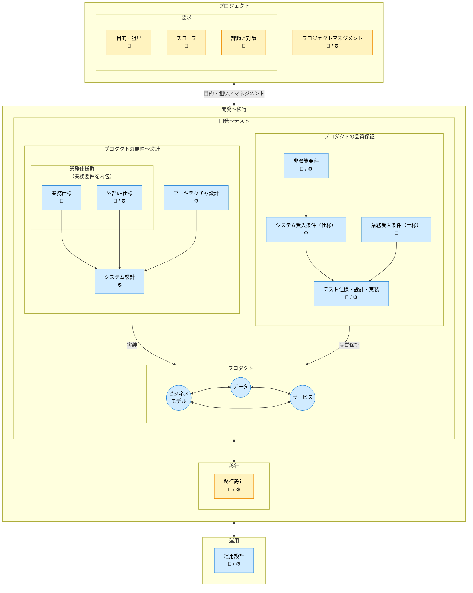
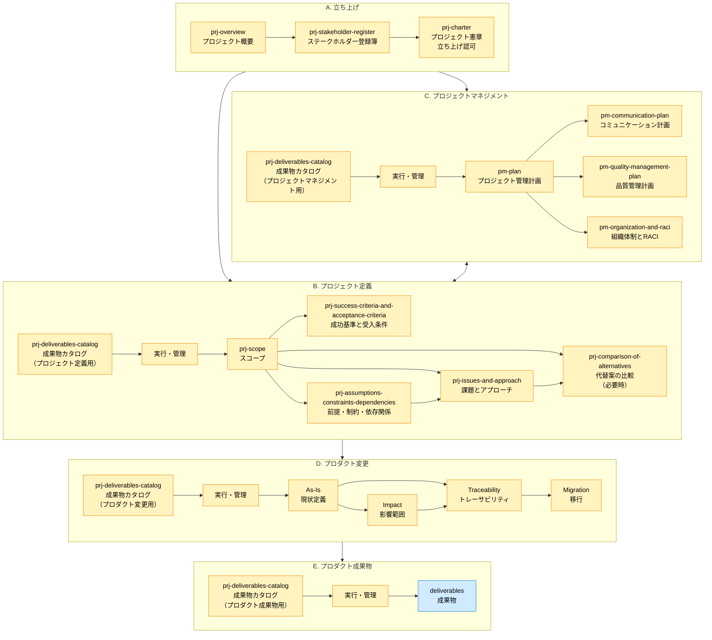
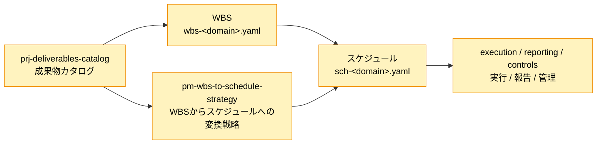

# ドキュメント構成ガイド

Document Structure Guide

SpecDojoで扱うドキュメントの全体構成について、以下のガイドラインを示します。

## SpecDojoで扱うドキュメントの全体構成

- SpecDojo は、1つの SpecDojo Unit で1つのプロダクト文脈を扱うことを基本とします。SpecDojo Unit とは、プロダクトドキュメントとプロジェクトドキュメントを含む1つの `docs/` ルートを指します（例: `repo/docs/ja/product/`）。
- 1つの SpecDojo Unit には、対象プロダクトを構築・改修するための複数のプロジェクトが存在します。プロジェクトごとにプロジェクトドキュメントを作成します（例: `repo/docs/ja/projects/prj-0001/`）。
- 1つのリポジトリで複数プロダクトを扱う場合は、プロダクトごとに `docs/` ルートを分け、それぞれを独立した SpecDojo Unit として扱います（例: `repo/apps/product-a/docs/ja/product/`, `repo/apps/product-b/docs/ja/product/`）。
- 成果物IDは、原則として SpecDojo Unit 内で一意にします。複数の SpecDojo Unit を横断して扱う場合は、必要に応じて Unit ID と成果物IDの組み合わせで識別します。

## 1. ドキュメントの分類

ドキュメントは、プロダクトドキュメントとプロジェクトドキュメントの2種類に分類されます。

### 1.1. プロダクトドキュメント

**プロダクトの最新状況を説明するドキュメントです**。

プロダクトを新規に構築する際に作成されて、プロダクトを改修する毎に更新されます。プロダクトの、

- 要件〜設計に関する定義
- 品質保証に関する定義

について記載します。プロダクトのライフサイクルにわたって管理されます。

プロダクトドキュメントは、

- 常に「現在の正」を表します。
- プロジェクト固有の判断や経緯は含めず、必要な場合はプロジェクトドキュメントから反映されます。
- ドキュメントの改定履歴はバージョン管理システムで管理します。

### 1.2. プロジェクトドキュメント

**プロダクトの構築時や改修時に、プロジェクト毎に作成されるドキュメントです**。

個別プロジェクト毎の、

- 業務要求: 目的・狙い、スコープ、課題と対策
- プロダクトの変更（現状、トレース、影響範囲、移行）
- プロジェクトマネジメント

について記載します。プロジェクト完了後はアーカイブされます。

## 2. 前提となる工程のフロー

| フェーズ | 用語                   | 5W1H            | このガイドでの意味                        |
| -------- | ---------------------- | --------------- | ----------------------------------------- |
| 1        | 要求（Needs）          | Why             | ユーザー・業務の**目的・欲求・困りごと**  |
| 2        | 要件（Requirements）   | What (条件)     | システムとして**満たすべき条件**          |
| 3        | 仕様（Specifications） | What (振る舞い) | 振る舞い・I/F・ルールを**曖昧さなく定義** |
| 4        | 設計（Design）         | How (方式)      | 構造・方式・構成として**どう実現するか**  |
| 5        | 実装（Implementation） | How (具現)      | コード・設定としての実現                  |

## 3. ドキュメントオーナー

ドキュメントのオーナーは、以下の通りです。

| オーナー         | 記号 | 略称 | 役割                       |
| ---------------- | ---- | ---- | -------------------------- |
| ビジネスオーナー | 🧭   | BO   | 最終的な価値判断の主体     |
| エンジニア       | ⚙️   | EN   | 技術的実現と品質判断の主体 |

## 4. ドキュメントの構成

### 4.1. 凡例


### 4.2. ドキュメント構成図



※補足事項

- 図中のアーキテクチャ設計は、個別仕様に先立つ全体構造の設計を表します。
- 「要件含む」とは、業務仕様の冒頭に業務要件相当（対象範囲・成功条件・制約等）を含めることを指します。

## 5. プロジェクトドキュメントの構成

### 5.1. ディレクトリ構成

ディレクトリ名とファイル名については、以下のようにfrontmatterで定義されたidと対応させることを推奨します。
idと対応させない場合（日本語名称を使用する場合等）は、一貫性を保った命名規約を採用してください。

```text
docs/
├── ja/                                           # 多言語化対応（将来: en/ など）
│   ├── handbook/
│   │   ├── guidelines/                           # ドキュメント作成ガイド
│   │   ├── rulebooks/                            # ドキュメント記述規約
│   │   └── instructions/                         # 生成AIへの指示テンプレート
│   │
│   ├── projects/
│   │   ├── prj-0001/                             # プロジェクト（ID）
│   │   │   ├── 010-deliverables-catalog/         # 成果物カタログ
│   │   │   │   ├── dct-index.md                  # 成果物カタログ
│   │   │   │   ├── dct-010-project-definition.md # プロジェクト定義の成果物カタログ
│   │   │   │   └── dct-020-project-management.md # プロジェクトマネジメントの成果物カタログ
│   │   │   │
│   │   │   ├── 020-project-definition/           # プロジェクト定義
│   │   │   │   ├── prj-overview.md               # プロジェクト概要
│   │   │   │   ├── prj-stakeholder-register.md   # ステークホルダー登録簿
│   │   │   │   ├── prj-organization.md           # 組織体制
│   │   │   │   ├── prj-charter.md                # プロジェクト憲章
│   │   │   │   ├── prj-scope.md                  # プロジェクトスコープ
│   │   │   │   ├── prj-success-criteria-and-acceptance-criteria.md # 成功基準と受入条件
│   │   │   │   ├── prj-issues-and-approach.md    # プロジェクト課題と解決アプローチ
│   │   │   │   ├── prj-assumptions-constraints-dependencies.md # 前提・制約・依存関係
│   │   │   │   └── prj-comparison-of-alternatives.md # 代替案の比較
│   │   │   │
│   │   │   ├── 030-project-management/           # プロジェクトマネジメント
│   │   │   │   ├── 010-management-plan/          # 管理計画
│   │   │   │   │   ├── pm-plan.md                # プロジェクト管理計画
│   │   │   │   │   ├── pm-communication-plan.md  # コミュニケーション計画
│   │   │   │   │   ├── pm-quality-management-plan.md　# 品質管理計画
│   │   │   │   │   ├── pm-raci.md　              # 組織体制とRACI
│   │   │   │   │   └── pm-wbs-to-schedule-strategy.md　# WBSからスケジュールへの変換戦略
│   │   │   │   │
│   │   │   │   ├── 020-controls/                 # 管理台帳・管理ビュー ※WBS対象外
│   │   │   │   │   ├── 010-project-register/     # 統合管理台帳（正本）
│   │   │   │   │   │   ├── pjr-index.md          # プロジェクト登録簿の索引・一覧
│   │   │   │   │   │   ├── pjr-0001-auth.md      # 登録項目（認証）
│   │   │   │   │   │   ├── pjr-0002-payment.md   # 登録項目（決済）
│   │   │   │   │   │   └── generated/            # 正本から生成される補助一覧
│   │   │   │   │   │       ├── pjr-open-items.md # 未完了項目一覧
│   │   │   │   │   │       ├── pjr-by-owner.md   # 担当者別一覧
│   │   │   │   │   │       ├── pjr-by-priority.md # 優先度別一覧
│   │   │   │   │   │       └── pjr-by-status.md  # 状態別一覧
│   │   │   │   │   │
│   │   │   │   │   └── generated/                # type別の派生管理ビュー
│   │   │   │   │       ├── pm-risk-register.md   # type=risk の抽出ビュー
│   │   │   │   │       ├── pm-issue-log.md       # type=issue の抽出ビュー
│   │   │   │   │       ├── pm-change-request-log.md # type=change-request の抽出ビュー
│   │   │   │   │       └── pm-decision-log.md    # type=decision の抽出ビュー
│   │   │   │   │
│   │   │   │   ├── 030-wbs/                      # WBS
│   │   │   │   │   ├── wbs-definition.yaml       # 成果物カタログ作成までのWBS
│   │   │   │   │   ├── wbs-auth.yaml             # WBS定義（認証）
│   │   │   │   │   ├── wbs-payment.yaml          # WBS定義（決済）
│   │   │   │   │   └── wbs-infra.yaml            # WBS定義（インフラ）
│   │   │   │   │
│   │   │   │   ├── 040-schedule/                 # スケジュール
│   │   │   │   │   ├── sch-definition.yaml       # 成果物カタログ作成のスケジュール
│   │   │   │   │   ├── sch-milestones.yaml       # マイルストーン定義
│   │   │   │   │   ├── sch-auth.yaml             # スケジュール定義（認証）
│   │   │   │   │   ├── sch-auth-api.yaml         # スケジュール定義（認証API）
│   │   │   │   │   └── sch-payment.yaml          # スケジュール定義（決済）
│   │   │   │   │
│   │   │   │   ├── 050-reporting/                # レポート ※WBS対象外
│   │   │   │   │   ├── progress-reports/         # 進捗報告
│   │   │   │   │   │   ├── pr-2026-03-01-01.md   # 進捗報告
│   │   │   │   │   │   └── pr-2026-03-08-01.md   # 進捗報告
│   │   │   │   │   └── meeting-minutes/          # 議事録
│   │   │   │   │       ├── mm-2026-03-01-01.md   # 議事録
│   │   │   │   │       └── mm-2026-03-08-01.md   # 議事録
│   │   │   │   │
│   │   │   │   └── 060-execution/                # 実行管理 ※WBS対象外
│   │   │   │       ├── exec/                     # タスク実行ワークスペース
│   │   │   │       │   ├── events/               # イベントログ
│   │   │   │       │   └── .locks/               # 実行ロック
│   │   │   │       └── generated/                # 自動生成成果物
│   │   │   │
│   │   │   ├── 040-product-change/               # プロダクト変更
│   │   │   │   ├── 010-as-is/                    # 現状定義（As-Is）
│   │   │   │   │   └── 010-business-specifications/ # 業務仕様
│   │   │   │   │
│   │   │   │   ├── 020-impact-analysis/          # 影響調査
│   │   │   │   │   ├── imp-business.md           # 業務影響
│   │   │   │   │   ├── imp-data.md               # データ影響
│   │   │   │   │   ├── imp-interface.md          # インターフェース影響
│   │   │   │   │   ├── imp-test.md               # テスト影響
│   │   │   │   │   └── imp-operations.md         # 運用影響
│   │   │   │   │
│   │   │   │   ├── 030-traceability/             # トレーサビリティ
│   │   │   │   │   └── generated/                # 自動生成成果物
│   │   │   │   │       ├── trc-requirements-to-specs.md # 要求と仕様のトレース
│   │   │   │   │       └── trc-requirements-to-tests.md # 要求とテストのトレース
│   │   │   │   │
│   │   │   │   └── 040-migration/                # 移行
│   │   │   │       ├── mip-index.md              # 移行計画
│   │   │   │       ├── dmd-index.md              # データ移行設計
│   │   │   │       ├── mtp-index.md              # 移行テスト計画（リハーサル計画）
│   │   │   │       ├── cop-index.md              # カットオーバー計画（本番切替手順）
│   │   │   │       └── otp-index.md              # 運用切替計画（ハイパーケア含む）
│   │   │   │
│   │   │   └── ...
│   │   │
│   │   └── prj-0002/ ...                         # 他プロジェクト
│   │
│   └── product/
│
└── en/                                           # 将来の英語ドキュメント用ディレクトリ
```

## 6. ドキュメントの作成順・検討順のガイドライン

> ここで示すドキュメントの関係は、作成順・検討順を表します。
> Frontmatter の `based_on` とは直接の関係はありません。
> Frontmatter の `based_on` は各文書を作成する際に直接根拠として参照した文書のみを記載するため、
> 本図の矢印を `based_on` は一致するわけではありません。

- 成果物カタログ（`prj-deliverables-catalog`）は、
  プロジェクトで管理対象とする成果物の単一の正本（SSOT）であり、各成果物の作成・更新・管理の起点となる。
  各類型（プロジェクト定義、プロジェクトマネジメント、プロダクト変更等）の成果物は、
  本カタログに登録された単位で管理されます。
- 成果物の類型は次の5つに大別されます。
  - A. 立ち上げ
  - B. プロジェクト定義
  - C. プロジェクトマネジメント
  - D. プロダクト変更
  - E. プロダクト成果物（更に詳細な類型に分類）
- 成果物の作成順は、`A → (C + B) → D → E` が基本になりますが、プロジェクトの状況に応じて柔軟に対応します。
  特に、`A. 立ち上げ`の成果物（概要・ステークホルダー・憲章）を起点として、
  `B. プロジェクト定義`（何を作るか）と `C. プロジェクトマネジメント`（どう進めるか）は並行して作成されることが多いです。
- 図中の `prj-deliverables-catalog` は同一文書を表し、各サブグラフでは当該類型に関する登録範囲を示しています。



図中の成果物カタログからプロジェクトドキュメントを作成する`実行・管理`の流れは以下になります。



## 7. プロダクトドキュメントの構成

### 7.1. ディレクトリ構成

ディレクトリ名とファイル名については、以下のようにfrontmatterで定義されたidと対応させることを推奨します。
idと対応させない場合（日本語名称を使用する場合等）は、一貫性を保った命名規約を採用してください。

```text
docs/
├── ja/                                           # 多言語化対応（将来: en/ など）
│   ├── handbook/
│   │   ├── guidelines/                           # ドキュメント作成ガイド
│   │   ├── rulebooks/                            # ドキュメント記述規約
│   │   └── instructions/                         # 生成AIへの指示テンプレート
│   │
│   ├── projects/
│   │   ├── prj-0001/                             # プロジェクト（ID）
│   │   └── prj-0002/ ...                         # 他プロジェクト
│   │
│   └── product/
│       ├── 010-business-specifications/          # 業務仕様
│       │   ├── 010-data-flow/                    # データフロー
│       │   │   └── cdfd-sales-management.md      # 概念データフロー図（例：販売管理）
│       │   ├── 020-data-model/                   # データモデル
│       │   │   ├── bdd-sales-management.md       # 業務データ辞書（例：販売管理）
│       │   │   ├── cdsd-sales-management.md      # 概念データストア定義（例：販売管理）
│       │   │   ├── sld-sales-management.md       # 保管場所定義（例：倉庫・店舗）
│       │   │   ├── stsd-product-lifecycle.md     # ステータス定義（例：商品ライフサイクル）
│       │   │   ├── cld-product-category.md       # 分類定義（例：商品カテゴリ）
│       │   │   ├── ccd-sales-management.md       # 概念クラス図（例：販売管理）
│       │   │   └── cstd-product-lifecycle.md     # 概念状態遷移図（例：商品ライフサイクル）
│       │   ├── 030-business-model/               # 業務モデル
│       │   │   ├── bps-sales-order-flow.md       # 業務プロセス仕様（例：受注フロー）
│       │   │   ├── br-reorder-point.md           # ビジネスルール（例：発注点判定）
│       │   │   ├── bes-index.md                  # 業務イベント仕様（全体構成）（例：販売管理）
│       │   │   └── bes-order-approved.md         # 業務イベント仕様（個別）（例：受注承認）
│       │   ├── 040-interface-model/              # インターフェースモデル
│       │   │   ├── uis-order-entry.md            # 画面仕様（例：受注入力）
│       │   │   └── bds-order-summary.md          # 帳票仕様（例：受注明細）
│       │   └── 050-common/                       # 共通
│       │       ├── sf-index.md                   # システム化機能一覧（全体構成）
│       │       ├── sf-order-entry.md             # システム化機能一覧（個別）（例：受注入力）
│       │       └── gl-sales-management.md        # 用語集（例：販売管理）
│       │
│       ├── 020-external-if-specifications/       # 外部I/F仕様
│       │   ├── ifx-index.yaml                    # 外部システムI/F一覧
│       │   ├── ifx-api-supplier-system.yaml      # 外部API仕様（例：仕入先システム）
│       │   ├── ifx-file-inventory-sync.yaml      # 外部ファイル連携仕様（例：在庫同期）
│       │   └── ifx-msg-stock-changed.yaml        # 外部メッセージ仕様（例：在庫変更通知）
│       │
│       ├── 030-architecture/                     # アーキテクチャ
│       │   ├── 010-c4/                           # C4（構造・依存関係）
│       │   │   ├── cxd-sales-management.md       # C4コンテキスト図（例：販売管理）
│       │   │   ├── cnd-sales-management.md       # C4コンテナ図（例：販売管理）
│       │   │   └── cpd-sales-management.md       # C4コンポーネント図（例：販売管理）
│       │   └── 020-infrastructure/               # インフラ・技術選定
│       │       ├── ifd-production-environment.md # インフラ構成図（例：本番環境）
│       │       └── tsd-sales-management.md       # 技術スタック一覧（例：販売管理）
│       │
│       ├── 040-system-design/                    # システム設計
│       │   ├── sysd-index.md                     # 全体構成（リンク集）
│       │   ├── sysd-critical-flows.md            # 重要フロー
│       │   └── sysd-cross-cutting-policy.md      # 横断ルール
│       │
│       ├── 050-business-acceptance-criteria/     # 業務受入条件
│       │   └── bac-sales-order.md                # 業務受入条件（例：受注）
│       │
│       ├── 060-non-functional-requirements/      # 非機能要件
│       │   ├── nfr-index.md                      # 非機能要件
│       │   ├── nfr-reliability.md                # 非機能要件 / 信頼性
│       │   ├── nfr-availability.md               # 非機能要件 / 可用性
│       │   ├── nfr-maintainability.md            # 非機能要件 / 保守性
│       │   ├── nfr-integrity.md                  # 非機能要件 / 完全性
│       │   ├── nfr-security-safety.md            # 非機能要件 / 機密性・安全性
│       │   ├── nfr-performance.md                # 非機能要件 / 性能
│       │   ├── nfr-operations.md                 # 非機能要件 / 運用
│       │   └── nfr-usability.md                  # 非機能要件 / 操作性
│       │
│       ├── 070-system-acceptance-criteria/       # システム受入条件
│       │   └── sac-sales-management.md           # システム受入条件（例：販売管理）
│       │
│       ├── 080-testing/                          # テスト
│       │   ├── 010-test-strategy-and-policy/     # テスト戦略・方針
│       │   │   └── tsp-index.md                  # テスト戦略・方針
│       │   ├── 020-unit-test-catalog/            # 単体テストカタログ
│       │   │   ├── utc-index.md                  # 単体テスト
│       │   │   └── utc-order-service.md          # 単体テスト対象別（例：受注サービス）
│       │   ├── 030-internal-integration-test-catalog/ # 内部結合テストカタログ
│       │   │   ├── itc-index.md                  # 内部結合テスト
│       │   │   └── itc-order-flow.md             # 内部結合テスト対象別（例：受注フロー）
│       │   ├── 040-external-integration-test-catalog/ # 外部結合テストカタログ
│       │   │   ├── etc-index.md                  # 外部結合テスト
│       │   │   └── etc-payment-gateway.md        # 外部結合テスト対象別（例：決済GW）
│       │   ├── 050-system-test-catalog/          # 総合結合テストカタログ
│       │   │   ├── stc-index.md                  # 総合テスト
│       │   │   └── stc-order-to-settlement.md    # 総合テスト対象別（例：受注〜決済）
│       │   └── 060-acceptance-test-catalog/      # 受入結合テストカタログ
│       │       ├── atc-index.md                  # 受入テスト
│       │       └── atc-store-operations.md       # 受入テスト対象別（例：店舗運用）
│       │
│       └── 090-operations/                       # 運用
│           ├── opd-index.md                      # 運用方針・設計
│           ├── opd-monitoring.md                 # 運用方針・設計（監視）（例：アラート運用）
│           ├── opr-index.md                      # 運用手順（例：全体手順）
│           ├── opr-incident.md                   # 運用手順（障害対応）（例：P1対応）
│           └── opr-backup-restore.md             # 運用手順（バックアップ・リストア）（例：復旧演習）
│
└── en/                                           # 将来の英語ドキュメント用ディレクトリ
```
