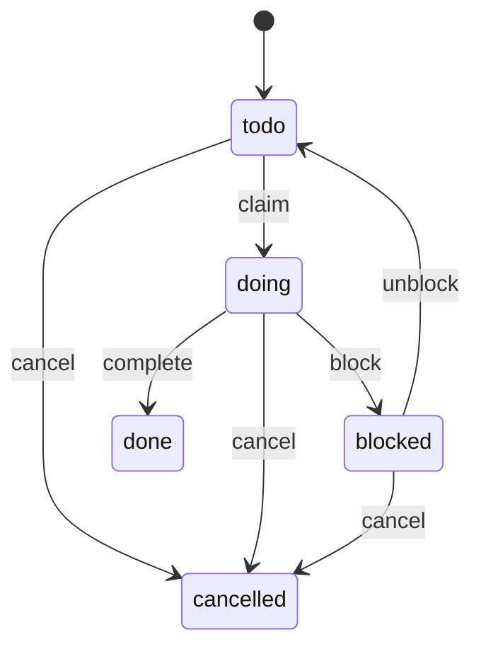

# specdojoコマンド利用ガイド

本ドキュメントでは、SpecDojo における **Gitベースのプロジェクト実行管理ツール `specdojo` CLI** の利用方法を説明します。

`specdojo` は以下を Git リポジトリ内で管理することを目的としています。

- スケジュール定義（`sch-*.yaml`）
- 実行イベント（`exec/events/*.json`）
- 実行状態・CPM等の生成物（`generated/`）

## 1. 概要

`specdojo` は以下の機能を提供します。

- スケジュール定義の検証
- 実行イベントの記録
- 実行状態の生成
- Readyタスク抽出
- CPM（Critical Path Method）計算
- クリティカルパス算出
- スケジュール差分検出
- Agent安全実行（排他ロック）

## 2. ディレクトリ構成

例:

```text
repo-root/
├─ specdojo.config.json
├─ .env
├─ docs/
│  └─ ja/
│     └─ sdh-ja-projects/
│        └─ prj-0001/
│           ├─ 060-schedule/
│           │  ├─ sch-milestones.yaml
│           │  ├─ sch-governance.yaml
│           │  ├─ sch-design.yaml
│           │  └─ sch-design-structure.yaml
│           └─ 070-execution/
│              ├─ exec/
│              │  ├─ events/
│              │  └─ .locks/
│              └─ generated/
└─ tools/
   └─ dojo/
```

## 3. 設定

### 3.1. `specdojo.config.json`

複数プロジェクトを扱うための **プロジェクトレジストリ**です。

例:

```json
{
  "version": 1,
  "projects": {
    "shj-0001": {
      "schedule_path": "docs/ja/sdh-ja-projects/prj-0001/060-schedule",
      "execution_path": "docs/ja/sdh-ja-projects/prj-0001/070-execution",
      "members_path": "docs/ja/sdh-ja-projects/prj-0001/040-project-management/010-management-plan/members.yaml"
    }
  }
}
```

`projects.<id>` には `schedule_path`、`execution_path`、必要に応じて `members_path` を指定します。

### 3.2. `.env`（任意）

ローカル開発者用の簡易設定です。

```bash
SPECDOJO_PROJECT=shj-0001
```

または

```bash
SPECDOJO_SCHEDULE_PATH=docs/ja/sdh-ja-projects/prj-0001/060-schedule
SPECDOJO_EXECUTION_PATH=docs/ja/sdh-ja-projects/prj-0001/070-execution
```

### 3.3. プロジェクトパス解決順序

`specdojo` は schedule path と execution path を同じ入力元から解決します。

1. `--project` で指定したプロジェクト ID を `specdojo.config.json` から解決
2. `SPECDOJO_SCHEDULE_PATH` と `SPECDOJO_EXECUTION_PATH` をセットで解決
3. `SPECDOJO_PROJECT` で指定したプロジェクト ID を `specdojo.config.json` から解決

- `--project` を使う場合は、`specdojo.config.json` の `projects.<id>.schedule_path` と `projects.<id>.execution_path` を使います。
- `SPECDOJO_PROJECT` を使う場合も、`specdojo.config.json` に定義済みのプロジェクト ID から両方を解決します。
- 直接環境変数で指定する場合は、`SPECDOJO_SCHEDULE_PATH` と `SPECDOJO_EXECUTION_PATH` を両方指定します。

## 4. スケジュールファイル

スケジュールは YAML で管理します。

```bash
sch-milestones.yaml
sch-auth.yaml
sch-auth-api.yaml
```

内容例:

```yaml
tasks:
  - id: T-AUTH-API-020
    name: implement login api
    duration_days: 2
    depends_on:
      - T-AUTH-API-010
```

## 5. 実行イベント

作業履歴は **append-only JSONイベント**として保存されます。

保存場所:

```bash
exec/events/
```

例:

```json
{
  "v": 1,
  "ts": "2026-03-05T03:10:00Z",
  "type": "claim",
  "task_id": "T-AUTH-API-020",
  "by": "agent-1",
  "msg": "start implementation"
}
```

## 6. 生成ファイル

`specdojo exec build` により以下が生成されます。

```bash
generated/
├─ exec.jsonl
├─ state.json
├─ ready.md
├─ ready.json
├─ claim-next.json
├─ cpm.json
├─ cpm.md
├─ critical-path.md
├─ schedule-hash.json
├─ schedule-diff.md
└─ metadata.json
```

## 7. 初期セットアップ

`npm link` は使いません。

このリポジトリでは `npm install` 後に `tools/dojo` がビルドされ、VS Code 統合ターミナルでは `node_modules/.bin` が `PATH` に追加されます。新しいターミナルを開けば、以降は `npx` なしで `specdojo` を直接実行できます。

```bash
npm install
specdojo config init
```

VS Code 統合ターミナル以外では `PATH` が通らないため、必要に応じて以下を使ってください。

```bash
./node_modules/.bin/specdojo config init
```

### 7.1. config作成

```bash
specdojo config init
```

### 7.2. プロジェクト一覧

```bash
specdojo project list
```

## 8. パス確認

```bash
specdojo exec where --project shj-0001
```

出力例:

```bash
schedule-path: /repo/.../060-schedule
execution-path: /repo/.../070-execution
exec/events : .../070-execution/exec/events
generated   : .../070-execution/generated
scheduler-lock: .../070-execution/exec/.locks/scheduler.lock
```

## 9. 検証

```bash
specdojo exec validate --project shj-0001
```

検証内容:

- スケジュール依存関係
- 循環依存
- イベントJSON構造
- task_id存在チェック

## 10. 生成

```bash
specdojo exec build --project shj-0001
```

生成:

- state snapshot
- ready list
- ordered ready queue JSON
- next claim target JSON
- CPM
- schedule diff

`ready.md` は人間向けの ready 一覧で、`critical-first` の順序と `fifo` の順序を併記します。

`ready.json` は機械向けの ready キューで、strategy ごとの順序付き task ID と CPM 情報を持ちます。

`claim-next.json` は strategy ごとの次の claim 対象を持ちます。

## 11. 実行イベントコマンド

### 11.1. claim

```bash
specdojo exec claim \
  --project shj-0001 \
  --task T-AUTH-API-020 \
  --by agent-1 \
  --msg "start implementation"
```

### 11.2. complete

```bash
specdojo exec complete \
  --project shj-0001 \
  --task T-AUTH-API-020 \
  --by agent-1 \
  --msg "done"
```

### 11.3. block

```bash
specdojo exec block \
  --project shj-0001 \
  --task T-AUTH-API-020 \
  --by agent-1 \
  --msg "waiting for spec"
```

### 11.4. unblock

```bash
specdojo exec unblock \
  --project shj-0001 \
  --task T-AUTH-API-020 \
  --by agent-2 \
  --msg "spec clarified"
```

### 11.5. cancel

```bash
specdojo exec cancel \
  --project shj-0001 \
  --task T-AUTH-API-020 \
  --by agent-1 \
  --msg "scope removed"
```

## 12. scheduler

自動タスク取得:

```bash
specdojo exec scheduler --project shj-0001 --by agent-1
```

`specdojo exec scheduler` は `critical-first` または `fifo` の戦略で `ready.json` / `claim-next.json` と同じ順序規則を使って claim 対象を選びます。

Dry-run:

```bash
specdojo exec scheduler --dry-run
```

## 13. ロック

以下コマンドは **プロジェクトロック**を使用します。

- `claim`
- `complete`
- `block`
- `unblock`
- `cancel`
- `scheduler`

ロック位置:

```bash
exec/.locks/scheduler.lock
```

## 14. 状態遷移

状態:

```bash
todo
doing
blocked
done
cancelled
```

### 14.1. 状態遷移表

| current | command  | next      | guard       |
| ------- | -------- | --------- | ----------- |
| todo    | claim    | doing     | 依存完了    |
| doing   | block    | blocked   | 同一actor   |
| blocked | unblock  | todo      | blockedのみ |
| doing   | complete | done      | 同一actor   |
| todo    | cancel   | cancelled | 可          |
| doing   | cancel   | cancelled | 同一actor   |
| blocked | cancel   | cancelled | 可          |

### 14.2. 遷移図



## 15. 推奨ワークフロー

```bash
specdojo exec validate
specdojo exec build
specdojo exec scheduler --by agent-1
specdojo exec complete ...
specdojo exec build
```

## 16. lefthook例

```yaml
pre-commit:
  commands:
    validate:
      run: ./node_modules/.bin/specdojo exec validate --project shj-0001

pre-push:
  commands:
    build:
      run: ./node_modules/.bin/specdojo exec build --project shj-0001
```

## 17. Agent利用ガイド

推奨利用方法:

- schedulerで取得
- claimで開始
- completeで終了
- blockで停止

actor例:

```bash
agent-backend
agent-docs
agent-test
```

## 18. まとめ

`specdojo` は以下を実現します。

- Gitネイティブなプロジェクト管理
- append-only実行ログ
- deterministic生成物
- safe multi-agent execution
- CPM / Critical Path計算
- schedule diff検出
- AI Agent向けタスク取得
