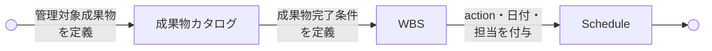

# 成果物カタログからスケジュールへの展開ガイド

SpecDojo Deliverables Catalog to Schedule Guide

SpecDojo における成果物カタログからスケジュールへの展開ルールとガイドラインを定義します。成果物カタログで定義した管理対象成果物を、WBS 定義で完了条件とともに分解し、Schedule 定義で実行計画に落とし込む一連の流れを示します。

## 成果物カタログとWBS、Scheduleの関係

### 基本方針

- **成果物カタログ** は「**何を管理対象とするか**」
- **WBS** は「**何を完了すればスコープを満たすか**」、
- **Schedule** は「**いつ・誰が・どの順で作業するか**」

を扱います。

### 責務の違い

| 観点       | 成果物カタログ                   | WBS                         | Schedule               |
| ---------- | -------------------------------- | --------------------------- | ---------------------- |
| 主目的     | 成果物の定義                     | スコープ完了単位の定義      | 実行計画               |
| 問い       | 何を管理対象にするか             | 何が完了すればよいか        | いつ誰が何をするか     |
| 単位       | 成果物                           | スコープ完了単位            | 実行タスク             |
| 成果物ID   | 定義する                         | 参照する                    | 参照する               |
| 成果物パス | 持つ                             | 原則持たない                | 原則持たない           |
| 完了条件   | 原則持たない                     | 持つ                        | 原則持たない           |
| action     | 持たない                         | 持たない                    | 持つ                   |
| 日付       | 持たない                         | 持たない                    | 持つ                   |
| 担当者     | 原則持たない                     | 原則持たない                | 持つ                   |
| 依存関係   | 成果物間の根拠程度               | スコープ上の依存            | 実行順序の依存         |
| status     | カタログ定義文書の状態として持つ | WBS定義文書の状態として持つ | タスクの実行状態を持つ |

### 管理単位の考え方

成果物カタログでは、全成果物を定義する。成果物の種別は、

1. `work`（作成する成果物）
2. `control`（管理用のドキュメント）
3. `generated`（自動生成したドキュメント等）

WBSへの展開対象は原則 `work` のみとする。ただし、プロジェクト遂行上、作成・更新を明示的に管理する必要がある `control` は例外的にWBS展開対象にできる。`generated` は原則対象外とする。

管理をシンプルにするため、成果物カタログとWBS, Scheduleの管理単位とその関係は次のように定めます。

- **原則**: 1成果物 = 1 WBS item (作業分解単位)
- **実行管理**: 1 WBS item = 原則1 Schedule item (タスク)
- **例外**: 必要な場合のみ Schedule item を分割できる

> 例外の例： レビュー、承認、公開、外部待ち、長期間作業は、Schedule itemを分ける。

### 管理単位のID付けルール

- 成果物の `id` は frontmatter の `id` を使用する。
  - frontmatter の `id` は SpecDojo リポジトリ内でユニークになるようにIDを付ける。
  - プロダクトドキュメントの`id`は`<prefix>-<term>`形式とする（例: `uts-index`, `utd-<term>`）。
  - プロジェクトドキュメントの`id`は`<project-id>:<prefix>-<term>`形式とする（例: `prj-0001:uts-index`）。
- 成果物については、成果物カタログの中で略称を定める。略称は、ドメインの略称`<DOMAIN>` と 成果物の略称`<ARTIFACT>`を定義し、`<DOMAIN>-<ARTIFACT>` はプロジェクト内でユニークになるように定める。
- WBS item の `id` はこの略称をベースに、`WBS-<DOMAIN>-<ARTIFACT>` 形式で付ける（例: `WBS-PJD-OVERVIEW`）。
- Schedule itemの `id` は先にScheduleを管理するまとまり（グループ）を定義し、`SCH-<GROUP>-<ARTIFACT>-<NNN>` 形式で付ける（例: `SCH-PJD-OVERVIEW-010`）。

### 定義の流れ

