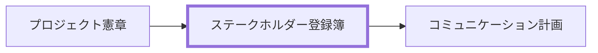

# ステークホルダー登録簿 作成ルール

Stakeholder Register Documentation Rulebook

本ドキュメントは、プロジェクトの関係者を識別し、影響度と関与方針を可視化するためのルールです。
関係者との合意形成とコミュニケーション統制に使える粒度を定義します。

## 1. 全体方針

- 本ルールの対象は、ステークホルダー登録簿（関係者の識別、分析、対応方針）です。
- 目的は、意思決定者・影響者・実行者の責務を明確化し、合意形成の遅延リスクを抑えることです。
- プロジェクト概要/憲章で定義した背景と認可情報を入力として扱い、本書で重複管理しません。
- PMBOK 観点では、ステークホルダー特定、エンゲージメント計画、監視更新に必要な情報を含めます。
- 曖昧語を避け、更新条件、責任者、証跡を記載します。

## 2. 位置づけと用語定義

### 2.1. 位置づけ（他ドキュメントとの関係）

### 2.2. 用語定義（本ルール内）

| 用語             | 定義                                                          |
| ---------------- | ------------------------------------------------------------- |
| ステークホルダー | プロジェクトの成果に影響を与える、または影響を受ける個人/組織 |
| 影響度           | 意思決定や実行に与える影響の強さ                              |
| 関心度           | プロジェクト成果に対する関与意欲・関心の高さ                  |
| エンゲージメント | 関係者が期待される状態で関与している度合い                    |
| 対応方針         | 関係者ごとに定義する情報提供・調整・合意の進め方              |

## 3. ファイル命名・ID規則

### 3.1. 配置（推奨）

- `docs/ja/projects/<project-id>/010-プロジェクト定義/` 配下への配置を推奨します。
- 関係者ごとの補足資料（議事録、合意記録、依頼メモ）は同階層に配置し、登録簿から参照します。

### 3.2. ドキュメントID（推奨）

- 推奨: `<project-id>-prj-stakeholder-register`
  - 例: `prj-0001-prj-stakeholder-register`

### 3.3. ファイル名（推奨）

- 推奨: `prj-stakeholder-register.md`
- 日本語ファイル名の場合: `ステークホルダー登録簿.md`

## 4. 推奨 Frontmatter 項目

### 4.1. 設定内容

- 参照スキーマ: [docs/shared/schemas/deliverable-frontmatter.schema.yaml](../../../../shared/schemas/deliverable-frontmatter.schema.yaml)
- メタ情報ルール: [meta-deliverable-metadata-rulebook.md](meta-deliverable-metadata-rulebook.md)

| 項目       | 説明                                    | 必須 |
| ---------- | --------------------------------------- | ---- |
| id         | `<project-id>-prj-stakeholder-register` | ○    |
| type       | `project` 固定                          | ○    |
| status     | `draft` / `ready` / `deprecated`        | ○    |
| based_on   | 憲章、体制資料、既存連絡網              | 任意 |
| supersedes | 置き換え対象の旧文書 ID                 | 任意 |

### 4.2. 推奨ルール

- 個人情報を含む場合は記載範囲を最小化し、必要時は参照先へ分離します。
- 改訂時は、変更理由と変更対象（追加/削除/役割変更）を記録します。

## 5. 本文構成（標準テンプレ）

### 5.1. ステークホルダー登録簿（Stakeholder Register）

| 番号 | 見出し                 | 必須 | 内容（要点）                           |
| ---- | ---------------------- | ---- | -------------------------------------- |
| 1    | 関係者一覧             | ○    | ステークホルダー識別、役割、所属、責任 |
| 2    | 影響度/関心度分析      | ○    | 影響度、関心度、期待、懸念             |
| 3    | エンゲージメント方針   | ○    | 期待状態、現状評価、対応方針           |
| 4    | コミュニケーション要件 | ○    | 連絡頻度、チャネル、責任者、証跡       |
| 5    | 変更履歴と見直し条件   | 任意 | 更新トリガー、見直し周期、承認者       |

## 6. 記述ガイド

### 6.1. 共通

- 1 ステークホルダーにつき、責任、期待、リスク、対応方針を 1 セットで記載します。
- 関係者の分類は固定語彙（スポンサー、意思決定者、実行責任者、利用者など）を使います。
- 章参照は章番号ではなく章タイトルで記載します。

### 6.2. 影響度/関心度分析

- 影響度と関心度は High/Medium/Low 等で定義し、評価基準を明示します。
- 高影響・低関心の関係者は、巻き込み施策を別途定義します。

推奨表（関係者分析）:

| ID  | 関係者 | 役割 | 影響度 | 関心度 | 主な期待 | 主な懸念 |
| --- | ------ | ---- | ------ | ------ | -------- | -------- |

### 6.3. エンゲージメント方針

- 現状と目標のエンゲージメント状態を比較し、差分対策を記載します。
- 対応方針には責任者と実施期限を含めます。

推奨表（対応方針）:

| ID  | 現状 | 目標 | 対応方針 | 責任者 | 期限 | 証跡 |
| --- | ---- | ---- | -------- | ------ | ---- | ---- |

## 7. 禁止事項

| 項目                        | 理由                                 |
| --------------------------- | ------------------------------------ |
| 役割や責任の未記載          | 調整漏れと責任不明確を招くため       |
| 影響度/関心度の根拠なし評価 | 対応優先度を誤るため                 |
| 個人情報の過剰記載          | 情報管理リスクを高めるため           |
| 関係者更新の未記録          | 合意形成プロセスの追跡ができないため |

## 8. サンプル（最小でも可）

- 参照: [prj-stakeholder-register-sample.md](../samples/prj-stakeholder-register-sample.md)

## 9. 生成 AI への指示テンプレート

- 参照: [prj-stakeholder-register-instruction.md](../instructions/prj-stakeholder-register-instruction.md)
