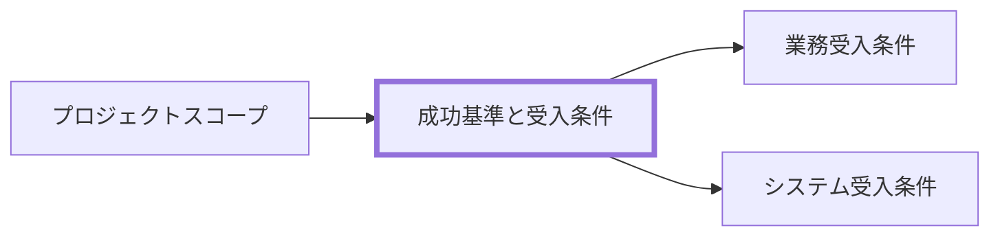

# 成功基準と受入条件 作成ルール

Success Criteria and Acceptance Criteria Documentation Rulebook

本ドキュメントは、プロジェクト成功判定と受入可否判定を定義するためのルールです。
判定基準、責任者、証跡を揃え、完了判断のぶれを防ぎます。

## 1. 全体方針

- 本ルールの対象は、成功基準と受入条件（業務/システムの判定条件）です。
- 目的は、完了定義と受入判定の基準を測定可能な形で固定することです。
- 成功条件は「条件」「判定基準」「測定方法」「判定時期」「責任者」を 1 セットで定義します。
- PMBOK 観点では、品質マネジメント、受入判定、監視統制の証跡に必要な情報を含めます。
- 実装詳細は扱わず、判定に必要な要求レベルの条件のみを扱います。

## 2. 位置づけと用語定義

### 2.1. 位置づけ（他ドキュメントとの関係）

### 2.2. 用語定義（本ルール内）

| 用語     | 定義                                               |
| -------- | -------------------------------------------------- |
| 成功基準 | プロジェクトの成果が達成されたことを示す判定条件   |
| 受入条件 | 成果物を利用側が受け入れ可能と判断する条件         |
| 完了定義 | 完了とみなすために満たすべき必須条件               |
| 証跡     | 判定結果を確認できる記録（報告書、ログ、議事録等） |
| 承認者   | 判定結果に対して最終責任を持つ役割                 |

## 3. ファイル命名・ID規則

### 3.1. 配置（推奨）

- `docs/ja/projects/<project-id>/020-プロジェクトスコープ/` 配下への配置を推奨します。
- 判定結果の証跡（評価表、受入記録）は参照可能な場所に配置します。

### 3.2. ドキュメントID（推奨）

- 推奨: `<project-id>-prj-success-criteria-and-acceptance-criteria`
  - 例: `prj-0001-prj-success-criteria-and-acceptance-criteria`

### 3.3. ファイル名（推奨）

- 推奨: `prj-success-criteria-and-acceptance-criteria.md`
- 日本語ファイル名の場合: `成功基準と受入条件.md`

## 4. 推奨 Frontmatter 項目

### 4.1. 設定内容

- 参照スキーマ: [docs/shared/schemas/deliverable-frontmatter.schema.yaml](../../../../shared/schemas/deliverable-frontmatter.schema.yaml)
- メタ情報ルール: [meta-deliverable-metadata-rulebook.md](meta-deliverable-metadata-rulebook.md)

| 項目       | 説明                                                        | 必須 |
| ---------- | ----------------------------------------------------------- | ---- |
| id         | `<project-id>-prj-success-criteria-and-acceptance-criteria` | ○    |
| type       | `project` 固定                                              | ○    |
| status     | `draft` / `ready` / `deprecated`                            | ○    |
| based_on   | スコープ文書、憲章、品質方針                                | 任意 |
| supersedes | 置き換え対象の旧文書 ID                                     | 任意 |

### 4.2. 推奨ルール

- 成功基準と受入条件は混在させず、種別を明示して管理します。
- 閾値が未確定の場合は `_UNDECIDED_:` を使い、確定期限と担当を記載します。

## 5. 本文構成（標準テンプレ）

### 5.1. 成功基準と受入条件（Success Criteria and Acceptance Criteria）

| 番号 | 見出し               | 必須 | 内容（要点）                   |
| ---- | -------------------- | ---- | ------------------------------ |
| 1    | 判定対象と適用範囲   | ○    | 何を判定するか、対象外は何か   |
| 2    | 成功基準             | ○    | 指標、目標値、判定方法、責任者 |
| 3    | 受入条件             | ○    | 受入項目、合否基準、前提条件   |
| 4    | 判定手順と証跡       | ○    | 判定タイミング、証跡、承認経路 |
| 5    | 例外条件と未解決事項 | 任意 | 保留条件、暫定対応、解決期限   |

## 6. 記述ガイド

### 6.1. 共通

- 各条件は測定可能で再現可能な表現にします。
- 章参照は章番号ではなく章タイトルで記述します。
- 条件追加/変更時は、変更理由と影響範囲を追記します。

### 6.2. 成功基準

- KPI のような定量指標だけでなく、運用定着や利用者受容など定性条件も明示します。
- 各条件に判定タイミングと責任者を必ず設定します。

推奨表（成功基準）:

| ID  | 条件 | 判定基準 | 測定方法 | 判定時期 | 責任者 |
| --- | ---- | -------- | -------- | -------- | ------ |

### 6.3. 受入条件

- 業務受入とシステム受入を区別して記載します。
- 否決時の再判定条件（再試験、是正期限、承認者）を定義します。

推奨表（受入条件）:

| ID  | 種別 | 条件 | 合格基準 | 証跡 | 承認者 |
| --- | ---- | ---- | -------- | ---- | ------ |

## 7. 禁止事項

| 項目                                   | 理由                       |
| -------------------------------------- | -------------------------- |
| 「十分に」「問題ない」等のみで基準記載 | 合否判定ができないため     |
| 測定方法なしの閾値記載                 | 再現性が担保できないため   |
| 承認者不在の受入判定                   | 最終責任が不明確になるため |
| 証跡なしの合格宣言                     | 監査と追跡ができないため   |

## 8. サンプル（最小でも可）

- 参照: [prj-success-criteria-and-acceptance-criteria-sample.md](../samples/prj-success-criteria-and-acceptance-criteria-sample.md)

## 9. 生成 AI への指示テンプレート

- 参照: [prj-success-criteria-and-acceptance-criteria-instruction.md](../instructions/prj-success-criteria-and-acceptance-criteria-instruction.md)
