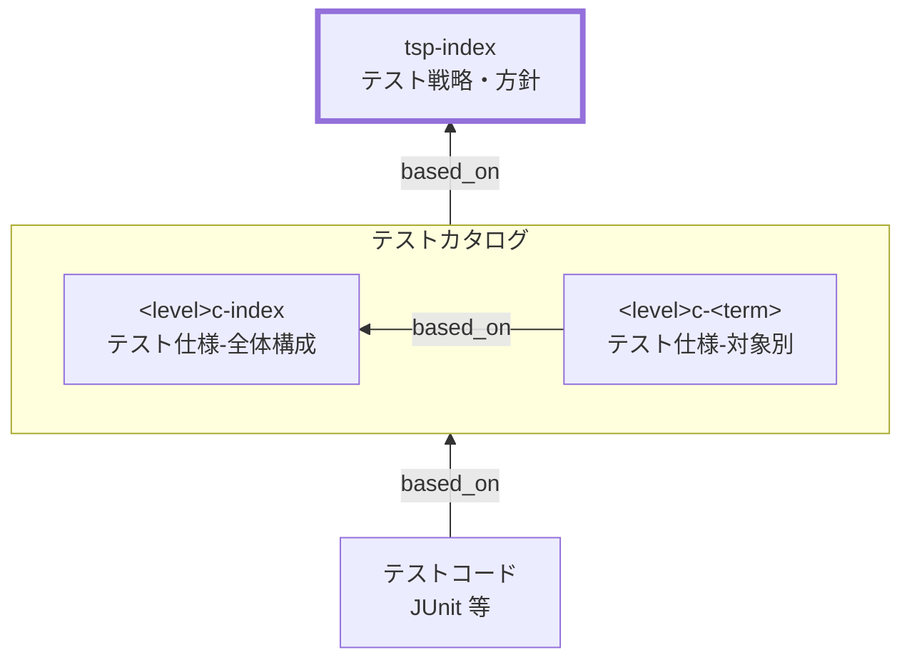

# テスト戦略・方針 作成ルール

Test Strategy and Policy (TSP) Index Documentation Rules

本ドキュメントは、品質保証・テスト設計のために **テスト戦略・方針を統一形式で記述する標準ルール**です。
TSP は「全体として、どのようにテストで品質を担保するか」を明文化し、テスト設計・実施・受入判断の認識ズレを防ぎます。

TSP は「個別のテストケース集」ではありません。
各テストレベル（単体/内部結合/外部結合/総合/受入など）の **目的・範囲・体制**、および **フェーズ間の入口／出口条件（品質ゲート）** を合意することが主目的です。

## 1. 全体方針

- TSP は **プロジェクト/システムのテストの全体像**（考え方）を定義します。
  - 例: 「ドメインロジックは単体〜結合まで自動化し、UI は主要シナリオのみ E2E を行う」
- テスト戦略は全体の考え方・分配、テスト方針は各レベル・領域での具体的な判断基準を指します。
- TSP は下位成果物（各テストレベルのテストカタログ（`<level>c-index`/`<level>c-<term>`）、テストコード／CI成果物、受入条件（SAC/BAC））を導く **上位方針**です。
  - 下位成果物に“何をどこまで書くか”の境界は、[meta-test-document-scope-rules.md](meta-test-document-scope-rules.md) の責務分離に従って定義します。
- TSP では、観点/条件を設計するための **共通原則（定義粒度・分類・判定軸）** を定義し、レベル共通の採用基準・分配方針は `*c-index`、対象別の観点→ケース化は `*c-<term>` に委譲します。
- TSP では各テストレベルについて、**保証すること（合格したら何が言えるか）** と **やらないこと（何をこのレベルの責務にしないか）** をセットで明文化します。
- 曖昧な表現（例: 「十分にテストする」「品質を確保する」）は禁止し、
  - スコープ（対象/対象外）
  - 品質ゲート（入口/出口条件）
  - エビデンス（何をもって合否判断するか）
    を明確に書きます。
- クリック手順の逐語列挙は避け、**業務行為/入力/期待結果**として要約します。
- 実装詳細（例: 物理テーブル名、SQL全文、実装クラス/関数名、特定ライブラリの設定値）は記載しません。
- TSP は原則 **`tsp-index` 1本** に統一します。分割ルールは [セクション 3](#3-ファイル命名id規則) 参照。
- 観点/条件の詳細は、`*c-index`（共通ルール）と `*c-<term>`（対象別）で管理します。

## 2. 位置づけと用語定義

### 2.1. 位置づけ（他ドキュメントとの関係）

TSP と下位ドキュメント（テストカタログ、テストコード／CI成果物）の関係を示します。



`<level>`はテストレベル（ut:単体、it:内部結合、et:外部結合、st:総合、at:受入）

### 2.2. 用語定義

| 用語                   | 定義                                                                                       |
| ---------------------- | ------------------------------------------------------------------------------------------ |
| スコープ               | テスト対象（含む）と対象外（除外）                                                         |
| 入口条件               | そのテストレベルを開始してよい状態（前提、準備完了条件）                                   |
| 出口条件               | そのテストレベルを完了（合格）してよい条件（合格基準、残課題扱い）                         |
| エビデンス             | 合否判定の根拠（レポート、メトリクス、ログ、記録、承認など）                               |
| 回帰（リグレッション） | 変更により既存機能が壊れていないことを確認する試験                                         |
| 重大度                 | 不具合の影響度（業務影響/停止有無/回避可否など）                                           |
| スタブ                 | テスト対象外の依存を置き換え、決め打ちの応答を返すことでテスト対象を動かすための代替実装   |
| モック                 | スタブの一種で、依存がどのように呼び出されたか（回数・引数・順序など）を検証できる代替実装 |
| スモーク               | システムの基本的な動作確認を目的とした簡易試験                                             |

## 3. ファイル命名・ID規則

ID 命名ルールは [meta-id-and-file-naming-rules.md](meta-id-and-file-naming-rules.md) に従います。

- `id`: 小文字ハイフン形式で `tsp-<term>` の構造とします。
  - **デフォルト: `tsp-index`** （全体方針の入口・概説）
  - 分割が必要な場合：方針の対象範囲が分かる ID を使用
    - 例: `tsp-nfr-testing`（非機能試験方針）
    - 例: `tsp-regression`（回帰方針）
  - 個別方針が多数になった場合：`tsp-index` を別途置きナビゲーション用とする（オプション）
- ファイル名は `tsp-<番号>-<短い日本語名>.md`（例: `tsp-0010-全体方針.md`）等の一意な名前を推奨。

## 4. 推奨 Frontmatter 項目

### 4.1. 設定内容

Frontmatter は共通スキーマに従います（参照: [docs/shared/schemas/spec-frontmatter.schema.yaml](../../../shared/schemas/spec-frontmatter.schema.yaml) / [meta-document-metadata-rules.md](meta-document-metadata-rules.md)）。

| 項目       | 説明                                               | 必須 |
| ---------- | -------------------------------------------------- | ---- |
| id         | TSP ID（`tsp-...`）                                | ○    |
| type       | `test` 固定                                        | ○    |
| title      | 方針名（例: テスト戦略・方針: 全体）               | ○    |
| status     | `draft`/`ready`/`deprecated`                       | ○    |
| part_of    | 集約ドキュメントへの所属（例: `tsp-index`）        | 任意 |
| based_on   | 参照する仕様ID（BAC/NFR/SAC/DEC/TSL/UIS/EAPIS 等） | 任意 |
| supersedes | 置き換え関係（古仕様→新仕様）                      | 任意 |

### 4.2. 推奨ルール

- `part_of`: 複数ファイルに分割した場合、集約ドキュメント（`tsp-overview`など）を指定。
- `based_on`: 方針の根拠となる主要仕様（BAC/NFR/SAC/DECなど）を列挙し、スコープを明確にする。

## 5. 本文構成（標準テンプレ）

各 TSP は以下の見出しを **この順で** 記載します。

1. 概要
2. テストレベル一覧（目的/範囲/体制）と観点/条件設計の共通原則
3. スコープ（対象/対象外）
4. テスト環境・テストデータ（スタブ/モック方針を含む）
5. 入口／出口条件（品質ゲート）
6. 自動化・回帰方針（任意だが推奨）
7. 不具合管理方針（任意）
8. 品質メトリクス（任意）
9. メモ / 将来課題

## 6. 記述ガイド

### 6.1. 概要

- 1〜3文で「何の品質を、どの範囲に対して、どのように担保するか（全体方針）」を書きます。
- 可能なら対象仕様（BAC/NFR/主要機能）を言及し、`based_on` と整合させます。

### 6.2. テストレベル一覧

テストレベルは **一覧表** で定義します。

#### 6.2.1. 最小（必須）

最小構成（必須）の列は次を推奨します。

| 列             | 目的                                           |
| -------------- | ---------------------------------------------- |
| テストレベル   | 単体/結合/システム/受け入れ等                  |
| 目的           | そのレベルで何を保証したいか                   |
| 範囲           | 対象（例: モジュール/画面/API/バッチ/外部I/F） |
| 実施体制・備考 | 実施主体、ツール、自動化方針、除外など         |

記述のコツ:

- “何をそのレベルで確認し、何を下位/上位に委ねるか”の境界をはっきりさせます。
- 「範囲」は成果物（モジュール/画面/API/バッチ等）で書き、個別ケースは下位文書に委ねます。

#### 6.2.2. 推奨（責任分界を明確化）

可能なら、次の列を追加して「合格の意味」と「非目的（やらないこと）」を明確にします。

| 列                         | 目的                                                                 |
| -------------------------- | -------------------------------------------------------------------- |
| 保証すること（合格の意味） | このレベルが合格したときに、ステークホルダーに対して何を保証できるか |
| やらないこと（非目的）     | このレベルでは確認しないこと（＝上位/下位に委ねること）              |

例（外部I/Fの責任分界）:

| テストレベル   | 保証すること（合格の意味）                                                                    | やらないこと（非目的）                                                                                         | 前提（下位で保証済み）                      |
| -------------- | --------------------------------------------------------------------------------------------- | -------------------------------------------------------------------------------------------------------------- | ------------------------------------------- |
| 単体テスト     | I/Fに渡すデータの生成・変換・バリデーションが仕様どおり                                       | 実ネットワーク経由の導通、相手システムの状態差分に起因する挙動                                                 | ドメイン/計算/バリデーションの網羅          |
| 外部結合テスト | 外部I/Fの契約（認証/リクエスト/レスポンス形式）と代表的な異常（タイムアウト等）への対処が成立 | 外部システムを含む業務の一貫性の完全保証（相手側の内部整合・SLA・全機能網羅）。一貫テストは導通/スモークに限定 | 内部結合で主要フローが成立している          |
| 総合/受入      | BAC/SACに紐づく主要シナリオが成立し、外部I/Fを含むE2Eが合意した範囲で通る                     | 外部システムの品質そのもの（相手側の障害・性能・データ品質の全面保証）                                         | 外部結合でI/F契約と代表エラーが成立している |

#### 6.2.3. 観点/条件設計の共通原則（必須）

観点/条件は、次の原則で定義します（詳細の具体化は `*c-index` / `*c-<term>` で行う）。

| 項目     | ルール                                                                                                            | 最低限の記述要素                                                                |
| -------- | ----------------------------------------------------------------------------------------------------------------- | ------------------------------------------------------------------------------- |
| 定義粒度 | 1観点は「1つの合否命題」で定義する（1行に複数命題を混在させない）。1条件は「状態/入力の差分を表す1単位」とする。  | 観点名、条件名、期待結果を 1:1:1 で対応づける                                   |
| 分類     | 観点/条件は最低限「正常・境界・例外・状態（遷移）」で分類する。非機能や運用起因が重要な場合は追加分類を定義する。 | 分類名、採用理由、どのレベルで担保するか                                        |
| 判定軸   | 判定は「期待結果」「観測点」「合格条件」の3点で定義する。曖昧語（十分/適切/問題ない）は使わない。                 | 期待結果（何が起きるか）、観測点（どこで確認するか）、合格条件（Pass/Fail基準） |

補足:

- レベル共通の採用基準・分配方針は `*c-index` に記載する。
- 対象別の観点→ケース化と証跡リンクは `*c-<term>` に記載する。
- 具体値・網羅展開・実行結果はテストコード/CI成果物を正とする。

### 6.3. スコープ（対象/対象外）

TSP は必ず「どこまでがテスト対象か」を定義します。

- 対象（含む）
- 対象外（除外）
- 除外の理由（任意）

例:

- 対象: 主要業務フロー（販売/発注/入荷/棚卸）、主要 API、主要バッチ
- 対象外: 外部サービス自体の SLA（外部契約に委ねる）、外部端末の物理故障

### 6.4. テスト環境・テストデータ

環境やデータの前提が曖昧だと、試験結果が比較できません。
次を“方針”として定義します。

- 環境区分（例: 開発/内部結合/外部結合/総合/受入）と用途
- データ方針（匿名化、代表データ量、マスタの扱い）
- 外部I/Fの扱い（実接続/スタブ/モック、切り替え方針）
- 外部I/Fの範囲（導通/契約/データ内容/業務一貫性）と、どこまでを対象にするか（下表）
- スタブ/モック選択基準（共通戦略）
  - 外部I/Fは原則スタブ（契約確認目的ならサンドボックス優先）
  - 内部依存はテストレベルに応じて、単体/内部結合はモック・限定実接続、総合/受入は実接続を優先
  - タイミング/リトライ/冪等性の検証が目的なら、実接続または動的挙動を再現できるスタブを使用
  - 性能・スループット検証では実接続を基本とし、代替する場合は計測対象・誤差許容を明記

外部I/F（他システム連携）の範囲合意（チェックリスト）:

| 観点                 | 対象にしたときに確認すること（例）                                        | 備考                             |
| -------------------- | ------------------------------------------------------------------------- | -------------------------------- |
| 導通                 | 到達/認証/疎通（スモーク）                                                | ネットワーク・認証・疎通の成立   |
| 契約（コントラクト） | スキーマ、必須項目、コード値、エラー形式、タイムアウト/リトライ、冪等性等 | 外部結合での主要対象になりやすい |
| データ内容           | 生成根拠・変換・丸め/桁/NULLの扱い                                        | 主に自システム側の責務           |
| 業務一貫性           | 外部システムを含むE2E整合                                                 | 範囲を限定して合意するのが現実的 |

合意文の例:

- 外部I/Fとのテストは、外部結合で「導通＋契約（代表エラーを含む）」、総合/受入で「主要シナリオのスモーク」までを対象とする。
- 外部システムを含む業務一貫性の網羅は対象外とし、相手側の品質は契約と運用合意（SLA等）に委ねる。

### 6.5. 入口／出口条件（品質ゲート）

フェーズ間の入口／出口条件は、**合否判定できる形**で書きます。

推奨の書き方（表）:

| フェーズ/テストレベル | 入口条件（開始条件） | 出口条件（完了条件） | エビデンス（根拠） |
| --------------------- | -------------------- | -------------------- | ------------------ |
| 単体テスト            | …                    | …                    | …                  |
| 内部結合テスト        | …                    | …                    | …                  |
| 外部結合テスト        | …                    | …                    | …                  |
| 総合テスト            | …                    | …                    | …                  |
| 受け入れテスト        | …                    | …                    | …                  |

記述のコツ:

- 出口条件には「未解決不具合の扱い（重大度別の許容）」を含めます。
- 非機能の出口条件は、可能なら NFR/SAC と接続します（例: 「全 NFR を満たす」）。

### 6.6. 自動化・回帰方針（任意）

自動化は “やる/やらない” ではなく、**どこを自動化し、どこを手動で補うか** を決めます。

- 自動化の優先領域（例: ドメインロジック、計算、バリデーション、回帰）
- 手動で行う領域（例: UX の探索、端末差異、教育/運用リハーサル）
- 回帰の基本方針（例: 変更影響のある領域は自動回帰を必須）

### 6.7. 不具合管理方針（任意）

不具合管理は、テスト成果の解釈ブレを防ぐために記載してよいです。

- 重大度（例: Blocker/Critical/Major/Minor）と判断観点（業務影響/回避可否）
- 収束基準（出口条件との関係）
- 既知不具合の扱い（残課題/例外承認/ロールバック条件）

### 6.8. 品質メトリクス（任意）

合意が必要な場合のみ、最小限のメトリクスを定義します。

- 例: 自動テストの実行結果（Pass率）、主要シナリオの実施状況、重大不具合件数、性能の合否（NFR達成状況）

### 6.9. メモ / 将来課題

- 未確定の前提（例: ピーク時の定義、想定データ量、外部依存の SLA）
- 将来追加したい試験（例: DR 訓練、長期運用での監査手順、非機能の拡充）

### 6.10. よくある誤りと対策

| 誤り                         | 対策                                           |
| ---------------------------- | ---------------------------------------------- |
| テストレベルの役割分担が曖昧 | 「目的/範囲/体制」を表で固定する               |
| スコープが書かれていない     | 対象/対象外と除外理由を必ず明記する            |
| 入口/出口条件がない          | 品質ゲート（開始/完了条件）を表で定義する      |
| 自動化の範囲が不明           | 自動化領域と手動領域を分けて記述する           |
| 不具合が残ったまま“完了”扱い | 重大度別許容と例外承認ルールを出口条件に含める |

## 7. 禁止事項

| 項目                                            | 理由                                                                |
| ----------------------------------------------- | ------------------------------------------------------------------- |
| 物理テーブル名・物理カラム名・SQL全文           | 実装依存で変更に弱い                                                |
| 実装クラス/関数名、特定ライブラリの設定値の列挙 | 実装依存で変更に弱い                                                |
| クリック/画面遷移の逐語列挙                     | UI変更に弱い・本質が埋もれる                                        |
| 個別テストケースの大量列挙                      | 下位成果物（`<level>s-<term>`、テストコード、CI成果物）に委譲すべき |
| 「十分」「適切」「問題ない」等の曖昧表現        | 合否判定不能                                                        |
| 前提なしの数値（条件が不明）                    | 合意不能、再現不能                                                  |

## 8. サンプル（最小）

### 8.1. メタ情報

```yaml
---
id: tsp-overview
type: test
title: テスト戦略・方針: 全体（駄菓子屋販売管理システム）
status: draft
part_of: []
based_on:
  - bac-sale-checkout
  - bac-inventory-replenishment
  - nfr-performance
  - nfr-security
  - sac-performance
  - sac-disaster-recovery
supersedes: []
---
```

### 8.2. 概要

駄菓子屋販売管理システムの主要業務（販売/在庫/発注・入荷/棚卸/レポート）と外部決済・帳票I/F境界、および主要非機能（性能/可用性/セキュリティ）を対象に品質を担保する。
担保方法は、単体→内部結合→外部結合→総合→受入の順に確認し、入口／出口条件（品質ゲート）とエビデンス（BAC/SAC含む）で合否を判定する。

### 8.3. テストレベル一覧

| テストレベル   | 目的                         | 範囲                                           | 実施体制・備考                                           |
| -------------- | ---------------------------- | ---------------------------------------------- | -------------------------------------------------------- |
| 単体テスト     | ドメインロジックの正確性担保 | 計算・バリデーション・分岐                     | 開発者。自動化必須。外部I/Fはモック                      |
| 内部結合テスト | 社内モジュール連携の担保     | 画面→API→サービス→DB（テスト用）               | 開発者。主要フローの最短経路を確認                       |
| 外部結合テスト | 外部I/F境界の担保            | 決済I/F、ファイル連携（スタブ/サンドボックス） | 開発者・テスト担当。タイムアウト/リトライ/重複防止を重視 |
| 総合テスト     | E2E成立の確認                | 販売→在庫→発注→入荷→棚卸→レポート              | テスト担当・業務担当。代表データ量で実運用相当を確認     |
| 受け入れテスト | BAC/SACで合否判定            | 受入シナリオ（BAC/SAC準拠）                    | 業務担当。承認をもって完了                               |

補足: 結合テストは「社内境界（内部）」と「外部境界（外部）」で分け、切り分け容易性を上げる。

#### 8.3.1. 観点/条件設計の共通原則（例）

| 項目     | ルール（例）                                                                                              |
| -------- | --------------------------------------------------------------------------------------------------------- |
| 定義粒度 | 1観点は1合否命題、1条件は1差分単位で定義し、観点名・条件名・期待結果を 1:1:1 で対応づける                 |
| 分類     | 最低限「正常・境界・例外・状態（遷移）」で分類し、追加分類は採用理由と担保レベルを明示する                |
| 判定軸   | 各観点/条件は「期待結果」「観測点」「合格条件」で判定可能に定義し、曖昧語（十分/適切/問題ない）は使わない |

### 8.4. スコープ（対象/対象外）

- 対象（含む）
  - 販売（会計確定/取消/返品）、在庫（引当/減算/不足判定/補充/棚卸差異）、発注・入荷、レポート
  - 外部決済・帳票I/Fの正常系と代表エラー系
  - 主要非機能（性能/可用性/セキュリティ）は NFR を根拠に確認する
- 対象外（除外）
  - 外部決済事業者自体の品質（SLA/障害そのもの）
  - 端末・回線の物理故障
  - 画面文言・見た目の網羅

### 8.5. テスト環境・テストデータ（方針）

- 環境
  - 開発: 単体/一部結合（モック中心）
  - 結合: テスト用DB＋外部I/Fスタブ
  - 総合/受入: 本番相当＋外部I/Fサンドボックス（または合意した代替）
- テストデータ
  - 個人情報を含む実データは使用しない（匿名化/ダミー）
  - 総合テストで代表データ量を使用（例: 商品1,000、在庫10,000、日次売上1,000取引）
  - マスタは固定スナップショットで再現性を担保

### 8.6. 入口／出口条件（例）

| フェーズ/テストレベル | 入口条件（開始条件）                                 | 出口条件（完了条件）                                                               | エビデンス（根拠）               |
| --------------------- | ---------------------------------------------------- | ---------------------------------------------------------------------------------- | -------------------------------- |
| 単体テスト            | 対象機能の実装が完了しレビュー済                     | 失敗 0 件、Blocker/Critical 0 件                                                   | CIの単体テストレポート           |
| 内部結合テスト        | 単体テストが安定している                             | 主要フロー（販売/在庫/発注）が成立し、Blocker/Critical 0 件                        | 結合テスト結果レポート           |
| 外部結合テスト        | 外部I/F仕様が確定し、スタブ/サンドボックスが利用可能 | 正常系＋代表エラー系（タイムアウト/リトライ/重複防止）が成立し、観測点が揃っている | I/F試験結果、ログ/監視記録       |
| 総合テスト            | 結合テストが完了している                             | BACに紐づく主要シナリオが完了し、重大不具合 0 件、NFR/SACに紐づく非機能が合格      | 総合テスト結果、性能試験レポート |
| 受け入れテスト        | 総合テストの出口条件を満たす                         | 受入条件（BAC/SAC）が承認される                                                    | 受入判定記録、指摘一覧           |

### 8.7. 自動化・回帰方針（例）

- 自動化の中心は単体テストと内部結合の主要経路とする
- 販売（会計確定）/在庫引当/発注点判定は変更時の自動回帰を必須とする
- UIのE2Eは主要シナリオ最小限＋探索で補完する

### 8.8. 成果物（エビデンス）の最小セット（例）

- CIのテスト結果（単体/結合）
- 総合テスト結果（主要シナリオの結果）
- NFR/SACに対応する試験レポート（性能/可用性/セキュリティの合否）
- 受入判定記録（承認、残課題の扱い）

### 8.9. メモ / 将来課題

- ピーク時条件（同時数・データ量）の確定
- 外部決済の障害時（代替運用/ロールバック）の合意

## 9. 生成 AI への指示テンプレート

生成 AI に TSP を作らせるときの指示テンプレートは [tsp-index-instruction.md](../instructions/tsp-index-instruction.md) を参照してください。
