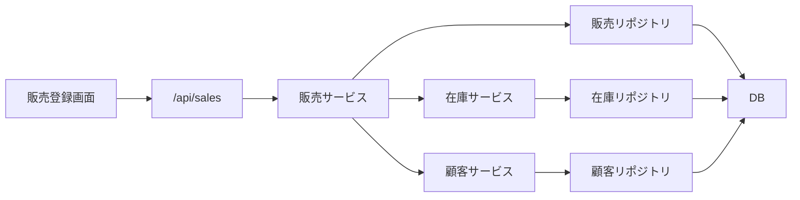

# 実装データフロー図（販売登録）

```mermaid
flowchart LR
  UI["販売登録画面"]
  API["/api/sales"]
  SalesSvc["販売サービス"]
  StockSvc["在庫サービス"]
  CustSvc["顧客サービス"]
  SalesRepo["販売リポジトリ"]
  StockRepo["在庫リポジトリ"]
  CustRepo["顧客リポジトリ"]
  DB["DB"]

  UI --> API
  API --> SalesSvc
  SalesSvc --> SalesRepo
  SalesRepo --> DB

  SalesSvc --> StockSvc
  StockSvc --> StockRepo
  StockRepo --> DB

  SalesSvc --> CustSvc
  CustSvc --> CustRepo
  CustRepo --> DB
```
