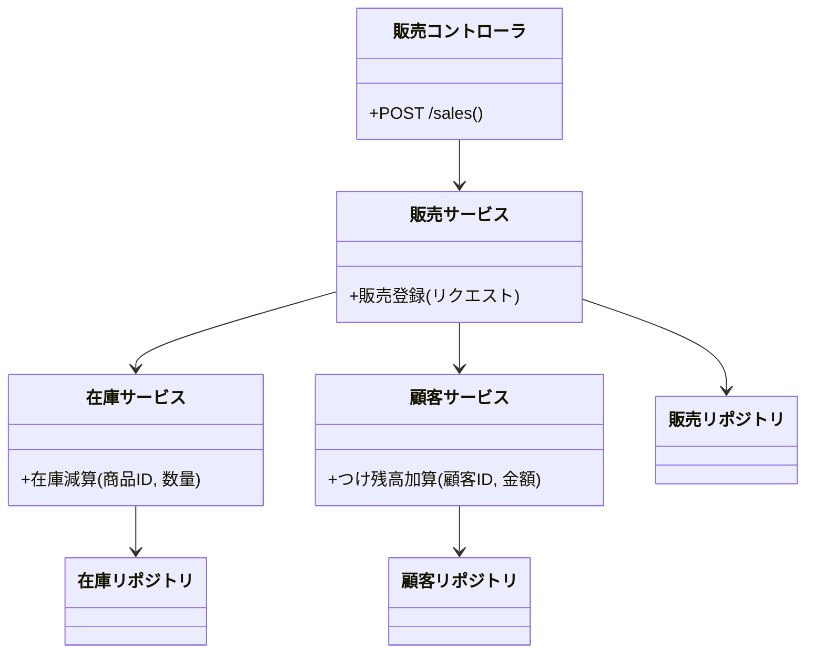

# 実装クラス図（簡略）

```mermaid
classDiagram
  class 販売コントローラ {
    +POST /sales()
  }

  class 販売サービス {
    +販売登録(リクエスト)
  }

  class 在庫サービス {
    +在庫減算(商品ID, 数量)
  }

  class 顧客サービス {
    +つけ残高加算(顧客ID, 金額)
  }

  class 販売リポジトリ
  class 在庫リポジトリ
  class 顧客リポジトリ

  販売コントローラ --> 販売サービス
  販売サービス --> 販売リポジトリ
  販売サービス --> 在庫サービス
  販売サービス --> 顧客サービス
  在庫サービス --> 在庫リポジトリ
  顧客サービス --> 顧客リポジトリ
```
