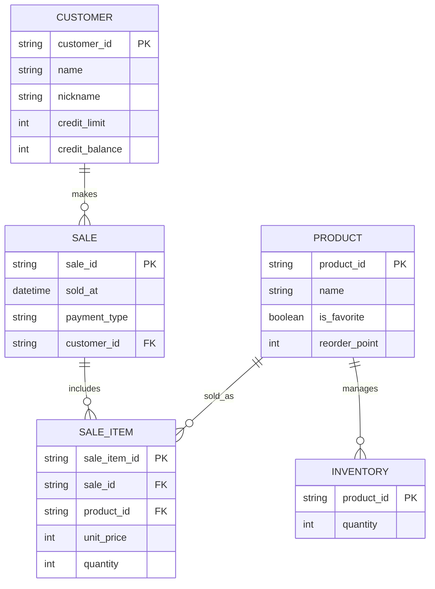

# DB 論理設計（ER図）

```mermaid
erDiagram
  PRODUCT {
    string product_id PK
    string name
    boolean is_favorite
    int reorder_point
  }

  INVENTORY {
    string product_id PK
    int quantity
  }

  CUSTOMER {
    string customer_id PK
    string name
    string nickname
    int credit_limit
    int credit_balance
  }

  SALE {
    string sale_id PK
    datetime sold_at
    string payment_type
    string customer_id FK
  }

  SALE_ITEM {
    string sale_item_id PK
    string sale_id FK
    string product_id FK
    int unit_price
    int quantity
  }

  PRODUCT ||--o{ INVENTORY : manages
  CUSTOMER ||--o{ SALE : makes
  SALE ||--o{ SALE_ITEM : includes
  PRODUCT ||--o{ SALE_ITEM : sold_as
```
