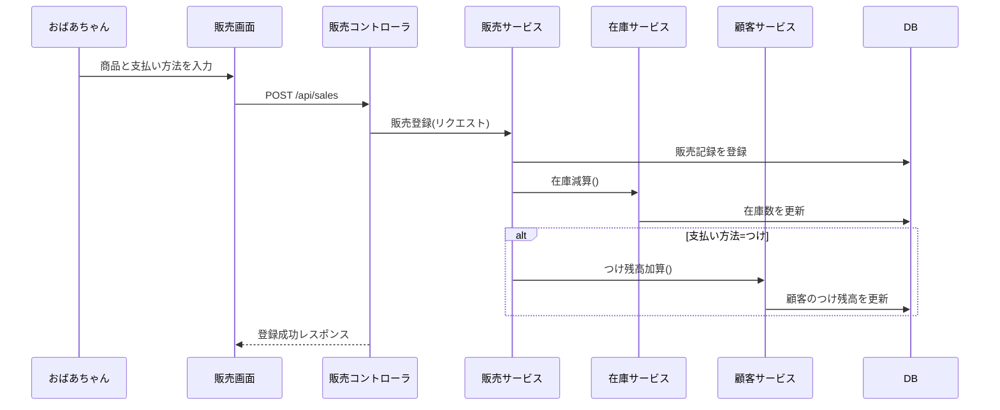

# シーケンス図（販売登録）

```mermaid
sequenceDiagram
  participant U as おばあちゃん
  participant UI as 販売画面
  participant API as 販売コントローラ
  participant SVC as 販売サービス
  participant ST as 在庫サービス
  participant CU as 顧客サービス
  participant DB as DB

  U ->> UI: 商品と支払い方法を入力
  UI ->> API: POST /api/sales
  API ->> SVC: 販売登録(リクエスト)
  SVC ->> DB: 販売記録を登録
  SVC ->> ST: 在庫減算()
  ST ->> DB: 在庫数を更新
  alt 支払い方法=つけ
    SVC ->> CU: つけ残高加算()
    CU ->> DB: 顧客のつけ残高を更新
  end
  API -->> UI: 登録成功レスポンス
```
