# Gantt Chart

- schedule_path: `docs/ja/sdh-ja-projects/prj-0001/060-schedule`
- project_start_date: `2026-03-16`
- project_duration_days: `11.5`
- scope: `full_schedule`
- critical_path_task_count: `23`
- progress_percent: `0.0%`
- done_tasks: `0/81`
- task_state_counts: `todo=80, doing=1, blocked=0, done=0, cancelled=0`

```mermaid
%%{init: {'gantt': {'leftPadding': 180, 'sectionFontSize': 11, 'fontSize': 12}}}%%
gantt
  title Project Schedule
  dateFormat YYYY-MM-DD HH:mm
  axisFormat %m/%d
  excludes sunday, saturday, 2026-03-20
  section milestones
  M-SDH-100 スケジュールキックオフ : crit, milestone, task_M-SDH-100, 2026-03-16 00:00, 0d
  M-SDH-200 ガバナンスベースライン確定 : crit, milestone, task_M-SDH-200, 2026-03-19 06:00, 0d
  M-SDH-300 業務・非機能要件ベースライン確定 : crit, milestone, task_M-SDH-300, 2026-03-26 00:00, 0d
  M-SDH-400 品質ベースライン確定 : milestone, task_M-SDH-400, 2026-03-30 12:00, 0d
  M-SDH-999 prj-0001 スケジュールスコープ完了 : milestone, task_M-SDH-999, 2026-03-30 12:00, 0d
  M-SDH-350 設計ベースライン確定 : crit, milestone, task_M-SDH-350, 2026-04-01 12:00, 0d
  section governance
  T-SDH-GOV-010 プロジェクトドキュメントルールの起草・レビュー : crit, active, task_T-SDH-GOV-010, 2026-03-16 00:00, 2026-03-17 00:00
  T-SDH-GOV-040 共有メタルールブックガバナンスセットの整合 : task_T-SDH-GOV-040, 2026-03-16 00:00, 2026-03-16 18:00
  T-SDH-GOV-011 プロジェクトドキュメント派生成果物の起草・レビュー : task_T-SDH-GOV-011, 2026-03-17 00:00, 2026-03-17 18:00
  T-SDH-GOV-020 移行ルールの起草・レビュー [1/2] : crit, task_T-SDH-GOV-020_seg_1, 2026-03-17 00:00, 2026-03-18 00:00
  T-SDH-GOV-020 [2/2] : crit, task_T-SDH-GOV-020_seg_2, 2026-03-18 00:00, 2026-03-18 06:00
  T-SDH-GOV-030 運用ルールの起草・レビュー : task_T-SDH-GOV-030, 2026-03-17 00:00, 2026-03-17 18:00
  T-SDH-GOV-031 運用派生成果物の起草・レビュー [1/2] : task_T-SDH-GOV-031_seg_1, 2026-03-17 18:00, 2026-03-18 00:00
  T-SDH-GOV-031 [2/2] : task_T-SDH-GOV-031_seg_2, 2026-03-18 00:00, 2026-03-18 06:00
  T-SDH-GOV-021 移行派生成果物の起草・レビュー [1/2] : crit, task_T-SDH-GOV-021_seg_1, 2026-03-18 06:00, 2026-03-19 00:00
  T-SDH-GOV-021 [2/2] : crit, task_T-SDH-GOV-021_seg_2, 2026-03-19 00:00, 2026-03-19 06:00
  M-SDH-GOV-900 ガバナンスドメイン完了 : crit, milestone, task_M-SDH-GOV-900, 2026-03-19 06:00, 0d
  section business
  T-SDH-BIZ-010 業務プロセス仕様ルールの起草・レビュー : crit, task_T-SDH-BIZ-010, 2026-03-19 06:00, 2026-03-19 18:00
  T-SDH-BIZ-030 業務データディクショナリルールの起草・レビュー : task_T-SDH-BIZ-030, 2026-03-19 06:00, 2026-03-19 18:00
  T-SDH-BIZ-060 用語集ルールの起草・レビュー : task_T-SDH-BIZ-060, 2026-03-19 06:00, 2026-03-19 18:00
  T-SDH-BIZ-070 リファレンスデータルールの起草・レビュー [1/2] : task_T-SDH-BIZ-070_seg_1, 2026-03-19 06:00, 2026-03-20 00:00
  T-SDH-BIZ-070 [2/2] : task_T-SDH-BIZ-070_seg_2, 2026-03-23 00:00, 2026-03-23 06:00
  T-SDH-BIZ-011 業務プロセス仕様派生成果物の起草・レビュー : task_T-SDH-BIZ-011, 2026-03-19 18:00, 2026-03-20 00:00
  T-SDH-BIZ-020 ビジネスルールのルール起草・レビュー [1/2] : crit, task_T-SDH-BIZ-020_seg_1, 2026-03-19 18:00, 2026-03-20 00:00
  T-SDH-BIZ-020 [2/2] : crit, task_T-SDH-BIZ-020_seg_2, 2026-03-23 00:00, 2026-03-23 06:00
  T-SDH-BIZ-031 業務データディクショナリ派生成果物の起草・レビュー : task_T-SDH-BIZ-031, 2026-03-19 18:00, 2026-03-20 00:00
  T-SDH-BIZ-040 帳票仕様ルールの起草・レビュー [1/2] : task_T-SDH-BIZ-040_seg_1, 2026-03-19 18:00, 2026-03-20 00:00
  T-SDH-BIZ-040 [2/2] : task_T-SDH-BIZ-040_seg_2, 2026-03-23 00:00, 2026-03-23 06:00
  T-SDH-BIZ-050 画面仕様ルールの起草・レビュー [1/2] : task_T-SDH-BIZ-050_seg_1, 2026-03-19 18:00, 2026-03-20 00:00
  T-SDH-BIZ-050 [2/2] : task_T-SDH-BIZ-050_seg_2, 2026-03-23 00:00, 2026-03-23 06:00
  T-SDH-BIZ-061 用語集派生成果物の起草・レビュー : task_T-SDH-BIZ-061, 2026-03-19 18:00, 2026-03-20 00:00
  T-SDH-BIZ-100 概念データストアルールの起草・レビュー [1/2] : task_T-SDH-BIZ-100_seg_1, 2026-03-19 18:00, 2026-03-20 00:00
  T-SDH-BIZ-100 [2/2] : task_T-SDH-BIZ-100_seg_2, 2026-03-23 00:00, 2026-03-23 06:00
  T-SDH-BIZ-110 概念状態遷移ルールの起草・レビュー [1/2] : task_T-SDH-BIZ-110_seg_1, 2026-03-19 18:00, 2026-03-20 00:00
  T-SDH-BIZ-110 [2/2] : task_T-SDH-BIZ-110_seg_2, 2026-03-23 00:00, 2026-03-23 12:00
  T-SDH-BIZ-120 概念クラス図ルールの起草・レビュー [1/2] : task_T-SDH-BIZ-120_seg_1, 2026-03-19 18:00, 2026-03-20 00:00
  T-SDH-BIZ-120 [2/2] : task_T-SDH-BIZ-120_seg_2, 2026-03-23 00:00, 2026-03-23 06:00
  T-SDH-BIZ-021 ビジネスルール派生成果物の起草・レビュー : task_T-SDH-BIZ-021, 2026-03-23 06:00, 2026-03-23 12:00
  T-SDH-BIZ-041 帳票仕様派生成果物の起草・レビュー : task_T-SDH-BIZ-041, 2026-03-23 06:00, 2026-03-23 12:00
  T-SDH-BIZ-051 画面仕様派生成果物の起草・レビュー : task_T-SDH-BIZ-051, 2026-03-23 06:00, 2026-03-23 12:00
  T-SDH-BIZ-071 リファレンスデータ派生成果物の起草・レビュー : task_T-SDH-BIZ-071, 2026-03-23 06:00, 2026-03-24 00:00
  T-SDH-BIZ-080 業務イベント仕様ルールの起草・レビュー : crit, task_T-SDH-BIZ-080, 2026-03-23 06:00, 2026-03-24 00:00
  T-SDH-BIZ-101 概念データストア派生成果物の起草・レビュー : task_T-SDH-BIZ-101, 2026-03-23 06:00, 2026-03-23 12:00
  T-SDH-BIZ-121 概念クラス図派生成果物の起草・レビュー : task_T-SDH-BIZ-121, 2026-03-23 06:00, 2026-03-23 12:00
  T-SDH-BIZ-111 概念状態遷移派生成果物の起草・レビュー : task_T-SDH-BIZ-111, 2026-03-23 12:00, 2026-03-24 00:00
  T-SDH-BIZ-081 業務イベント仕様派生成果物の起草・レビュー : task_T-SDH-BIZ-081, 2026-03-24 00:00, 2026-03-24 12:00
  T-SDH-BIZ-090 概念データフロールールの起草・レビュー : crit, task_T-SDH-BIZ-090, 2026-03-24 00:00, 2026-03-24 18:00
  T-SDH-BIZ-130 システム機能一覧ルールの起草・レビュー : task_T-SDH-BIZ-130, 2026-03-24 00:00, 2026-03-24 18:00
  T-SDH-BIZ-091 概念データフロー派生成果物の起草・レビュー [1/2] : crit, task_T-SDH-BIZ-091_seg_1, 2026-03-24 18:00, 2026-03-25 00:00
  T-SDH-BIZ-091 [2/2] : crit, task_T-SDH-BIZ-091_seg_2, 2026-03-25 00:00, 2026-03-25 06:00
  T-SDH-BIZ-131 システム機能一覧派生成果物の起草・レビュー [1/2] : task_T-SDH-BIZ-131_seg_1, 2026-03-24 18:00, 2026-03-25 00:00
  T-SDH-BIZ-131 [2/2] : task_T-SDH-BIZ-131_seg_2, 2026-03-25 00:00, 2026-03-25 06:00
  T-SDH-BIZ-140 業務受入条件ルールの起草・レビュー : crit, task_T-SDH-BIZ-140, 2026-03-25 06:00, 2026-03-25 18:00
  T-SDH-BIZ-141 業務受入条件派生成果物の起草・レビュー : crit, task_T-SDH-BIZ-141, 2026-03-25 18:00, 2026-03-26 00:00
  M-SDH-BIZ-900 業務ドメイン完了 : crit, milestone, task_M-SDH-BIZ-900, 2026-03-26 00:00, 0d
  section nfr
  T-SDH-NFR-010 NFR インデックスルールの起草・レビュー : task_T-SDH-NFR-010, 2026-03-19 06:00, 2026-03-19 18:00
  T-SDH-NFR-011 NFR インデックス派生成果物の起草・レビュー : task_T-SDH-NFR-011, 2026-03-19 18:00, 2026-03-20 00:00
  T-SDH-NFR-020 可用性要件ルールの起草・レビュー [1/2] : task_T-SDH-NFR-020_seg_1, 2026-03-19 18:00, 2026-03-20 00:00
  T-SDH-NFR-020 [2/2] : task_T-SDH-NFR-020_seg_2, 2026-03-23 00:00, 2026-03-23 06:00
  T-SDH-NFR-030 完全性要件ルールの起草・レビュー [1/2] : task_T-SDH-NFR-030_seg_1, 2026-03-19 18:00, 2026-03-20 00:00
  T-SDH-NFR-030 [2/2] : task_T-SDH-NFR-030_seg_2, 2026-03-23 00:00, 2026-03-23 06:00
  T-SDH-NFR-040 保守性要件ルールの起草・レビュー [1/2] : task_T-SDH-NFR-040_seg_1, 2026-03-19 18:00, 2026-03-20 00:00
  T-SDH-NFR-040 [2/2] : task_T-SDH-NFR-040_seg_2, 2026-03-23 00:00, 2026-03-23 06:00
  T-SDH-NFR-050 運用性要件ルールの起草・レビュー [1/2] : task_T-SDH-NFR-050_seg_1, 2026-03-19 18:00, 2026-03-20 00:00
  T-SDH-NFR-050 [2/2] : task_T-SDH-NFR-050_seg_2, 2026-03-23 00:00, 2026-03-23 06:00
  T-SDH-NFR-060 性能要件ルールの起草・レビュー [1/2] : task_T-SDH-NFR-060_seg_1, 2026-03-19 18:00, 2026-03-20 00:00
  T-SDH-NFR-060 [2/2] : task_T-SDH-NFR-060_seg_2, 2026-03-23 00:00, 2026-03-23 06:00
  T-SDH-NFR-090 ユーザビリティ要件ルールの起草・レビュー [1/2] : task_T-SDH-NFR-090_seg_1, 2026-03-19 18:00, 2026-03-20 00:00
  T-SDH-NFR-090 [2/2] : task_T-SDH-NFR-090_seg_2, 2026-03-23 00:00, 2026-03-23 06:00
  T-SDH-NFR-021 可用性要件派生成果物の起草・レビュー : task_T-SDH-NFR-021, 2026-03-23 06:00, 2026-03-23 12:00
  T-SDH-NFR-031 完全性要件派生成果物の起草・レビュー : task_T-SDH-NFR-031, 2026-03-23 06:00, 2026-03-23 12:00
  T-SDH-NFR-041 保守性要件派生成果物の起草・レビュー : task_T-SDH-NFR-041, 2026-03-23 06:00, 2026-03-23 12:00
  T-SDH-NFR-051 運用性要件派生成果物の起草・レビュー : task_T-SDH-NFR-051, 2026-03-23 06:00, 2026-03-23 12:00
  T-SDH-NFR-061 性能要件派生成果物の起草・レビュー : task_T-SDH-NFR-061, 2026-03-23 06:00, 2026-03-23 12:00
  T-SDH-NFR-070 信頼性要件ルールの起草・レビュー : task_T-SDH-NFR-070, 2026-03-23 06:00, 2026-03-23 18:00
  T-SDH-NFR-080 セキュリティ・安全性要件ルールの起草・レビュー : task_T-SDH-NFR-080, 2026-03-23 06:00, 2026-03-23 18:00
  T-SDH-NFR-091 ユーザビリティ要件派生成果物の起草・レビュー : task_T-SDH-NFR-091, 2026-03-23 06:00, 2026-03-23 12:00
  T-SDH-NFR-071 信頼性要件派生成果物の起草・レビュー : task_T-SDH-NFR-071, 2026-03-23 18:00, 2026-03-24 00:00
  T-SDH-NFR-081 セキュリティ・安全性要件派生成果物の起草・レビュー : task_T-SDH-NFR-081, 2026-03-23 18:00, 2026-03-24 00:00
  M-SDH-NFR-900 非機能要件ドメイン完了 : milestone, task_M-SDH-NFR-900, 2026-03-24 00:00, 0d
  section design
  T-SDH-DES-010 外部インターフェースルールの起草・レビュー [1/2] : task_T-SDH-DES-010_seg_1, 2026-03-26 00:00, 2026-03-27 00:00
  T-SDH-DES-010 [2/2] : task_T-SDH-DES-010_seg_2, 2026-03-27 00:00, 2026-03-27 06:00
  T-SDH-DES-020 C4 コンテキスト図ルールの起草・レビュー : crit, task_T-SDH-DES-020, 2026-03-26 00:00, 2026-03-26 18:00
  T-SDH-DES-060 技術スタック定義ルールの起草・レビュー : task_T-SDH-DES-060, 2026-03-26 00:00, 2026-03-26 12:00
  T-SDH-DES-061 技術スタック定義派生成果物の起草・レビュー : task_T-SDH-DES-061, 2026-03-26 12:00, 2026-03-26 18:00
  T-SDH-DES-021 C4 コンテキスト図派生成果物の起草・レビュー [1/2] : task_T-SDH-DES-021_seg_1, 2026-03-26 18:00, 2026-03-27 00:00
  T-SDH-DES-021 [2/2] : task_T-SDH-DES-021_seg_2, 2026-03-27 00:00, 2026-03-27 06:00
  T-SDH-DES-030 C4 コンテナ図ルールの起草・レビュー [1/2] : crit, task_T-SDH-DES-030_seg_1, 2026-03-26 18:00, 2026-03-27 00:00
  T-SDH-DES-030 [2/2] : crit, task_T-SDH-DES-030_seg_2, 2026-03-27 00:00, 2026-03-27 12:00
  T-SDH-DES-050 インフラ構成図ルールの起草・レビュー [1/2] : task_T-SDH-DES-050_seg_1, 2026-03-26 18:00, 2026-03-27 00:00
  T-SDH-DES-050 [2/2] : task_T-SDH-DES-050_seg_2, 2026-03-27 00:00, 2026-03-27 06:00
  T-SDH-DES-011 外部インターフェース派生成果物の起草・レビュー [1/2] : task_T-SDH-DES-011_seg_1, 2026-03-27 06:00, 2026-03-28 00:00
  T-SDH-DES-011 [2/2] : task_T-SDH-DES-011_seg_2, 2026-03-30 00:00, 2026-03-30 06:00
  T-SDH-DES-051 インフラ構成図派生成果物の起草・レビュー : task_T-SDH-DES-051, 2026-03-27 06:00, 2026-03-27 12:00
  T-SDH-DES-031 C4 コンテナ図派生成果物の起草・レビュー : task_T-SDH-DES-031, 2026-03-27 12:00, 2026-03-28 00:00
  T-SDH-DES-040 C4 コンポーネント図ルールの起草・レビュー [1/2] : crit, task_T-SDH-DES-040_seg_1, 2026-03-27 12:00, 2026-03-28 00:00
  T-SDH-DES-040 [2/2] : crit, task_T-SDH-DES-040_seg_2, 2026-03-30 00:00, 2026-03-30 06:00
  T-SDH-DES-041 C4 コンポーネント図派生成果物の起草・レビュー : crit, task_T-SDH-DES-041, 2026-03-30 06:00, 2026-03-30 18:00
  T-SDH-DES-070 システム設計ルールの起草・レビュー [1/2] : crit, task_T-SDH-DES-070_seg_1, 2026-03-30 18:00, 2026-03-31 00:00
  T-SDH-DES-070 [2/2] : crit, task_T-SDH-DES-070_seg_2, 2026-03-31 00:00, 2026-03-31 18:00
  T-SDH-DES-071 システム設計派生成果物の起草・レビュー [1/2] : crit, task_T-SDH-DES-071_seg_1, 2026-03-31 18:00, 2026-04-01 00:00
  T-SDH-DES-071 [2/2] : crit, task_T-SDH-DES-071_seg_2, 2026-04-01 00:00, 2026-04-01 12:00
  M-SDH-DES-900 設計ドメイン完了 : crit, milestone, task_M-SDH-DES-900, 2026-04-01 12:00, 0d
  section quality
  T-SDH-QLT-010 システム受入条件ルールの起草・レビュー : task_T-SDH-QLT-010, 2026-03-26 00:00, 2026-03-26 12:00
  T-SDH-QLT-020 テスト戦略・計画ルールの起草・レビュー : task_T-SDH-QLT-020, 2026-03-26 00:00, 2026-03-26 12:00
  T-SDH-QLT-011 システム受入条件派生成果物の起草・レビュー : task_T-SDH-QLT-011, 2026-03-26 12:00, 2026-03-26 18:00
  T-SDH-QLT-021 テスト戦略・計画派生成果物の起草・レビュー : task_T-SDH-QLT-021, 2026-03-26 12:00, 2026-03-26 18:00
  T-SDH-QLT-030 単体テストドキュメントルールの起草・レビュー [1/2] : task_T-SDH-QLT-030_seg_1, 2026-03-26 18:00, 2026-03-27 00:00
  T-SDH-QLT-030 [2/2] : task_T-SDH-QLT-030_seg_2, 2026-03-27 00:00, 2026-03-27 12:00
  T-SDH-QLT-040 結合テストドキュメントルールの起草・レビュー [1/2] : task_T-SDH-QLT-040_seg_1, 2026-03-26 18:00, 2026-03-27 00:00
  T-SDH-QLT-040 [2/2] : task_T-SDH-QLT-040_seg_2, 2026-03-27 00:00, 2026-03-27 12:00
  T-SDH-QLT-050 外部結合テストルールの起草・レビュー [1/2] : task_T-SDH-QLT-050_seg_1, 2026-03-26 18:00, 2026-03-27 00:00
  T-SDH-QLT-050 [2/2] : task_T-SDH-QLT-050_seg_2, 2026-03-27 00:00, 2026-03-27 18:00
  T-SDH-QLT-060 システムテストドキュメントルールの起草・レビュー [1/2] : task_T-SDH-QLT-060_seg_1, 2026-03-26 18:00, 2026-03-27 00:00
  T-SDH-QLT-060 [2/2] : task_T-SDH-QLT-060_seg_2, 2026-03-27 00:00, 2026-03-27 12:00
  T-SDH-QLT-070 受入テストドキュメントルールの起草・レビュー [1/2] : task_T-SDH-QLT-070_seg_1, 2026-03-26 18:00, 2026-03-27 00:00
  T-SDH-QLT-070 [2/2] : task_T-SDH-QLT-070_seg_2, 2026-03-27 00:00, 2026-03-27 18:00
  T-SDH-QLT-031 単体テストドキュメント派生成果物の起草・レビュー : task_T-SDH-QLT-031, 2026-03-27 12:00, 2026-03-28 00:00
  T-SDH-QLT-041 結合テストドキュメント派生成果物の起草・レビュー : task_T-SDH-QLT-041, 2026-03-27 12:00, 2026-03-28 00:00
  T-SDH-QLT-061 システムテストドキュメント派生成果物の起草・レビュー : task_T-SDH-QLT-061, 2026-03-27 12:00, 2026-03-28 00:00
  T-SDH-QLT-051 外部結合テスト派生成果物の起草・レビュー [1/2] : task_T-SDH-QLT-051_seg_1, 2026-03-27 18:00, 2026-03-28 00:00
  T-SDH-QLT-051 [2/2] : task_T-SDH-QLT-051_seg_2, 2026-03-30 00:00, 2026-03-30 12:00
  T-SDH-QLT-071 受入テストドキュメント派生成果物の起草・レビュー [1/2] : task_T-SDH-QLT-071_seg_1, 2026-03-27 18:00, 2026-03-28 00:00
  T-SDH-QLT-071 [2/2] : task_T-SDH-QLT-071_seg_2, 2026-03-30 00:00, 2026-03-30 12:00
  M-SDH-QLT-900 品質ドメイン完了 : milestone, task_M-SDH-QLT-900, 2026-03-30 12:00, 0d
```

