# Gantt Chart

- schedule_path: `docs/ja/sdh-ja-projects/prj-0001/060-schedule`
- project_start_date: `2026-03-16`
- project_duration_days: `15.5`
- scope: `full_schedule`
- critical_path_task_count: `19`
- progress_percent: `0.0%`
- done_tasks: `0/47`
- task_state_counts: `todo=46, doing=1, blocked=0, done=0, cancelled=0`

```mermaid
%%{init: {'gantt': {'leftPadding': 180, 'sectionFontSize': 11, 'fontSize': 12}}}%%
gantt
  title Project Schedule
  dateFormat YYYY-MM-DD HH:mm
  axisFormat %m/%d
  excludes sunday, saturday, 2026-03-20
  section milestones
  M-SDH-100 schedule kickoff : crit, milestone, task_M-SDH-100, 2026-03-16 00:00, 0d
  M-SDH-200 governance baseline ready : crit, milestone, task_M-SDH-200, 2026-03-18 12:00, 0d
  M-SDH-300 business and nfr baseline ready : crit, milestone, task_M-SDH-300, 2026-03-23 12:00, 0d
  M-SDH-350 design baseline ready : crit, milestone, task_M-SDH-350, 2026-04-02 00:00, 0d
  M-SDH-400 quality and traceability baseline ready : crit, milestone, task_M-SDH-400, 2026-04-07 12:00, 0d
  M-SDH-999 prj-0001 schedule scope completed : crit, milestone, task_M-SDH-999, 2026-04-07 12:00, 0d
  section governance
  T-SDH-GOV-010 align project overview and scope rule pairs : crit, active, task_T-SDH-GOV-010, 2026-03-16 00:00, 1d
  T-SDH-GOV-050 align shared metadata and naming constraints : task_T-SDH-GOV-050, 2026-03-16 00:00, 18h
  T-SDH-GOV-020 update glossary rule and instruction pair : task_T-SDH-GOV-020, 2026-03-17 00:00, 12h
  T-SDH-GOV-030 update handbook operation and planning rule sets : crit, task_T-SDH-GOV-030, 2026-03-17 00:00, 1d
  T-SDH-GOV-040 update migration index rule and instruction pair : crit, task_T-SDH-GOV-040, 2026-03-18 00:00, 12h
  section business
  T-SDH-BIZ-010 update business acceptance criteria pair : task_T-SDH-BIZ-010, 2026-03-18 12:00, 12h
  T-SDH-BIZ-020 update business data definition pair : task_T-SDH-BIZ-020, 2026-03-18 12:00, 12h
  T-SDH-BIZ-040 update business process specification pair : crit, task_T-SDH-BIZ-040, 2026-03-18 12:00, 18h
  T-SDH-BIZ-030 update business data schema pair : task_T-SDH-BIZ-030, 2026-03-19 00:00, 12h
  T-SDH-BIZ-050 update business rule pair : crit, task_T-SDH-BIZ-050, 2026-03-19 06:00, 12h
  T-SDH-BIZ-060 update business event specification family : crit, task_T-SDH-BIZ-060, 2026-03-19 18:00, 18h
  section nfr
  T-SDH-NFR-010 update nfr index pair : task_T-SDH-NFR-010, 2026-03-18 12:00, 12h
  T-SDH-NFR-020 update availability requirement pair : task_T-SDH-NFR-020, 2026-03-19 00:00, 12h
  T-SDH-NFR-030 update integrity requirement pair : task_T-SDH-NFR-030, 2026-03-19 00:00, 12h
  T-SDH-NFR-040 update maintainability requirement pair : task_T-SDH-NFR-040, 2026-03-19 00:00, 12h
  T-SDH-NFR-050 update operations requirement pair : task_T-SDH-NFR-050, 2026-03-19 00:00, 12h
  T-SDH-NFR-060 update performance requirement pair : task_T-SDH-NFR-060, 2026-03-19 00:00, 12h
  T-SDH-NFR-090 update usability requirement pair : task_T-SDH-NFR-090, 2026-03-19 00:00, 12h
  T-SDH-NFR-070 update reliability requirement pair : task_T-SDH-NFR-070, 2026-03-19 12:00, 12h
  T-SDH-NFR-080 update security and safety requirement pair : task_T-SDH-NFR-080, 2026-03-19 12:00, 18h
  section design
  T-SDH-DES-100 design context and policy updates summary : crit, task_T-SDH-DES-100, 2026-03-23 12:00, 2d
  T-SDH-DES-200 design flow and interaction updates summary : crit, task_T-SDH-DES-200, 2026-03-25 12:00, 60h
  T-SDH-DES-300 design structure and engineering updates summary : crit, task_T-SDH-DES-300, 2026-03-30 00:00, 3d
  M-SDH-DES-900 design domain complete : crit, milestone, task_M-SDH-DES-900, 2026-04-02 00:00, 0d
  section design / context
  T-SDH-DES-CTX-010 update context landscape pair : task_T-SDH-DES-CTX-010, 2026-03-23 12:00, 12h
  T-SDH-DES-CTX-020 update context narrative and mermaid family : task_T-SDH-DES-CTX-020, 2026-03-24 00:00, 18h
  M-SDH-DES-CTX-900 design context container complete : milestone, task_M-SDH-DES-CTX-900, 2026-03-24 18:00, 0d
  section design / policy
  T-SDH-DES-POL-010 update cross-cutting policy pair : task_T-SDH-DES-POL-010, 2026-03-23 12:00, 12h
  T-SDH-DES-POL-020 update component policy family : task_T-SDH-DES-POL-020, 2026-03-24 00:00, 18h
  M-SDH-DES-POL-900 design policy container complete : milestone, task_M-SDH-DES-POL-900, 2026-03-24 18:00, 0d
  section design / structure
  T-SDH-DES-STR-030 update domain model pair : task_T-SDH-DES-STR-030, 2026-03-23 12:00, 12h
  T-SDH-DES-STR-010 update shared diagram rule sets : task_T-SDH-DES-STR-010, 2026-03-24 18:00, 12h
  T-SDH-DES-STR-020 update component design summary pair : task_T-SDH-DES-STR-020, 2026-03-24 18:00, 12h
  T-SDH-DES-STR-050 update logical structure and ui specification pairs : task_T-SDH-DES-STR-050, 2026-03-25 06:00, 18h
  T-SDH-DES-STR-040 update engineering support documentation set : task_T-SDH-DES-STR-040, 2026-03-26 06:00, 1d
  T-SDH-DES-STR-060 update system design index and policy family : task_T-SDH-DES-STR-060, 2026-03-27 06:00, 1d
  M-SDH-DES-STR-900 design structure container complete : milestone, task_M-SDH-DES-STR-900, 2026-03-30 06:00, 0d
  section quality
  T-SDH-QLT-100 quality criteria families summary : task_T-SDH-QLT-100, 2026-03-23 12:00, 60h
  T-SDH-QLT-200 quality verification and acceptance summary : crit, task_T-SDH-QLT-200, 2026-04-02 00:00, 2d
  T-SDH-QLT-300 quality traceability and planning summary : crit, task_T-SDH-QLT-300, 2026-04-06 00:00, 36h
  M-SDH-QLT-900 quality domain complete : crit, milestone, task_M-SDH-QLT-900, 2026-04-07 12:00, 0d
  section quality / criteria
  T-SDH-QLT-CRT-010 update acceptance test criteria family : task_T-SDH-QLT-CRT-010, 2026-03-23 12:00, 1d
  T-SDH-QLT-CRT-020 update external test criteria family : task_T-SDH-QLT-CRT-020, 2026-03-23 12:00, 1d
  T-SDH-QLT-CRT-030 update user test criteria family : task_T-SDH-QLT-CRT-030, 2026-03-23 12:00, 18h
  M-SDH-QLT-CRT-900 quality criteria container complete : milestone, task_M-SDH-QLT-CRT-900, 2026-03-24 12:00, 0d
  section design / flow
  T-SDH-DES-FLOW-010 update data flow documentation family : task_T-SDH-DES-FLOW-010, 2026-03-24 18:00, 18h
  T-SDH-DES-FLOW-020 update state transition documentation family : task_T-SDH-DES-FLOW-020, 2026-03-24 18:00, 18h
  T-SDH-DES-FLOW-030 update cross-system design family : task_T-SDH-DES-FLOW-030, 2026-03-25 12:00, 18h
  M-SDH-DES-FLOW-900 design flow container complete : milestone, task_M-SDH-DES-FLOW-900, 2026-03-26 06:00, 0d
  section quality / governance
  T-SDH-QLT-GOV-010 update specification traceability link pair : task_T-SDH-QLT-GOV-010, 2026-04-02 00:00, 12h
  T-SDH-QLT-GOV-020 update test planning and strategy family : task_T-SDH-QLT-GOV-020, 2026-04-06 00:00, 18h
  M-SDH-QLT-GOV-900 quality governance container complete : milestone, task_M-SDH-QLT-GOV-900, 2026-04-06 18:00, 0d
  section quality / verification
  T-SDH-QLT-VRF-010 update integration test documentation family : task_T-SDH-QLT-VRF-010, 2026-04-02 00:00, 18h
  T-SDH-QLT-VRF-020 update system test documentation family : task_T-SDH-QLT-VRF-020, 2026-04-02 18:00, 18h
  T-SDH-QLT-VRF-030 update system acceptance condition pair : task_T-SDH-QLT-VRF-030, 2026-04-03 12:00, 12h
  M-SDH-QLT-VRF-900 quality verification container complete : milestone, task_M-SDH-QLT-VRF-900, 2026-04-06 00:00, 0d
```

