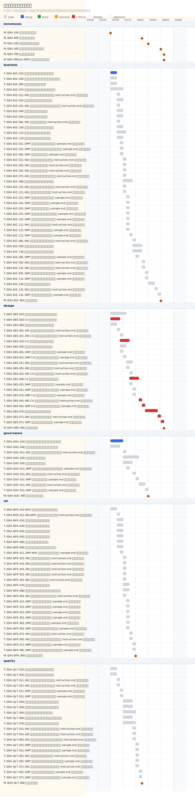

# タイムライン

## 進捗サマリー

- 判定: 前倒しで進行中
- 概況: 2026-03-15 時点では計画開始日 2026-03-16 前ですが、先行着手が進んでいます。
- 主な要因: 開始日前のため本来の進捗遅れはなく、doing 1 件で先行準備が進んでいます。

## 今後のアクション案

1. 進行中タスクを完了させ、開始日までにクリティカルパスの先頭を空けてください。
2. 次の着手候補 T-SDH-DES-020 の前提条件を開始日までに確認してください。

- schedule_path: `docs/ja/sdh-ja-projects/prj-0001/060-schedule`
- project_start_date: `2026-03-16`
- project_duration_days: `4.75`
- scope: `full_schedule`
- critical_path_task_count: `13`
- progress_percent: `0.0%`
- done_tasks: `0/161`
- task_state_counts: `todo=160, doing=1, blocked=0, done=0, cancelled=0`

