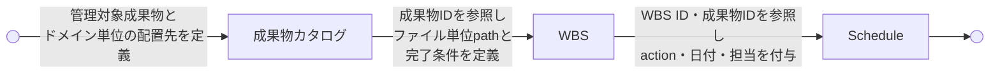

# 成果物カタログからスケジュールへの展開ガイド

SpecDojo Deliverables Catalog to Schedule Guide

SpecDojo における成果物カタログからスケジュールへの展開ルールとガイドラインを定義します。成果物カタログで定義した管理対象成果物を、WBS 定義で成果物パスと完了条件に展開し、Schedule 定義で実行計画に落とし込む一連の流れを示します。

## 1. 基本方針

- **成果物カタログ** は「**何を管理対象とするか**」
- **WBS** は「**どの成果物をどこに作成・更新し、何を満たせば完了か**」
- **Schedule** は「**いつ・誰が・どの順で作業するか**」

を扱います。

## 2. 責務の違い

| 観点               | 成果物カタログ                   | WBS                            | Schedule               |
| ------------------ | -------------------------------- | ------------------------------ | ---------------------- |
| 主目的             | 成果物の論理定義                 | スコープ完了単位の定義         | 実行計画               |
| 問い               | 何を管理対象にするか             | 何がどこに完成すればよいか     | いつ誰が何をするか     |
| 単位               | 成果物                           | スコープ完了単位               | 実行タスク             |
| 成果物ID           | 定義する                         | 参照する                       | 参照する               |
| 配置先・成果物パス | ドメイン単位の配置先を持つ       | ファイル単位の成果物パスを持つ | 原則持たない           |
| 完了条件           | 原則持たない                     | 持つ                           | 原則持たない           |
| action             | 持たない                         | 持たない                       | 持つ                   |
| 日付               | 持たない                         | 持たない                       | 持つ                   |
| 担当者             | 原則持たない                     | 持たない                       | 持つ                   |
| 依存関係           | 成果物間の根拠程度               | スコープ上の依存               | 実行順序の依存         |
| status             | カタログ定義文書の状態として持つ | WBS定義文書の状態として持つ    | タスクの実行状態を持つ |

## 3. 管理単位の考え方

成果物カタログでは、全成果物を定義する。成果物の種別は、

1. `work`（作成・更新する成果物）
2. `control`（管理用のドキュメント）
3. `generated`（自動生成したドキュメント等）

WBSへの展開対象は原則 `work` のみとする。ただし、プロジェクト遂行上、作成・更新を明示的に管理する必要がある `control` は例外的にWBS展開対象にできる。`generated` は原則対象外とする。

管理をシンプルにするため、成果物カタログとWBS、Scheduleの管理単位とその関係は次のように定めます。

- **原則**: 1成果物 = 1 WBS item（スコープ完了単位）
- **実行管理**: 1 WBS item = 原則1 Schedule item（タスク）
- **例外**: 必要な場合のみ Schedule item を分割できる

> 例外の例：レビュー、承認、公開、外部待ち、長期間作業は、Schedule item を分けてよい。

## 4. 管理単位のID付けルール

- 成果物の `id` は frontmatter の `id` を使用する。`id` の命名ルールは、[ドキュメントIDおよびファイル命名ルール](../standards/id-and-file-naming-standard.md) に従う。
- 成果物については、成果物カタログの中で略称を定める。略称は、ドメインの略称 `<DOMAIN>` と成果物の略称 `<ARTIFACT>` を定義し、`<DOMAIN>-<ARTIFACT>` はプロジェクト内で一意になるように定める。
- WBS item の `id` は、成果物の略称をベースに `WBS-<DOMAIN>-<ARTIFACT>` 形式で付ける。
  - 例: `WBS-PJD-OVERVIEW`
- Schedule item の `id` は、先に Schedule を管理するまとまり `<TRACK>` を定義し、`T-<TRACK>-<DOMAIN>-<ARTIFACT>-<NNN>` 形式で付ける。
  - 例: `T-LAUNCH-PJD-OVERVIEW-010`
  - `<TRACK>` は Schedule 上の管理トラックを表す。フェーズ、リリース、作業グループなど実行管理上のまとまりを表してもよい。
  - `<DOMAIN>-<ARTIFACT>` は、対応する成果物の略称を表す。
  - `<NNN>` は同一 `<TRACK>-<DOMAIN>-<ARTIFACT>` 内で Schedule item を識別する連番とする。
- 厳密な実行順序や依存関係は、Schedule item の `depends_on` で表現する。

## 5. 参照キーと配置先の原則

成果物カタログ、WBS、Schedule は、成果物IDを共通の参照キーとして接続する。

- 成果物カタログは、成果物ID、成果物略称、成果物種別、根拠、概要、およびドメイン単位の配置先を定義する。
- 成果物カタログに記載する配置先は、成果物を配置する既定ディレクトリを表す。
- WBS は、WBS展開対象成果物のスコープ完了単位を定義し、`deliverables[].id` と `deliverables[].path` の組で成果物IDと実体を管理する。
  - `deliverables[].id` は、SpecDojo 上の成果物IDを表す。
  - `deliverables[].path` は、成果物の実体ファイルまたはディレクトリのパスを表す。
  - `deliverables[].path` は、原則として成果物カタログに記載された配置先配下に置く。
- Schedule は、WBS item ID と成果物IDを参照して実行タスクを定義し、成果物パスは原則持たない。
- `create` / `modify` / `review` / `approve` / `publish` などの action は Schedule に記載する。
- 成果物ファイルに SpecDojo のIDを保持できる場合は、`deliverables[].id` と一致、または解決可能な関係にする。
- 成果物ファイルに任意のIDを付与できない場合、または既存のID体系を持つ場合は、ファイル内IDを変更せず、WBS の `deliverables[].id` と `deliverables[].path` の対応を正本とする。
- 成果物が既存IDや外部仕様IDを持つ場合は、必要に応じて `native_id` として記録する。

## 6. 定義の流れ

成果物カタログからScheduleへの定義の流れは次の通りです。

