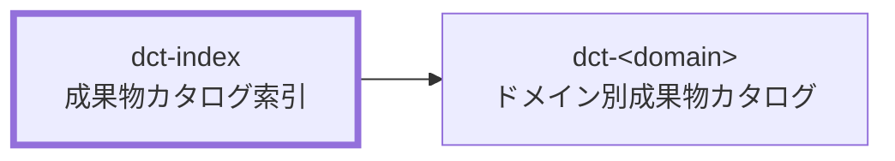

# 成果物カタログ 索引 作成ルール

Deliverables Catalog Index Documentation Rules

本ドキュメントは、プロジェクト成果物カタログの索引（`dct-index`）を統一形式で記述するためのルールです。
プロジェクトの成果物は `dct-index` と `dct-<domain>.md` で構成し、共通命名・ID規則を定義します。

## 1. 全体方針

- `dct-index` は、ドメイン別成果物カタログ（`dct-<domain>.md`）への索引・一覧として機能する。
- 個別成果物の詳細情報は各 `dct-<domain>.md` に集約し、索引はドメインと参照先リンクの管理に専念する。
- 本文の「共通ルール」は、`dct-<domain>.md` 全体に適用される命名・ID・種別定義の SSOT として扱う。

## 2. 位置づけ

`dct-index` と関連ドキュメントの関係を示します。

- `dct-index` がプロジェクト成果物カタログの起点となる。
- `dct-<domain>.md` は `dct-index` の `part_of` としてリンクされる。

## 3. ファイル命名・ID規則

### 3.1. ID規約

- `dct-index` 自体の `id` は `<project-id>:dct-index` 形式を推奨する。
  - 例: `prj-0001:dct-index`
- ドメイン別カタログの `id` は `<project-id>:dct-<domain>` 形式を推奨する。
  - 例: `prj-0001:dct-project-definition`
- 各成果物の `local-id` は英小文字・数字・ハイフンのみとし、プロジェクト内で一意にする。
- 各成果物の Frontmatter `id` は `<project-id>:<local-id>` 形式で統一する。

### 3.2. ファイル命名規約

- 索引ファイルのファイル名は `dct-index.md` を推奨する。
- ドメイン別カタログのファイル名は `dct-<domain>.md` 形式を推奨する。
- 成果物本体のファイル名は `<local-id>.md` 形式で作成する。
- 相対リンクで索引からドメイン別カタログへ遷移できる命名・配置を維持する。

## 4. 推奨 Frontmatter 項目

| 項目       | 説明                                                 | 必須 |
| ---------- | ---------------------------------------------------- | ---- |
| `id`       | `<project-id>:dct-index`（例: `prj-0001:dct-index`） | ○    |
| `type`     | `project` を推奨                                     | ○    |
| `status`   | `draft` / `ready` / `deprecated`                     | ○    |
| `rulebook` | `dct-index-rulebook`                                 | 任意 |
| `based_on` | 直接根拠として参照した文書IDの配列                   | 任意 |

## 5. 本文構成（標準テンプレ）

| 章  | 内容               | 必須 |
| --- | ------------------ | ---- |
| 1   | 共通ルール         | ○    |
| 2   | 成果物カタログ一覧 | ○    |

### 5.1. 共通ルール の標準項目

「共通ルール」章には、`dct-<domain>.md` 全体に適用される以下の共通定義を含める。

| 定義項目                                 | 説明                                                                | 必須 |
| ---------------------------------------- | ------------------------------------------------------------------- | ---- |
| `local-id` の役割                        | 成果物の論理名を表し、ファイル名・Frontmatter `id` の基礎として使用 | ○    |
| ファイル命名規則                         | `<local-id>.md` 形式                                                | ○    |
| Frontmatter `id` 規則                    | `<project-id>:<local-id>` 形式                                      | ○    |
| `根拠` の記載方針                        | 主要な依存関係を記載する                                            | ○    |
| `based_on` と `根拠` の関係              | 直接根拠のみ `based_on` に記載し、差分があっても構わない            | ○    |
| 種別定義（`work`/`control`/`generated`） | 種別の定義と WBS 展開対象は `work` のみである旨を明示               | ○    |

### 5.2. 成果物カタログ一覧 の標準列

| 列名           | 説明                                         | 必須 |
| -------------- | -------------------------------------------- | ---- |
| ドメイン       | ドメインの識別子（例: `project-definition`） | ○    |
| 名称           | ドメインの日本語名称                         | ○    |
| 成果物カタログ | `dct-<domain>.md` への相対リンク             | ○    |
| 概要           | ドメイン別カタログの目的・内容を1文で記述    | ○    |

## 6. 記述ガイド

### 6.1. 共通ルールの記述

- 共通ルールは箇条書き形式で記述し、ドメイン別カタログが参照する SSOT として機能させる。
- `local-id` の定義は、具体的な例（例: `prj-overview`）を示して分かりやすく記述する。
- 種別は `work` / `control` / `generated` の3種のみを定義し、WBS対象の区分を明示する。
- 「`根拠` と `based_on` は原則として一致させるが、差分があっても構わない」という運用方針を明記する。

### 6.2. 成果物カタログ一覧の記述

- 一覧は表形式で記載する。
- 「成果物カタログ」列には `[dct-<domain>](./dct-<domain>.md)` 形式で相対リンクを記載する。
- ドメイン識別子は英小文字・kebab-case で統一し、用語集(GL)に沿う。
- 概要は1文以内に収め、対象ドメインの成果物カタログが扱う範囲を端的に示す。

### 6.3. ID・命名運用

- `local-id` は再利用せず、廃止時は置き換え関係を明示する。
- ドメイン識別子は、業務上の意味をもつ英語名を kebab-case で付与する。
- プロジェクト内でドメイン識別子の揺れが生じないよう、一覧に定義した識別子を SSOT として使用する。

## 7. 禁止事項

- `dct-index` に個別成果物の詳細情報（配置先・根拠・派生関係など）を記載しない。詳細は各 `dct-<domain>.md` に集約する。
- 一覧表の「概要」列に複数文・長文を記載しない。
- ドメイン識別子に日本語・空白・大文字を使用しない。
- 種別定義を `work` / `control` / `generated` 以外に拡張しない。
- 特定プロジェクト固有の例外事項を共通ルールとして記載しない。

## 8. サンプル

サンプル未作成。作成後にリンクを追記する。

## 9. 生成 AI への指示テンプレート

instruction 未作成。作成後にリンクを追記する。
