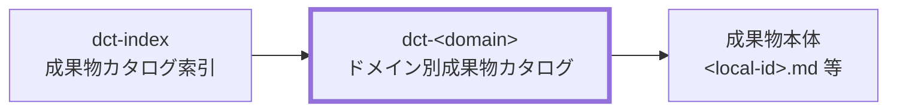

# 成果物カタログ（ドメイン別）作成ルール

Deliverables Catalog (Domain) Documentation Rules

本ドキュメントは、ドメイン別成果物カタログ（`dct-<domain>.md`）を統一形式で記述するためのルールです。
各ドメインが管理する成果物の `local-id`・種別・根拠・配置先を一覧化し、プロジェクト内のトレーサビリティを担保します。

## 1. 全体方針

- `dct-<domain>` は、特定ドメインに属する成果物の台帳として機能する。
- 個別成果物の本文内容は各成果物ファイルを正とし、カタログはメタ情報（ID・種別・根拠・配置先・概要）の管理に専念する。
- 成果物の漏れ・重複・所在不明を防ぐため、プロジェクト内で発生するすべての成果物をいずれかのドメインカタログに記載する。
- 種別（`work` / `control` / `generated`）を明示し、WBS 展開対象（`work`）を他と区別する。
- `dct-index` の「共通ルール」を SSOT として参照し、重複定義を避ける。

## 2. 位置づけ

`dct-<domain>` と関連ドキュメントの関係を示します。

- `dct-index` の索引エントリから各 `dct-<domain>.md` へリンクされる。
- 成果物本体（`<local-id>.md` 等）への参照は、必要に応じて `local-id` から相対リンクで辿れるようにする。

## 3. ファイル命名・ID規則

### 3.1. ID規約

- ドキュメント自体の `id` は `<project-id>:dct-<domain>` 形式を推奨する。
  - 例: `prj-0001:dct-project-definition`
- `<domain>` は英小文字・kebab-case とし、ドメインの業務的な意味を表す語を用いる。
- 各成果物の `local-id` は英小文字・数字・ハイフンのみとし、プロジェクト内で一意にする。

### 3.2. ファイル命名規約

- ファイル名は `dct-<domain>.md` を推奨する。
  - 例: `dct-project-definition.md`、`dct-project-management.md`
- `<domain>` はドメイン識別子と一致させる。

## 4. 推奨 Frontmatter 項目

| 項目       | 説明                                                                 | 必須 |
| ---------- | -------------------------------------------------------------------- | ---- |
| `id`       | `<project-id>:dct-<domain>`（例: `prj-0001:dct-project-management`） | ○    |
| `type`     | `project` 固定                                                       | ○    |
| `status`   | `draft` / `ready` / `deprecated`                                     | ○    |
| `part_of`  | 親となる `dct-index` の `id`（配列形式）                             | ○    |
| `rulebook` | `dct-rulebook`                                                       | 任意 |
| `based_on` | 直接根拠として参照した文書IDの配列                                   | 任意 |

## 5. 本文構成（標準テンプレ）

### 5.1. 先頭メタ情報

本文冒頭に以下のメタ情報を箇条書きで記載する。

| 項目         | 説明                                                                                   | 必須 |
| ------------ | -------------------------------------------------------------------------------------- | ---- |
| `project-id` | プロジェクトID（例: `prj-0001`）                                                       | ○    |
| `ドメイン`   | ドメイン識別子（例: `project-definition`）                                             | ○    |
| `DOMAIN`     | ドメインの略称（例: `PJD`）                                                            | 任意 |
| `配置先`     | 成果物を配置する既定ディレクトリ（ドメイン単位）。リポジトリルートからのパスで記載する | ○    |

### 5.2. 成果物一覧の標準列

| 列名       | 説明                                                                           | 必須 |
| ---------- | ------------------------------------------------------------------------------ | ---- |
| `local-id` | 成果物の論理名（例: `prj-overview`）                                           | ○    |
| `ARTIFACT` | 成果物の短縮コード（例: `OVERVIEW`）。プロジェクト内で統一する場合のみ使用する | 任意 |
| `成果物名` | 業務ユーザーが理解可能な日本語名                                               | ○    |
| `種別`     | `work` / `control` / `generated` のいずれか                                    | ○    |
| `根拠`     | 主要な依存関係（`local-id` で参照。なければ `-`）                              | ○    |
| `概要`     | 成果物の目的を1文で記述                                                        | ○    |

### 5.3. 章構成パターン

| パターン | 適用条件                             | 章構成                                                        |
| -------- | ------------------------------------ | ------------------------------------------------------------- |
| 平坦型   | 成果物がサブドメインに分かれない場合 | 先頭メタ情報 + 単一テーブル                                   |
| 章分割型 | サブドメインが2つ以上に分かれる場合  | 先頭メタ情報 + サブドメイン別章（各章に `配置先` とテーブル） |

## 6. 記述ガイド

### 6.1. タイトルと概要の記述

- H1 はドキュメントの役割が一読で判別できる名称とし、「成果物カタログ `<ドメイン>`」のように対象と目的を含めて記述する。
- H1 の直下には英語名を 1 行で記載する（例: Project Deliverables Catalog: Project Definition）。
- 英語名の直下に、ドキュメント概要を 2〜3 行で記載する。
- 概要には少なくとも「対象」「目的」「扱う範囲」を含め、詳細な手順や実装説明は書かない。

### 6.2. 先頭メタ情報の記述

- `project-id`・`ドメイン`・`配置先` は必須とし、箇条書きで記載する。
- `DOMAIN`（略称）はプロジェクト内で短縮コードを使う慣習がある場合のみ記載する。
- `配置先` はドメイン単位の既定ディレクトリを表し、リポジトリルートからのパスで記載する。ファイル単位のパスは WBS の `deliverables[].path` で管理するため、カタログには記載しない。
- サブドメインが分かれる場合は、章ごとに対応する `配置先` を記載する。

### 6.3. 成果物一覧の記述

- 一覧は表形式で記載する。
- `local-id` は backtick（`` ` ``）で囲んで記載する。
- `種別` は `work` / `control` / `generated` の3値のみを使用する。WBS 展開対象は `work` のみ。
- `根拠` には直接依存する `local-id` を記載し、複数の場合はカンマ区切りにする。依存がない場合は `-` を記載する。
- `概要` は1文以内に収め、成果物の目的を端的に示す。

### 6.4. 章分割型の記述

- サブドメイン別に章（`##` または `###`）を設け、章タイトルはサブドメインの業務名称とする。
- 各章の冒頭に `配置先` を箇条書きで記載する。
- WBS へ落とし込まない `control` / `generated` 成果物が含まれる場合は引用ブロック（`>`）で注記する。
  - 例: `> WBSへの落とし込み対象外。`

### 6.5. `ARTIFACT` 列の扱い

- `ARTIFACT` はプロジェクト内で成果物コードを管理する慣習がある場合に使用する任意列である。
- 不要な場合は列ごと省略してよい。
- 使用する場合はプロジェクト内で一意の英大文字略称を付与し、`dct-index` または別の管理台帳で定義する。

## 7. 禁止事項

- `local-id` に日本語・空白・大文字を使用しない。
- 成果物の詳細本文（仕様・手順・構成図など）を `dct-<domain>` に記載しない。詳細は成果物本体に集約する。
- 種別を `work` / `control` / `generated` 以外に拡張しない。
- 同一 `local-id` を複数ドメインのカタログに重複して記載しない。
- `根拠` 列に `local-id` 以外の表記（ファイルパス、URL など）を混在させない。

## 8. サンプル

[dct-sample.md](../samples/dct-sample.md)

## 9. 生成 AI への指示テンプレート

[dct-instruction.md](../instructions/dct-instruction.md)
