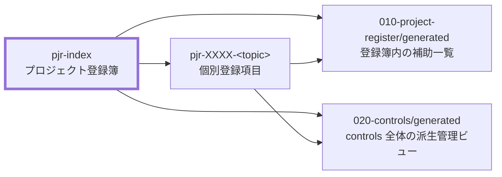

# プロジェクト登録簿 作成ルール

Project Register Documentation Rules

本ドキュメントは、プロジェクト登録簿（`pjr-index`）を統一形式で記述するためのルールです。
プロジェクト登録簿は `pjr-index` と `pjr-XXXX-<topic>.md` で構成し、TODO、要確認事項、リスク、課題、変更要求、決定事項、依存事項、備忘などの管理対象を一元管理します。
type 別、担当者別、状態別、優先度別などの派生ビューは `generated/` 配下に置き、`pjr-index` と個別登録項目を正本として扱います。

## 1. 全体方針

- `pjr-index` は、project-register の本体として機能する。
- 個別登録項目の詳細説明、判断理由、経緯、対応内容は各 `pjr-XXXX-<topic>.md` に集約し、`pjr-index` は登録項目一覧と参照先リンクの管理に専念する。
- 本文の「登録項目一覧」は、type / status / priority / 担当 / 期限 を横断的に確認する入口として扱う。
- `generated/` 配下の派生ビューは補助一覧であり、正本ではない。

## 2. 位置づけ

`pjr-index` と関連ドキュメントの関係を示します。



- `pjr-index` が project-register の起点となる。
- `pjr-XXXX-<topic>.md` は個別登録項目の正本として扱う。
- `010-project-register/generated/` には、登録簿内の補助一覧を置く。
- `020-controls/generated/` には、controls 全体の type 別管理ビューを置く。

## 3. ファイル命名・ID規則

### 3.1. ID規約

- `pjr-index` 自体の `id` は `<project-id>:pjr-index` 形式を推奨する。
  - 例: `prj-0001:pjr-index`
- 個別登録項目の表示 ID は `PJR-XXXX` 形式とする。
  - 例: `PJR-0001`
- 個別登録項目のファイル連番は 4 桁とし、project-register 内で一意にする。
- `<topic>` は英小文字・数字・ハイフンのみとし、対象領域や論点が分かる短い名称にする。

### 3.2. ファイル命名規約

- プロジェクト登録簿本体のファイル名は `pjr-index.md` とする。
- プロジェクト登録簿本体は以下に配置する。

```text
docs/ja/projects/<project-id>/030-project-management/020-controls/010-project-register/pjr-index.md
```

- 個別登録項目のファイル名は `pjr-XXXX-<topic>.md` 形式とする。
  - 例: `pjr-0001-auth-boundary.md`
  - 例: `pjr-0002-payment-migration-range.md`
- 相対リンクで `pjr-index` から個別登録項目へ遷移できる命名・配置を維持する。

## 4. 推奨 Frontmatter 項目

| 項目         | 説明                                                 | 必須 |
| ------------ | ---------------------------------------------------- | ---- |
| `id`         | `<project-id>:pjr-index`（例: `prj-0001:pjr-index`） | ○    |
| `type`       | `project` を推奨                                     | ○    |
| `status`     | `draft` / `ready` / `deprecated`                     | ○    |
| `rulebook`   | `pjr-index-rulebook`                                 | 任意 |
| `based_on`   | 登録簿全体の運用根拠として参照した文書IDの配列       | 任意 |
| `supersedes` | 置き換え元の文書IDの配列                             | 任意 |

## 5. 本文構成（標準テンプレ）

| 章  | 内容         | 必須 |
| --- | ------------ | ---- |
| 1   | 登録項目一覧 | ○    |
| 4   | 派生ビュー   | 任意 |

### 5.1. 登録項目一覧 の標準列

| 列名       | 説明                                          | 必須 |
| ---------- | --------------------------------------------- | ---- |
| ID         | `PJR-XXXX` 形式の表示 ID                      | ○    |
| タイトル   | 登録項目の内容が分かる短いタイトル            | ○    |
| 説明       | 登録項目の内容を短く説明する本文              | 条件 |
| 分類       | 登録項目の分類                                | ○    |
| ステータス | 登録項目の現在状態                            | ○    |
| 優先度     | 対応優先度                                    | ○    |
| 担当       | 主担当者または役割。未定の場合は `_TODO_`     | 任意 |
| 期限       | 対応期限または判断期限。未定の場合は `_TODO_` | 任意 |
| 個票       | `pjr-XXXX-<topic>.md` への相対リンク          | 条件 |

`description` と `個票` は、少なくともどちらか一方を記載する。短文で管理できる項目は `description` のみでよい。

### 5.2. 派生ビュー の標準リンク

「派生ビュー」章には、必要に応じて以下のリンク群を含める。

| 区分                        | リンク先例                              | 必須 |
| --------------------------- | --------------------------------------- | ---- |
| 登録簿内の未完了項目一覧    | `./generated/pjr-open-items.md`         | 任意 |
| 登録簿内の担当者別一覧      | `./generated/pjr-by-owner.md`           | 任意 |
| 登録簿内の優先度別一覧      | `./generated/pjr-by-priority.md`        | 任意 |
| 登録簿内の状態別一覧        | `./generated/pjr-by-status.md`          | 任意 |
| controls 全体のリスク登録簿 | `../generated/pm-risk-register.md`      | 任意 |
| controls 全体の課題ログ     | `../generated/pm-issue-log.md`          | 任意 |
| controls 全体の変更要求ログ | `../generated/pm-change-request-log.md` | 任意 |
| controls 全体の決定記録     | `../generated/pm-decision-log.md`       | 任意 |

## 6. 記述ガイド

### 6.1. タイトルと概要の記述

- H1 は `プロジェクト登録簿` とし、project-register の本体であることが分かる名称にする。
- H1 の直下には英語名を 1 行で記載する（例: Project Register）。
- 英語名の直下に、ドキュメント概要を 2〜3 行で記載する。
- 概要には少なくとも「対象」「目的」「登録項目を一覧管理すること」を含め、個別項目の詳細説明は書かない。

### 6.2. 登録項目一覧の記述

- 一覧は表形式で記載する。
- 短文で管理できる項目は、`description` に内容を記載し、個票を作成しなくてよい。
- 詳細説明、判断理由、経緯、対応内容、根拠、添付情報が必要な項目は個票を作成する。
- 「個票」列にリンクを記載する場合は `[pjr-XXXX-<topic>.md](./pjr-XXXX-<topic>.md)` 形式で相対リンクを記載する。
- 個票を作成しない場合、「個票」列は `-` とする。
- タイトルは1文以内に収め、登録項目の内容を端的に示す。
- `description` は1〜2文以内に収め、長文化する場合は個票へ分離する。
- 担当または期限が未定の場合は空欄にせず `_TODO_` と記載する。
- 個票がある一覧行は個別登録項目の要約に留め、判断理由、経緯、対応内容は個別登録項目へ分離する。

### 6.3. type / status / priority の記述

- `type` は `todo` / `question` / `risk` / `issue` / `change-request` / `decision` / `dependency` / `note` のいずれかを使用する。
- `status` は `open` / `in-progress` / `waiting` / `review` / `decided` / `done` / `deferred` / `rejected` のいずれかを使用する。
- `priority` は `high` / `medium` / `low` のいずれかを使用する。
- type / status / priority の値は、派生ビュー生成や横断管理で使用するため、表記ゆれを作らない。

### 6.4. 派生ビューの記述

`generated/` 配下のファイルは、project-register から生成される派生ビューであり、正本ではない。

- `010-project-register/generated/` は、登録簿内の補助一覧を置く。
- `020-controls/generated/` は、controls 全体の type 別管理ビューを置く。
- 派生ビューの内容と `pjr-index` または個別登録項目が矛盾する場合は、`pjr-index` または個別登録項目を正とする。

### 6.5. based_on の記述

- `pjr-index` の `based_on` は、登録簿全体の運用根拠だけを記載する。
- 登録項目ごとの根拠文書は、個別の `pjr-XXXX-<topic>.md` 側に記載する。
- 登録簿全体の直接根拠がない場合、`based_on` は省略してよい。

## 7. 禁止事項

- `pjr-index` に個別登録項目の詳細説明、判断理由、経緯、対応内容を長文で記載しない。
- type 別一覧、担当者別一覧、状態別一覧、優先度別一覧を `pjr-index` 本文で重複管理しない。
- `generated/` 配下の派生ビューを正本として扱わない。
- `type` / `status` / `priority` に未定義の値を使用しない。
- `description` と `個票` の両方がない一覧行を作成しない。
- Git 管理を前提とする場合に、手書きの更新履歴を追加しない。
- 特定プロジェクト固有の例外事項を共通ルールとして記載しない。

## 8. サンプル

_TODO_: `pjr-index-sample.md` を作成する。

## 9. 生成 AI への指示テンプレート

_TODO_: `pjr-index-instruction.md` を作成する。
