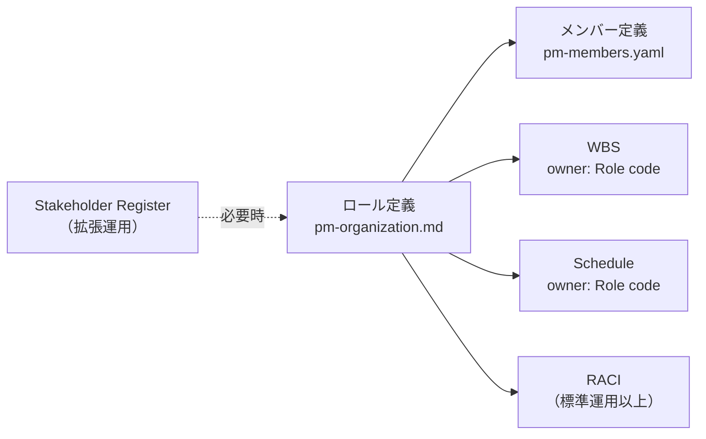

# 組織定義 作成ルール

Organization Definition Documentation Rulebook

本ドキュメントは、プロジェクトで採用するロールを定義する `pm-organization.md` を一貫した形式で記述するためのルールを定義する。ロールは責務・判断権限・専門性を表す論理的な役割であり、WBS / Schedule の `owner` および `pm-members.yaml` の参照基準として機能する。

## 1. 全体方針

- 本ルールの対象は、プロジェクトで採用する Role（ロール）を定義する `pm-organization.md` である。
- ロールは、個人名・部署名・agent 名ではなく、プロジェクト上の責務・判断権限・専門性を表す論理的な役割として定義する。
- WBS / Schedule の `owner` には、本書で定義した Role code のみを使用する。
- `pm-members.yaml` の `role` フィールドは、本書に存在する Role code を参照する。
- 小規模運用では最低限の Role のみを定義し、規模に応じて拡張する。
- 兼務（1 つの主体が複数 Role の作業を担うこと）は認めるが、兼務を理由に責務境界を曖昧にしない。
- agent は実行支援者であり、最終承認責任を持たせない。
- 未確定のロール採用判断は `_UNDECIDED_:` ラベルで明示し、放置しない。
- 必要な章と記述粒度は規模（小規模・中規模・大規模）によって異なる。詳細は `本文構成（標準テンプレ）` を参照する。

## 2. 位置づけと用語定義

### 2.1. 位置づけ（他ドキュメントとの関係）

- `pm-organization.md`: プロジェクトで採用する Role と責務を定義する（本書の対象）
- `pm-members.yaml`: 実際に作業する人間または agent を定義する。`role` に Role code を参照する
- WBS / Schedule: `owner` に Role code を使用する
- `pm-raci.md`: Role ごとの責任分担を定義する（中規模以上で導入）
- `prj-stakeholder-register.md`: 外部関係者の利害・期待・合意対象を管理する（拡張運用で導入）

### 2.2. 用語定義

| 用語      | 定義                                                            |
| --------- | --------------------------------------------------------------- |
| Role      | 責務・判断権限・専門性を表す論理的な役割                        |
| Role code | Role を表す短い識別子。例: `PO`, `PM`, `BA`, `ARC`, `DEV`, `QE` |
| Member    | 実際に作業する人間または agent                                  |
| nickname  | CLI や実行ログで使う Member の安定識別子                        |
| `owner`   | WBS / Schedule 上の主責任ロール。Role code を使う               |
| `role`    | Member が対応する Role code。`pm-members.yaml` で使う           |
| `--by`    | タスクを実行する Member の nickname                             |
| 兼務      | 1 人の人間または agent が複数 Role の作業を担うこと             |

## 3. ファイル命名・ID規則

### 3.1. 配置（推奨）

- 推奨パス: `docs/ja/projects/<project-id>/030-project-management/020-organization/pm-organization.md`
- 公開リポジトリに配置する場合は、個人情報・非公開の組織情報・機密性の高い情報を記載しない。

### 3.2. ドキュメント ID（推奨）

- 推奨: `<project-id>:pm-organization`
  - 例: `prj-0001:pm-organization`

### 3.3. ファイル名（推奨）

- 推奨: `pm-organization.md`

## 4. 推奨 Frontmatter 項目

- 参照スキーマ: [deliverable-frontmatter.schema.yaml](../../../specdojo/schemas/v1/deliverable-frontmatter.schema.yaml)
- メタ情報標準: [deliverable-metadata-standard.md](../standards/deliverable-metadata-standard.md)

| 項目         | 説明                             | 必須 |
| ------------ | -------------------------------- | ---- |
| `id`         | `<project-id>:pm-organization`         | ○    |
| `type`       | `project` 固定                   | ○    |
| `status`     | `draft` / `ready` / `deprecated` | ○    |
| `rulebook`   | `pm-organization-rulebook`             | ○    |
| `based_on`   | 参照した標準・方針の ID（配列）  | 任意 |
| `supersedes` | 置き換え対象の旧文書 ID          | 任意 |

## 5. 本文構成（標準テンプレ）

規模の目安:

- **小規模**: 個人・AI 支援中心で、1 人が複数 Role を兼務する運用
- **中規模**: 複数人・定期進捗管理・RACI が必要な運用
- **大規模**: 外部関係者・監査・全ロール分離が必要な運用

| 番号 | 見出し                           | 小規模 | 中規模 | 大規模 | 内容（要点）                                                                 |
| ---- | -------------------------------- | ------ | ------ | ------ | ---------------------------------------------------------------------------- |
| 1    | 基本方針                         | ○      | ○      | ○      | ロール定義の目的、`owner` の使用ルール、兼務方針の基本原則                   |
| 2    | 標準ロールと規模別の扱い         | ○      | ○      | ○      | SpecDojo 標準ロール一覧と規模（小・中・大）ごとの採用方針                    |
| 3    | 採用ロール                       | ○      | ○      | ○      | プロジェクトで採用する各 Role の詳細定義と主な責務                           |
| 4    | 兼務方針                         | ○      | ○      | 省略可 | 兼務の可否・規則と規模別の扱いを表で示す（大規模では兼務が少ないため省略可） |
| 5    | `owner` の意味                   | ○      | ○      | ○      | WBS / Schedule の `owner` の定義と使用可能な Role code 一覧                  |
| 6    | member との関係                  | ○      | ○      | ○      | Role と Member の関係、`pm-members.yaml` の参照ルールと記述例                |
| 7    | `owner` / `role` / `--by` の違い | ○      | ○      | ○      | 3 概念の定義と使い分けを示す比較表                                           |
| 8    | 意思決定責任                     | 簡易可 | ○      | ○      | 判断対象ごとの主責任ロール、相談先、記録先                                   |
| 9    | Agent 委任方針                   | ○      | ○      | ○      | agent に委任できる作業と人間が最終判断すべき事項                             |
| 10   | エスカレーション                 | 省略可 | ○      | ○      | 判断不能・責務競合・遅延発生時の一次対応と最終判断ロール                     |
| 11   | 見直し条件                       | 簡易可 | ○      | ○      | ロール定義を見直すトリガーと見直し内容                                       |
| 12   | 禁止事項                         | ○      | ○      | ○      | `owner` 誤記、agent への責任移譲などの禁止項目と理由                         |

小規模での最小構成:

- 章 1〜7、9、12 を完全に記述する。
- 章 8（意思決定責任）と章 11（見直し条件）は簡易化可（表不要、主方針のみ）。`PO` が最終判断するという方針を章 1 に記述すれば足りる。
- 章 10（エスカレーション）は省略可。ただし `PO` への集約方針を章 1 に明記すること。

## 6. 記述ガイド

### 6.1. 基本方針

- ロールを定義する目的（Schedule `owner` / Member `role` の基準として使う）と、採用基準（責務境界が明確になるか）を簡潔に記述する。
- `owner` の使用先（WBS / Schedule）と使用禁止箇所（個人名・member nickname・agent 名・stakeholder ID）を明記する。
- 兼務の可否と「兼務しても責務境界を維持する」原則を明示する。
- 最低でも 3 項目の方針を箇条書きで示す。
- **小規模**: 「最終判断は `PO` が担う」「判断不能時は `PO` に集約する」旨をここに記述すれば、章 8・章 10 を省略または簡易化できる。

### 6.2. 標準ロールと規模別の扱い

- SpecDojo の標準ロール（`PO`, `PM`, `BA`, `ARC`, `DEV`, `QE`, `UX`, `OPS`）の全 8 ロールを行として並べる。
- 各ロールの正式名称、本プロジェクトでの採用状況（採用/未採用）、兼務・省略の方針を記載する。
- **主な責務の列は書かない**。標準的な責務は `people-and-organization-definition-standard` を参照する。本表にはプロジェクト固有の採用判断のみを記載する。
- **小規模**: 必須採用は `PO` のみ。`BA`, `ARC`, `QE` は責務を分けたい場合に追加する。`PM`, `DEV`, `UX`, `OPS` は原則省略し、`PO` が兼務してよい。
- **中規模**: `PO`, `PM`, `BA`, `ARC`, `QE` を推奨。`DEV`, `UX`, `OPS` は必要時に追加する。
- **大規模**: 全ロールを分離して定義する。

推奨表（標準ロール一覧）:

| Role code | 正式名称 | 本プロジェクトでの採用 | 兼務・省略の方針 |
| --------- | -------- | ---------------------- | ---------------- |

### 6.3. 採用ロール

- プロジェクトで採用する Role を個別の節（`### 3.n.`）として記述する。
- 各 Role の責務を箇条書きで 3 件以上記載する。
- 小規模運用で兼務がある場合は、兼務する責務を明記する。
- 未採用ロールは本章に含めず、標準ロールの表（見出し「標準ロールと規模別の扱い」）で管理する。
- **小規模**: 採用ロールが `PO` のみであっても、責務箇条書きと兼務する責務の範囲を明記する。

### 6.4. 兼務方針

- 兼務を認める Role の一覧と、それぞれの扱いを表で示す。
- 兼務しても `owner` には作業の性質に最も近い Role code を使うことを明示する。
- `owner` の書き分けルールを簡潔に説明する。
- **小規模**: 本章は必須。兼務が多いほど責務境界を明記することが重要になる。
- **大規模**: 兼務がほとんど発生しない場合は本章を省略してよい。

推奨表（兼務方針）:

| 標準ロール | 小規模運用での扱い | 備考 |
| ---------- | ------------------ | ---- |

### 6.5. `owner` の意味

- WBS / Schedule の `owner` が「主責任ロール」であることを明示する。
- 本書で採用した Role code のうち `owner` として使用できるものを箇条書きで列挙する。
- 現時点で使用しない Role code（未採用ロール）も明示する。
- YAML の記述例を示す。

### 6.6. member との関係

- Member が実際に作業する人間または agent であることを説明する。
- `pm-members.yaml` の `role` フィールドに Role code を記載するルールを示す。
- `role: null` の汎用 agent の扱い（実行時に対象ロールを明示する）を記述する。
- YAML の記述例を示す（`nickname`, `display_name`, `role`, `type` を含むこと）。

### 6.7. `owner` / `role` / `--by` の違い

- 3 概念を比較表で示す。

推奨表（3 概念の比較）:

| 項目 | 意味 | 値の例 | 管理先 |
| ---- | ---- | ------ | ------ |

- 各概念の使用先と書き方の原則を箇条書きで 3 件以上記述する。

### 6.8. 意思決定責任

- 判断対象ごとに主責任ロール、相談先、記録先を表で示す。
- プロジェクトの種類・規模に関わらず共通する判断（スコープ変更、公開判断、品質基準）は必ず含める。
- **小規模**: 全判断対象を表にするかわりに、「すべての最終判断は `PO` が担う。各ロールは判断材料を提示する」と章 1 に記述すれば本章を簡易化（箇条書き数行）できる。
- **中規模以上**: 全主要判断対象を表で記述する。

推奨表（意思決定責任）:

| 判断対象 | 主責任ロール | 相談先 | 記録先 |
| -------- | ------------ | ------ | ------ |

### 6.9. Agent 委任方針

- agent が実行支援者であり、人間の判断や説明責任を代替しないことを冒頭に明示する。
- 作業種別ごとに委任可否と最終判断者を表で示す。
- 「不可」判断は `PO` または対応ロールの人間が担うことを明示する。

推奨表（委任方針）:

| 作業種別 | agent 委任 | 最終判断 |
| -------- | ---------- | -------- |

### 6.10. エスカレーション

- 判断不能・責務競合・遅延・品質上の懸念が発生した場合の対応を示す。
- 状況ごとに一次対応ロール、最終判断者、記録先を表で示す。
- **小規模**: 章 1 に「判断不能時はすべて `PO` が最終判断する」と記述すれば本章を省略できる。
- **中規模以上**: 状況別の一次対応ロールと記録先を表で記述する。

推奨表（エスカレーション）:

| 状況 | 一次対応ロール | 最終判断 | 記録先 |
| ---- | -------------- | -------- | ------ |

### 6.11. 見直し条件

- ロール定義を見直すトリガーと見直し内容を表で示す。
- **小規模**: 主要トリガー 3 件（スコープ変更・複数人運用開始・実装規模の変化など）のみでよい。
- **中規模以上**: 全トリガーを表で記述する。

推奨表（見直し条件）:

| 更新トリガー | 見直し内容 |
| ------------ | ---------- |

### 6.12. 禁止事項

- 禁止事項を列挙する。中規模以上は理由を列として表で示す。
- **小規模**: 箇条書き（理由なし）でよい。
- **中規模以上**: 禁止事項と理由を 2 列の表で示す。
- 次の項目は規模にかかわらず必ず含める。
  - Schedule / WBS の `owner` に個人名・member nickname・agent 名・stakeholder ID を書くこと
  - `pm-members.yaml` の member 側で `owner` フィールドを使うこと
  - agent に最終承認責任を持たせること
  - 兼務を理由に責務境界を曖昧にすること

## 7. 禁止事項

| 禁止事項                                                      | 理由                                                                  |
| ------------------------------------------------------------- | --------------------------------------------------------------------- |
| Schedule / WBS の `owner` に個人名を書くこと                  | 責務がロールではなく人に依存し、引継ぎ時に混乱するため                |
| Schedule / WBS の `owner` に member nickname を書くこと       | `owner`（主責任ロール）と executor（実行主体）が混同されるため        |
| Schedule / WBS の `owner` に agent 名を書くこと               | ロールと実行主体が混同されるため                                      |
| Schedule / WBS の `owner` に stakeholder ID を書くこと        | ロールではない概念が Schedule に混入するため                          |
| `pm-members.yaml` の member 側で `owner` フィールドを使うこと | `owner` はタスク側のフィールドであり、member 側には `role` を使うため |
| 未採用ロールを Schedule / WBS の `owner` に使うこと           | 本書と Schedule の整合性が崩れるため                                  |
| agent に最終承認責任を持たせること                            | 説明責任が不明確になり、判断の追跡ができないため                      |
| 兼務を理由に責務境界を曖昧にすること                          | レビュー・承認の独立性が失われるため                                  |
| 公開文書に不要な個人情報や非公開組織情報を書くこと            | 情報管理リスクを高めるため                                            |
| ロール採用の未確定事項を `_UNDECIDED_:` なしで放置すること    | 判断漏れが Schedule の `owner` 不整合を引き起こすため                 |

## 8. サンプル

サンプル未作成。作成後にリンクを追記する。

## 9. 生成 AI への指示テンプレート

instruction 未作成。作成後にリンクを追記する。
