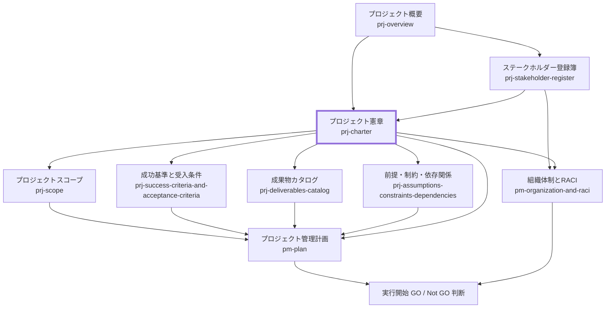

# プロジェクト憲章 作成ルール

Project Charter Documentation Rulebook

本ドキュメントは、プロジェクト憲章を統一形式で記述するためのルールです。
関係者が「誰が、何を、どの段階まで承認したか」を監査可能な粒度で残すことを目的とします。

## 1. 全体方針

- 本ルールの対象は、プロジェクトの立ち上げ認可と初期段階の権限委譲を示す「プロジェクト憲章」です。
- プロジェクト憲章は、プロジェクトの存在を正式に認可し、プロジェクトマネージャーに詳細計画の策定および初期準備を進める権限を付与する文書です。
- プロジェクト憲章の承認は、本格実行の開始を意味しません。
- 本格実行の開始可否は、プロジェクトスコープ、成功基準、成果物カタログ、前提・制約・依存関係、およびプロジェクト管理計画の作成後に、GO / Not GO 判断として別途確認します。
- 背景・目的・必要性・期待効果の詳細本文は [prj-overview-rulebook.md](prj-overview-rulebook.md) を正とし、本書は認可判断に必要な要約と参照を記載します。
- 詳細なスコープ、成功基準、成果物一覧、管理方針、体制、スケジュール、リスク、コミュニケーション方針は、本憲章の承認後に作成または詳細化する関連文書で管理します。
- 曖昧表現（例: 「適切に」「十分に」）は避け、認可対象、権限範囲、後続判断条件を判定可能な形で記述します。

## 2. 位置づけと用語定義

### 2.1. 位置づけ（他ドキュメントとの関係）

プロジェクト憲章と関連ドキュメントの関係を示します。



### 2.2. 用語定義（本ルール内）

| 用語                     | 定義                                                                                           |
| ------------------------ | ---------------------------------------------------------------------------------------------- |
| プロジェクト憲章         | プロジェクトの立ち上げを正式に認可し、詳細計画の策定および初期準備を進める権限を付与する文書   |
| スポンサー               | プロジェクトの立ち上げ、重要変更、本格実行開始等の主要判断に責任を持つ役割                     |
| プロジェクトマネージャー | 憲章で委譲された範囲内で、詳細計画の策定、初期準備、実行管理を担う役割                         |
| 立ち上げ認可             | プロジェクトとして正式に開始し、詳細計画の策定および初期準備へ進むことを認める判断             |
| 本格実行                 | 承認されたプロジェクト管理計画に基づき、計画された成果物作成・管理活動を本格的に開始する段階   |
| GO / Not GO 判断         | 本格実行へ進むか、再計画・保留・中止とするかを判定する判断                                     |
| ハイレベルスコープ       | 憲章時点で認可する大まかな対象範囲。詳細な対象範囲と対象外はプロジェクトスコープで定義する     |
| ハイレベル成果物         | 憲章時点で想定する主要成果物群。詳細な一覧、配置、派生関係は成果物カタログで定義する           |
| ハイレベル成功基準       | 憲章時点で想定する成功判定の観点。具体的な指標、目標値、受入条件は成功基準と受入条件で定義する |
| 権限委譲                 | プロジェクトマネージャーに付与する意思決定範囲と制約                                           |
| 承認事項                 | 誰が何を承認したかを示す記録対象                                                               |
| 証跡                     | 承認・判定・変更履歴を追跡できる記録（会議体、チケット、議事録、Pull Request、決定記録など）   |

## 3. ファイル命名・ID規則

### 3.1. 配置（推奨）

- `docs/ja/projects/<project-id>/010-project-definition/` 配下への配置を推奨します。
- 関連資料（承認議事録、スポンサー合意メモ、決定記録等）は同階層または関連する管理文書配下に配置し、本文から参照できる状態にします。
- ファイル名を日本語にする場合も、frontmatter の `id` で一意性を担保します。

### 3.2. ドキュメントID（推奨）

- 推奨: `<project-id>-prj-charter`
  - 例: `prj-0001-prj-charter`

### 3.3. ファイル名（推奨）

- 推奨: `prj-charter.md`
- 日本語ファイル名の場合: `プロジェクト憲章.md`

## 4. 推奨 Frontmatter 項目

### 4.1. 設定内容

- 参照スキーマ: [docs/specdojo/schemas/v1/deliverable-frontmatter.schema.yaml](../../../specdojo/schemas/v1/deliverable-frontmatter.schema.yaml)
- メタ情報標準: [deliverable-metadata-standard.md](../standards/deliverable-metadata-standard.md)

| 項目       | 説明                                                                                   | 必須 |
| ---------- | -------------------------------------------------------------------------------------- | ---- |
| id         | `<project-id>-prj-charter`                                                             | ○    |
| type       | `project` 固定                                                                         | ○    |
| status     | `draft` / `ready` / `deprecated`                                                       | ○    |
| rulebook   | `prj-charter-rulebook`                                                                 | ○    |
| based_on   | プロジェクト概要、ステークホルダー登録簿など、立ち上げ認可の根拠として直接参照した文書 | 任意 |
| supersedes | 置き換え対象の旧文書 ID                                                                | 任意 |

### 4.2. 推奨ルール

- `based_on` は、立ち上げ認可の根拠として直接参照した資料のみを列挙します。
- PMBOK 準拠の立ち上げ認可文書として扱う場合、`based_on` は原則として `prj-overview` と `prj-stakeholder-register` を中心にします。
- `prj-scope`、`prj-success-criteria-and-acceptance-criteria`、`prj-deliverables-catalog`、`prj-assumptions-constraints-dependencies`、`pm-plan`、`pm-organization-and-raci` は、原則として `prj-charter` 承認後に作成または詳細化する文書であり、初版憲章の `based_on` には含めません。
- 後続文書を改訂した結果、憲章自体の認可範囲や権限委譲を変更する必要がある場合は、憲章を改訂し、必要に応じて再承認します。
- 改訂時は `supersedes` に旧文書 ID を設定し、差し替え関係を追跡可能にします。
- H1 にはプロジェクト名を含め、Frontmatter には `title` を持たせません。

推奨例:

```yaml
---
id: prj-0001-prj-charter
type: project
status: draft
rulebook: prj-charter-rulebook
based_on:
  - prj-0001-prj-overview
  - prj-0001-prj-stakeholder-register
supersedes: []
---
```

## 5. 本文構成（標準テンプレ）

プロジェクト憲章は以下の見出し構成を順序固定で配置します。

### 5.1. プロジェクト憲章（Project Charter）

| 番号 | 見出し                          | 必須 | 内容（要点）                                                           |
| ---- | ------------------------------- | ---- | ---------------------------------------------------------------------- |
| 1    | 本書の目的                      | ○    | 立ち上げ認可文書であること、本格実行開始ではないこと、概要根拠への参照 |
| 2    | 認可対象                        | ○    | プロジェクト名、プロジェクト ID、認可対象、参照文書                    |
| 3    | プロジェクトの目的              | ○    | プロジェクト概要に基づく目的の要約                                     |
| 4    | ハイレベルスコープ              | ○    | 初期検討および詳細計画策定の対象範囲、詳細化先                         |
| 5    | ハイレベル成果物                | ○    | 想定する主要成果物群、詳細化先                                         |
| 6    | ハイレベル成功基準              | ○    | 成功判定の候補観点、詳細化先                                           |
| 7    | 初期ステークホルダー            | ○    | 初期関係者、主要役割、ステークホルダー登録簿への参照                   |
| 8    | 権限委譲                        | ○    | PM に付与する権限、スポンサー承認が必要な事項                          |
| 9    | 主要前提・制約                  | ○    | 憲章時点の主要な前提・制約、詳細化先                                   |
| 10   | 後続で作成・詳細化する文書      | ○    | 憲章承認後に作成する文書と目的                                         |
| 11   | 本格実行開始の GO / Not GO 判断 | ○    | 本格実行前に確認する観点、記録先                                       |
| 12   | 承認                            | ○    | 承認者、承認日、承認対象、証跡リンク                                   |
| 13   | 未決事項                        | 任意 | 今後の意思決定が必要な論点、期限、担当                                 |

## 6. 記述ガイド

### 6.1. 共通

- プロジェクト憲章は、詳細計画を作る前に、プロジェクトの立ち上げを認可する文書として記述します。
- 本書の承認が本格実行開始を意味しない場合は、その旨を明記します。
- 事実（観測値/制約）と判断（方針/選択理由）を分離して記述します。
- 章参照は章番号ではなく章タイトルで記述します。
- 未確定事項は `_UNDECIDED_`、仮置き前提は `_ASSUMPTION_` を用いて明示します。
- 背景や期待効果の詳細説明を本書に重複転記せず、[prj-overview-rulebook.md](prj-overview-rulebook.md) への参照で整合を保ちます。
- 後続文書で詳細化する内容は、憲章では概要レベルに留めます。
- 「詳細は後続文書で定義する」と記述する場合は、後続文書名を明示します。

### 6.2. プロジェクト概要との分担

- `prj-overview` は、プロジェクトの背景、目的、必要性、期待効果、前提条件、社会的意義を説明する構想・概要文書です。
- `prj-charter` は、`prj-overview` を根拠として、プロジェクトの立ち上げを正式に認可する文書です。
- 本書は「なぜ重要か」を詳細に説明する文書ではなく、「何を立ち上げ、誰にどこまで権限を与えるか」を明確にする文書です。
- 背景、必要性、期待効果、オープンソース公開の意義などの詳細は `prj-overview` を正とします。
- 本書に背景や目的を記載する場合は、認可判断に必要な要約のみに留めます。

### 6.3. 認可対象

- 認可対象には、プロジェクト名、プロジェクト ID、認可する段階を明記します。
- 認可する段階は、原則として「立ち上げ」「詳細計画の策定」「初期準備」とします。
- 本格実行まで認可する場合は、実行計画、体制、スケジュール、予算、リスク対応が確認済みであることを明記します。
- 初期憲章では、詳細文書が未作成であることを前提に、後続で作成・詳細化する文書を示します。

推奨表（認可対象）:

| 項目                 | 内容 |
| -------------------- | ---- |
| プロジェクト名       |      |
| プロジェクトID       |      |
| 認可対象             |      |
| プロジェクト概要     |      |
| 初期ステークホルダー |      |

### 6.4. ハイレベルスコープ

- 憲章では、詳細なスコープ定義ではなく、立ち上げ時点で認可する大まかな対象範囲を記載します。
- 詳細な対象範囲、対象外、境界条件は `prj-scope` で定義します。
- スコープ外を憲章に記載する場合は、明確に分かっている主要な対象外のみに留めます。
- 詳細計画策定前に確定できない事項は、未決事項または後続文書での詳細化対象として扱います。

推奨表（ハイレベルスコープ）:

| 区分   | 内容 | 詳細化先               |
| ------ | ---- | ---------------------- |
| 対象   |      | `prj-scope`            |
| 対象外 |      | `prj-scope`            |
| 未確定 |      | `prj-scope` / 未決事項 |

### 6.5. ハイレベル成果物

- 憲章では、主要成果物群を候補として記載します。
- 成果物の詳細な一覧、配置、生成元、派生関係は `prj-deliverables-catalog` で定義します。
- 成果物を確定扱いにする場合は、承認済みであること、または後続の変更管理対象であることを明記します。
- 詳細化前の段階では、「整備対象の候補」「主要成果物群」などの表現を用います。

推奨表（ハイレベル成果物）:

| 成果物群 | 内容 | 詳細化先                   |
| -------- | ---- | -------------------------- |
|          |      | `prj-deliverables-catalog` |

### 6.6. ハイレベル成功基準

- 憲章では、成功判定の候補観点を記載します。
- 具体的な成功指標、目標値、受入条件、判定方法、承認者は `prj-success-criteria-and-acceptance-criteria` で定義します。
- 憲章に数値目標を記載する場合は、初期仮説であるか、正式なコミット値であるかを明示します。
- 成功基準は、後続の GO / Not GO 判断や受入判断に接続できる粒度にします。

推奨表（ハイレベル成功基準）:

| 観点 | 成功判定の候補 | 詳細化先                                       |
| ---- | -------------- | ---------------------------------------------- |
|      |                | `prj-success-criteria-and-acceptance-criteria` |

### 6.7. 初期ステークホルダー

- 初期ステークホルダーは `prj-stakeholder-register` を正とします。
- 憲章には、認可判断と権限委譲に必要な主要役割のみを要約します。
- 個人プロジェクト等でスポンサー、プロジェクトオーナー、プロジェクトマネージャーを同一主体が兼ねる場合は、その旨を明記します。
- 個人情報、連絡先、非公開の組織情報、機密性の高い利害関係は、公開文書には記載しません。

推奨表（初期ステークホルダー）:

| 役割 | 関与区分 | 主な責任 |
| ---- | -------- | -------- |
|      |          |          |

### 6.8. 権限委譲

- 承認権限（最終決裁）と実行権限（運営判断）を分けて記述します。
- 憲章承認時点でプロジェクトマネージャーに委譲する権限は、詳細計画策定および初期準備を中心に定義します。
- 本格実行開始、主要目的の変更、ハイレベルスコープの大幅変更、主要成果物群の追加・削除、予算・納期・体制に大きな影響を与える変更は、スポンサーまたはプロジェクトオーナーの承認事項として扱います。
- 変更要求、予算超過、納期変更のエスカレーション経路を定義します。
- 役割ごとに責任範囲と不在時代理を明示します。ただし、詳細な RACI は `pm-organization-and-raci` で定義します。

推奨表（権限マトリクス）:

| 項目         | 決裁者 | 実行責任者 | 協議先 | 証跡 |
| ------------ | ------ | ---------- | ------ | ---- |
| 立ち上げ認可 |        |            |        |      |
| 詳細計画策定 |        |            |        |      |
| 本格実行開始 |        |            |        |      |
| 主要変更     |        |            |        |      |

### 6.9. 主要前提・制約

- 憲章では、立ち上げ判断に必要な主要な前提・制約のみを記載します。
- 詳細な前提、制約、依存関係は `prj-assumptions-constraints-dependencies` で定義します。
- 公開リポジトリで管理する文書では、個人情報、非公開の組織情報、機密性の高い利害関係を記載しない制約を明示します。
- 特定の技術、製品、組織、開発手法への依存がある場合は、憲章時点で分かる範囲で記載します。

推奨表（主要前提・制約）:

| 区分 | 内容 | 詳細化先                                   |
| ---- | ---- | ------------------------------------------ |
| 前提 |      | `prj-assumptions-constraints-dependencies` |
| 制約 |      | `prj-assumptions-constraints-dependencies` |
| 依存 |      | `prj-assumptions-constraints-dependencies` |

### 6.10. 後続で作成・詳細化する文書

- 憲章承認後に作成または詳細化する文書を明示します。
- 後続文書は、原則として `prj-charter` を `based_on` として作成します。
- ただし、各文書の直接入力となる文書が別にある場合は、`based_on` を最小限に絞ります。
- 後続文書で詳細化する事項を、憲章本文に重複して詳細記載しません。

推奨表（後続文書）:

| 文書                                           | 目的                                             |
| ---------------------------------------------- | ------------------------------------------------ |
| `prj-scope`                                    | プロジェクトの対象範囲と対象外を明確にする       |
| `prj-success-criteria-and-acceptance-criteria` | 成功基準、完了定義、受入条件、判定方法を定義する |
| `prj-deliverables-catalog`                     | 成果物の一覧、配置、生成元、派生関係を整理する   |
| `prj-assumptions-constraints-dependencies`     | 実行上の前提条件、制約事項、外部依存を明示する   |
| `pm-plan`                                      | プロジェクト全体の管理方針と実行計画を定義する   |
| `pm-organization-and-raci`                     | 体制図と責任分担を定義する                       |

### 6.11. 本格実行開始の GO / Not GO 判断

- 憲章承認後、プロジェクトは詳細計画策定および初期準備の段階へ移行します。
- 本格実行を開始する前に、`pm-plan` の承認時点で GO / Not GO 判断を行います。
- GO / Not GO 判断では、スコープ、成功基準、成果物、前提・制約、体制、管理方針、公開方針などを確認します。
- 判断結果は、`pm-plan`、決定記録、議事録、Issue、Pull Request 等に証跡として記録します。
- Not GO の場合は、再計画、保留、中止、条件付き GO のいずれかを明確にします。

推奨表（GO / Not GO 判断観点）:

| 判定観点   | 確認内容                                                                         | 主な参照文書                                          |
| ---------- | -------------------------------------------------------------------------------- | ----------------------------------------------------- |
| スコープ   | 対象範囲と対象外が定義されていること                                             | `prj-scope`                                           |
| 成功基準   | 成功基準、受入条件、判定方法が定義されていること                                 | `prj-success-criteria-and-acceptance-criteria`        |
| 成果物     | 主要成果物と管理方法が定義されていること                                         | `prj-deliverables-catalog`                            |
| 前提・制約 | 実行上の前提、制約、依存関係が整理されていること                                 | `prj-assumptions-constraints-dependencies`            |
| 体制       | 役割と責任分担が定義されていること                                               | `pm-organization-and-raci`                            |
| 管理方針   | 進捗、品質、リスク、課題、変更、コミュニケーションの管理方針が定義されていること | `pm-plan`                                             |
| 公開方針   | オープンソース公開、ライセンス、個人情報・機密情報の扱いが確認されていること     | `pm-plan`, `prj-assumptions-constraints-dependencies` |

推奨表（GO / Not GO 判断結果）:

| 判定        | 判定日      | 判定者      | 条件        | 証跡        |
| ----------- | ----------- | ----------- | ----------- | ----------- |
| _UNDECIDED_ | _UNDECIDED_ | _UNDECIDED_ | _UNDECIDED_ | _UNDECIDED_ |

### 6.12. 承認と証跡

- 承認履歴は、日付、承認者、承認対象、証跡リンクを必須項目とします。
- 口頭合意のみで完了扱いにせず、会議体記録、チケット、Pull Request、決定記録等を残します。
- 憲章承認は、立ち上げ認可であることを明記します。
- 本格実行開始の承認は、憲章承認とは別の GO / Not GO 判断として記録します。
- 改版時は差分要約と再承認要否を明記します。

推奨表（承認履歴）:

| 版  | 承認日 | 承認者 | 承認対象 | 証跡リンク |
| --- | ------ | ------ | -------- | ---------- |

### 6.13. 未決事項

- 立ち上げ時点で確定していない事項は、未決事項として記載します。
- 未決事項には、論点、期限、担当、対応方針を記載します。
- 未決事項は、後続文書で解消するか、決定記録として扱うかを明確にします。
- 未決事項を放置せず、GO / Not GO 判断までに解消が必要なものを識別します。

推奨表（未決事項）:

| 論点 | 期限 | 担当 | 対応方針 |
| ---- | ---- | ---- | -------- |

## 7. 禁止事項

| 項目                                                                   | 理由                                                                        |
| ---------------------------------------------------------------------- | --------------------------------------------------------------------------- |
| `pm-plan` や `pm-organization-and-raci` を初版憲章の前提文書として扱う | PMBOK 準拠の作成順序と逆転し、依存関係が分かりにくくなるため                |
| 憲章承認を本格実行開始の承認と混同する                                 | 立ち上げ認可と実行開始判断の責務が曖昧になるため                            |
| 詳細スコープを憲章に過剰記載する                                       | `prj-scope` との二重管理を招くため                                          |
| 成果物一覧や配置を憲章に過剰記載する                                   | `prj-deliverables-catalog` との二重管理を招くため                           |
| 具体的な成功指標・受入条件を憲章だけで確定する                         | `prj-success-criteria-and-acceptance-criteria` との責務分担が曖昧になるため |
| 設計詳細（DB定義、API項目詳細等）の記載                                | 設計ドキュメントへ責務委譲するため                                          |
| 判定不能な曖昧語のみで成功基準を定義する                               | 受入判定と監査ができないため                                                |
| 承認者未記載のまま正式認可と扱う                                       | 意思決定責任が不明確になるため                                              |
| 証跡リンクなしで承認済みと記載する                                     | トレーサビリティが失われるため                                              |
| 背景・期待効果の詳細を概要と二重管理する                               | 文書間不整合と保守負荷を招くため                                            |
| 後続文書の未作成を隠して確定済みのように記載する                       | 実行可否判断を誤るため                                                      |
| GO / Not GO 判断の記録先を定義しない                                   | 本格実行開始の判断証跡が残らないため                                        |

## 8. サンプル

- 参照: [prj-charter-sample.md](../samples/prj-charter-sample.md)

## 9. 生成 AI への指示テンプレート

- 参照: [prj-charter-instruction.md](../instructions/prj-charter-instruction.md)
