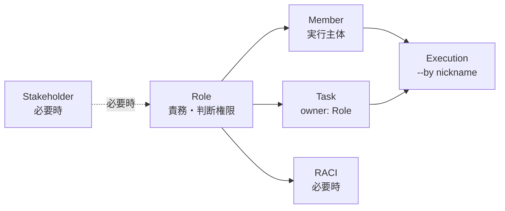

# 人と組織の定義標準

People and Organization Definition Standard

## 1. 目的

本標準は、SpecDojo における **ロール、メンバー、タスク担当、ステークホルダー、RACI** の定義方法を整理し、WBS、Schedule、実行ログに一貫して展開できるようにするための標準である。

本標準では、**Role（ロール）を中心概念** とする。

プロジェクトでは、「誰が責任を持つか」「誰が実行するか」「誰に相談・共有するか」が混在しやすい。そこで、本標準では次のように分けて扱う。

| 概念        | 意味                                     | 代表例                               |
| ----------- | ---------------------------------------- | ------------------------------------ |
| Role        | 責務・判断権限・専門性を表す論理的な役割 | `PO`, `PM`, `BA`, `ARC`, `DEV`, `QE` |
| Member      | 実際に作業する人または agent             | `po`, `ba-agent`, `copilot`          |
| Task owner  | WBS / Schedule 上の主責任ロール          | `owner: BA`                          |
| Executor    | 実際にタスクを claim / 実行する主体      | `--by ba-agent`                      |
| Stakeholder | 利害・期待・懸念・合意対象を管理する相手 | 将来利用者、貢献者、公開基盤         |
| RACI        | 作成・承認・相談・通知を分ける責任分担   | `R`, `A`, `C`, `I`                   |

すべてのプロジェクトで、最初から stakeholder register や RACI を管理する必要はない。個人・小規模プロジェクトでは、まず **Role、Member、Task owner** のみを定義すればよい。

## 2. 基本方針

### 2.1. Role を中心にする

Role は、個人名、部署名、agent 名ではなく、プロジェクト上の責務・判断権限・専門性を表す論理的な役割である。

WBS、Schedule、RACI、member 定義は、すべて Role code を基準に接続する。



### 2.2. `owner` はタスク側だけに使う

`owner` は、WBS / Schedule 上の **主責任ロール** を表す。

`owner` には、個人名、member nickname、agent 名、stakeholder ID を書かない。必ず Role code を書く。

```yaml
tasks:
  - id: T-SCOPE-010
    name: スコープを整理する
    owner: BA
```

この場合、`BA` がこのタスクの主責任ロールである。実際に誰が実行するかは、`owner` ではなく `--by <nickname>` で指定する。

### 2.3. Member 側では `role` を使う

Member は、実際に作業する人間または agent を表す。

Member がどの Role に対応するかは、`role` フィールドで表す。`pm-members.yaml` では `owner` という名前を使わない。

```yaml
members:
  - nickname: po
    display_name: Project Owner
    role: PO
    type: human

  - nickname: ba-agent
    display_name: Business Analyst Agent
    role: BA
    type: agent

  - nickname: copilot
    display_name: General Agent
    role: null
    type: agent
```

`role: null` は、特定の Role に固定しない汎用 agent を表す。この場合は、実行時の文脈や明示指定によって対象ロールを補う。

### 2.4. Executor は実行時に決まる

Executor は、実際にタスクを claim / 実行する Member である。

CLI では、次のように `--by <nickname>` で指定する。

```bash
specdojo exec T-SCOPE-010 --by ba-agent
```

Schedule Task の `owner` が `BA` であり、`ba-agent` の `role` も `BA` であれば、自然な対応関係になる。

## 3. 標準ロール

SpecDojo では、プロジェクト規模にかかわらず、次の標準ロールを基準にする。

| Role code | 正式名称                     | 主な責務                                         | 小規模での扱い                     | 大規模での扱い                     |
| --------- | ---------------------------- | ------------------------------------------------ | ---------------------------------- | ---------------------------------- |
| `PO`      | Project Owner                | 目的、スコープ、優先順位、公開方針、最終判断     | 必須。多くの判断を兼務する         | 必須。事業・成果物の最終責任を持つ |
| `PM`      | Project Manager              | 計画、進捗、課題、リスク、実行管理               | 原則省略し、`PO` が兼務してよい    | 原則独立させる                     |
| `BA`      | Business Analyst             | 要件、業務仕様、受入条件、利用者視点、関係者調整 | `PO` が兼務してもよい              | 原則独立させる                     |
| `ARC`     | Architect                    | 構成方針、技術方針、設計判断、非機能観点         | 必要時のみ定義する                 | 原則独立させる                     |
| `DEV`     | Developer                    | 実装、設定、変更作業、技術的な成果物作成         | 必要時のみ定義する                 | 原則独立させる                     |
| `QE`      | Quality Engineer             | 品質基準、レビュー方針、検証観点、受入確認       | 必要時のみ定義する                 | 原則独立させる                     |
| `UX`      | UX / Documentation Designer  | 利用者導線、説明、文書体験、読みやすさ           | 通常は `BA` または `PO` が兼務する | 必要に応じて独立させる             |
| `OPS`     | Operations / Release Manager | リリース、運用、公開、配布、変更管理             | 通常は `PO` または `PM` が兼務する | 必要に応じて独立させる             |

### 3.1. 必須ロールと任意ロール

最低限必要なロールは `PO` である。ただし、Schedule の `owner` を責務別に分けたい場合は、`BA`, `ARC`, `QE` などを追加する。

| 区分 | ロール                  | 説明                                             |
| ---- | ----------------------- | ------------------------------------------------ |
| 必須 | `PO`                    | プロジェクトの目的と最終判断を担う               |
| 基本 | `PM`, `BA`, `ARC`, `QE` | 多くのプロジェクトで有用な責務分担               |
| 任意 | `DEV`, `UX`, `OPS`      | 実装、文書体験、運用公開を分けたい場合に追加する |

### 3.2. ロールは増やしすぎない

ロールは、責務境界を明確にするために定義する。作業者の肩書きや一時的な作業内容をすべてロール化しない。

ロールを追加する目安は次のとおりである。

- その責務を持つタスクが複数ある。
- 他のロールとは判断基準が異なる。
- RACI または承認責任を分ける必要がある。
- Schedule の `owner` として使う必要がある。

## 4. 規模別の採用パターン

### 4.1. 小規模プロジェクト

個人プロジェクト、初期検証、AI 支援中心の小規模プロジェクトでは、ロールを最小限にする。

推奨ロール構成:

| Role code          | 採用     | 扱い                                            |
| ------------------ | -------- | ----------------------------------------------- |
| `PO`               | 必須     | 目的、優先順位、最終判断、PM 的な管理を兼務する |
| `BA`               | 任意     | 要件や利用者視点を分けたい場合に追加する        |
| `ARC`              | 任意     | 技術・構成判断を分けたい場合に追加する          |
| `QE`               | 任意     | 品質確認やレビュー観点を分けたい場合に追加する  |
| `PM`               | 原則省略 | `PO` が兼務する                                 |
| `DEV`, `UX`, `OPS` | 原則省略 | 必要になったら追加する                          |

小規模プロジェクトでは、次のような構成で開始してよい。

```yaml
roles:
  - code: PO
    name: Project Owner
  - code: BA
    name: Business Analyst
  - code: ARC
    name: Architect
  - code: QE
    name: Quality Engineer
```

この場合、`PM` 責務は `PO` が兼務する。兼務していても、Schedule の `owner` には作業の性質に近い Role code を書く。

例:

```yaml
tasks:
  - id: T-REQ-010
    name: 要件を整理する
    owner: BA

  - id: T-QUALITY-010
    name: レビュー観点を整理する
    owner: QE
```

実際には同じ人が `BA` と `QE` のタスクを実行してもよい。責務を Role として分けることで、タスクの性質を明確にする。

### 4.2. 中規模プロジェクト

複数人、レビュー、承認、定期的な進捗管理がある場合は、`PM` を独立させる。

推奨ロール構成:

| Role code          | 採用   | 扱い                                           |
| ------------------ | ------ | ---------------------------------------------- |
| `PO`               | 必須   | 目的、スコープ、優先順位、最終判断             |
| `PM`               | 推奨   | 計画、進捗、課題、リスク、実行管理             |
| `BA`               | 推奨   | 要件、受入条件、関係者調整                     |
| `ARC`              | 推奨   | 構成方針、技術判断                             |
| `QE`               | 推奨   | 品質基準、レビュー、受入確認                   |
| `DEV`, `UX`, `OPS` | 必要時 | 実装、文書体験、運用公開を分ける場合に追加する |

中規模以上では、作成責任と承認責任を分けるために RACI の導入を検討する。

### 4.3. 大規模プロジェクト

複数チーム、外部関係者、監査、OSS 公開、リリース管理がある場合は、ロールを明確に分離する。

推奨ロール構成:

| Role code | 採用   | 扱い                                       |
| --------- | ------ | ------------------------------------------ |
| `PO`      | 必須   | 成果物価値、目的、優先順位、最終判断       |
| `PM`      | 必須   | 計画、進捗、課題、リスク、横断調整         |
| `BA`      | 必須   | 要件、業務、受入条件、ステークホルダー調整 |
| `ARC`     | 必須   | アーキテクチャ、技術方針、構成判断         |
| `DEV`     | 必要時 | 実装・設定・技術的変更作業を担当する       |
| `QE`      | 必須   | 品質基準、レビュー、検証、受入確認         |
| `UX`      | 必要時 | 利用者体験、文書導線、説明品質を担当する   |
| `OPS`     | 必要時 | リリース、公開、運用、変更管理を担当する   |

大規模プロジェクトでは、次の文書を併用することを推奨する。

| 文書                          | 目的                                         |
| ----------------------------- | -------------------------------------------- |
| `pm-organization.md`                 | ロールと責務境界を定義する                   |
| `pm-members.yaml`             | 実行主体を定義する                           |
| `pm-raci.md`                  | 成果物・プロセスごとの責任分担を定義する     |
| `prj-stakeholder-register.md` | 外部関係者、期待、懸念、合意対象を管理する   |
| communication 関連文書        | 報告、共有、合意、エスカレーションを管理する |

## 5. 用語定義

| 用語        | 意味                                                             |
| ----------- | ---------------------------------------------------------------- |
| Role        | 責務・判断権限・専門性を表す論理的な役割                         |
| Role code   | Role を表す短い識別子。例: `PO`, `PM`, `BA`, `ARC`, `QE`         |
| Member      | 実際に作業または支援する主体。人間または agent を含む            |
| nickname    | CLI や実行ログで使う Member の安定識別子                         |
| role        | Member が対応する Role code。`pm-members.yaml` で使う            |
| owner       | WBS / Schedule 上の主責任ロール。Role code を使う                |
| Executor    | `specdojo exec --by <nickname>` でタスクを実行する主体           |
| Stakeholder | プロジェクトに影響する、または影響を受ける関係者・集団・外部基盤 |
| RACI        | Responsible / Accountable / Consulted / Informed の責任分担      |

## 6. ファイル別の責務

### 6.1. `pm-organization.md`

`pm-organization.md` は、プロジェクトで採用する Role を定義する。

記載する内容:

| 項目         | 内容                                        |
| ------------ | ------------------------------------------- |
| 採用ロール   | プロジェクトで使用する Role code と正式名称 |
| 責務         | 各 Role が担う主な責務                      |
| 規模別の扱い | 小規模では兼務、大規模では分離する責務      |
| 意思決定責任 | 主要判断の主責任ロールと相談先              |
| 委任方針     | agent に委任できる作業とできない判断        |

### 6.2. `pm-members.yaml`

`pm-members.yaml` は、実行主体の machine-readable な一覧を管理する。

標準フィールド:

| フィールド                     | 必須 | 内容                                         |
| ------------------------------ | ---- | -------------------------------------------- |
| `version`                      | ○    | メンバー定義のバージョン                     |
| `project_id`                   | ○    | プロジェクト ID                              |
| `members[].nickname`           | ○    | 実行ログに残る安定識別子                     |
| `members[].display_name`       | ○    | 表示名                                       |
| `members[].email`              | 任意 | 公開可能な連絡先。公開文書では `null` を推奨 |
| `members[].role`               | 任意 | 対応する Role code。汎用 agent は `null` 可  |
| `members[].type`               | ○    | `human` または `agent`                       |
| `members[].persona`            | 任意 | agent の実行姿勢                             |
| `members[].focus`              | 任意 | agent が重視する観点                         |
| `members[].scheduler_strategy` | 任意 | scheduler の既定選択戦略                     |
| `members[].note`               | 任意 | 補足                                         |

### 6.3. `pm-raci.md`

`pm-raci.md` は、標準運用以上で使用する。

RACI は、成果物、プロセス、または主要タスク単位の責任分担を管理する。最小運用では、WBS または Schedule の `owner` だけで責務を判断できる場合、RACI の作成を省略してよい。

| 記号 | 意味        | 説明                     |
| ---- | ----------- | ------------------------ |
| `R`  | Responsible | 実作業を担当する         |
| `A`  | Accountable | 最終責任を持ち、承認する |
| `C`  | Consulted   | 相談・レビューに参加する |
| `I`  | Informed    | 結果の共有を受ける       |

### 6.4. `prj-stakeholder-register.md`

ステークホルダー登録簿は、拡張運用で使用する。

ステークホルダーは、Role とは異なる。Role は責務と判断主体を表し、Stakeholder は利害、期待、懸念、合意対象を表す。

ステークホルダー登録簿には、Schedule の `owner` に直接使う値を定義しない。Schedule に展開する責務は、Role と必要に応じて RACI を経由して決める。

## 7. Schedule への担当展開

### 7.1. 基本ルール

WBS Item から Schedule Task を作る際は、以下の順で担当を決める。

1. WBS Item の `owner` が明示されていれば、その Role code を Schedule Task の `owner` に引き継ぐ。
2. WBS Item の `owner` が未定義で RACI がある場合は、成果物別 RACI の `R` を Schedule Task の `owner` とする。
3. `R` が複数ある場合は、タスクの action に最も近い Role を `owner` とし、残りはレビュー・相談タスクまたは notes に分離する。
4. `A/R` のように同一 Role が実作業と承認を兼ねる場合は、作業タスクの `owner` はその Role とする。
5. 承認、レビュー、外部待ちを Schedule Task として分割する場合は、RACI の `A` または `C` を owner にした別 Task / Milestone を作る。
6. `I` は Schedule の owner にはしない。通知・共有はコミュニケーション計画または実行イベントで扱う。

最小運用では 1 のみでよい。標準運用以上では 2 から 6 も適用する。

### 7.2. `owner` と `--by` の違い

| 項目    | 意味                          | 値の例                  | 管理先                  |
| ------- | ----------------------------- | ----------------------- | ----------------------- |
| `owner` | タスクの主責任ロール          | `PO`, `BA`, `ARC`, `QE` | WBS / Schedule          |
| `role`  | member が対応できるロール     | `BA`                    | `pm-members.yaml`       |
| `--by`  | タスクを claim / 実行する主体 | `ba-agent`              | 実行コマンド / 実行ログ |

原則:

- Schedule Task の `owner` には member nickname を書かない。
- `--by` に指定できる nickname は `pm-members.yaml` に存在しなければならない。
- member の `role` が定義されている場合、タスクの `owner` と一致することを推奨する。
- `role: null` の汎用 agent が実行する場合は、実行時の文脈で対象 Role を明示する。

## 8. Agent 委任方針

Agent は実行支援者であり、人間の判断や説明責任を代替しない。

| 作業種別                     | agent 委任 | 最終判断          |
| ---------------------------- | ---------- | ----------------- |
| 草案作成                     | 可         | 対応 Role の人間  |
| 表記揺れ確認                 | 可         | 対応 Role の人間  |
| 抜け漏れ検出                 | 可         | 対応 Role の人間  |
| 既存ルールに基づく機械的更新 | 可         | 対応 Role の人間  |
| スコープ変更                 | 不可       | `PO`              |
| 優先順位変更                 | 不可       | `PO`              |
| 公開可否判断                 | 不可       | `PO`              |
| 技術方針の最終決定           | 原則不可   | `ARC`             |
| 品質基準の最終決定           | 原則不可   | `QE`              |
| リリース可否判断             | 原則不可   | `PO` または `OPS` |

## 9. 整合性ルール

- WBS / Schedule の `owner` は、`pm-organization.md` に存在する Role code でなければならない。
- WBS / Schedule の `owner` に member nickname、人名、agent 名、stakeholder ID を書いてはならない。
- `pm-members.yaml` の `members[].role` は、`null` または `pm-organization.md` に存在する Role code でなければならない。
- RACI の列に使う Role code は、`pm-organization.md` に存在しなければならない。
- WBS の `owner` と Schedule の `owner` は、原則として同じ Role code を使う。
- 1 つの Schedule Task に複数 owner を書かない。複数 Role の実作業が必要な場合はタスクを分割する。
- `I` の Role をタスク owner にしない。
- agent に最終承認責任を持たせない。
- 公開文書に不要な個人名、私用メールアドレス、非公開組織情報を書かない。

## 10. 最小構成例

小規模プロジェクトでは、まず次の構成だけで運用してよい。

`pm-organization.md`:

```yaml
roles:
  - code: PO
    name: Project Owner
    note: PM 責務を兼務する
  - code: BA
    name: Business Analyst
  - code: ARC
    name: Architect
  - code: QE
    name: Quality Engineer
```

`pm-members.yaml`:

```yaml
members:
  - nickname: po
    display_name: Project Owner
    role: PO
    type: human

  - nickname: po-agent
    display_name: Project Owner Agent
    role: PO
    type: agent
    scheduler_strategy: critical-first

  - nickname: ba-agent
    display_name: Business Analyst Agent
    role: BA
    type: agent
```

Schedule:

```yaml
tasks:
  - id: T-LAUNCH-PJD-SCOPE-010
    wbs: WBS-PJD-SCOPE-010
    name: prj-scope を作成する
    duration_days: 0.5
    depends_on: []
    owner: BA
```

## 11. 見直し条件

People / Organization 定義は、以下のタイミングで見直す。

| 更新トリガー                           | 見直し対象                                   |
| -------------------------------------- | -------------------------------------------- |
| プロジェクトスコープ変更               | Stakeholder、Role、RACI                      |
| 成果物カタログまたは WBS の変更        | RACI、Schedule owner                         |
| Schedule のトラック追加                | Role、Member、scheduler strategy             |
| agent 追加・削除                       | `pm-members.yaml`、委任方針、agent overrides |
| 複数人運用の開始                       | `PM` ロール、RACI、承認責任                  |
| 外部利用者・貢献者の関与開始           | stakeholder register、コミュニケーション要件 |
| 公開前                                 | 個人情報、機密情報、公開可能な連絡先         |
| 実行ログに存在する nickname の変更要求 | 変更せず、新 nickname 追加または無効化で対応 |

## 12. 禁止事項

- Schedule の `owner` に個人名や member nickname を書くこと。
- `pm-members.yaml` で member の対応ロールを `owner` と表記すること。
- RACI の列名に未定義の Role code を使うこと。
- `pm-members.yaml` の nickname を履歴記録後に変更すること。
- agent に最終承認責任を持たせること。
- `I` の Role をタスク owner にすること。
- 兼務を理由に RACI の責務境界を曖昧にすること。
- 公開文書に不要な個人情報や非公開組織情報を書くこと。
