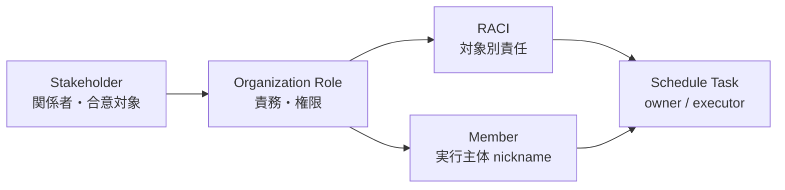

# People / Organization 定義標準

People and Organization Definition Standard

SpecDojo における組織、ステークホルダー、ロール、メンバー、RACI の定義を、WBS や Schedule のタスク担当へ一貫して展開するための標準を定義する。
本標準は、プロジェクト文書に散在しやすい「誰が関与し、誰が責任を持ち、誰が実行するか」を正規化し、`sch` の `owner` や `specdojo exec --by <nickname>` に接続できる状態を目標とする。

## 1. 適用範囲

本標準は、以下の情報を扱う。

| 対象                         | 主な定義内容                                     | 代表ファイル例                                                                    |
| ---------------------------- | ------------------------------------------------ | --------------------------------------------------------------------------------- |
| ステークホルダー             | 関係者、関与区分、期待、懸念、必要な合意         | `prj-stakeholder-register.md`                                                     |
| 組織ロール                   | ロールコード、正式名称、責務、意思決定権限       | `prj-organization.md`                                                             |
| メンバー                     | 実行主体の nickname、表示名、種別、対応ロール    | `members.yaml`                                                                    |
| RACI                         | 成果物・プロセス・タスクに対する責任分担         | `pm-raci.md`                                                                      |
| Schedule への担当展開        | `tasks[].owner`、実行候補、scheduler strategy    | `sch-track-<track>.yaml`, `sch-config-<track>.yaml`, `sch-agent-overrides-*.yaml` |

本標準は、個別プロジェクトの人名、連絡先、非公開組織情報を規定しない。
公開リポジトリに配置する文書では、必要最小限のロール・ニックネーム・公開可能な属性だけを記載する。

## 2. 全体方針

- ステークホルダーは「利害・合意・関与方針」を表す。
- 組織ロールは「責務・権限・判断主体」を表す。
- メンバーは「実行主体」を表す。
- RACI は「対象ごとの責任分担」を表す。
- Schedule の `owner` は「そのタスクの主責任ロール」を表す。
- `specdojo exec --by <nickname>` の nickname は「そのタスクを実際に claim / 実行する主体」を表す。
- 人間と agent は同じロールに紐づけられるが、最終責任は常に人間または組織ロール側に置く。
- 個人名や連絡先は、公開文書では原則として書かない。必要な場合は非公開の運用台帳に分離する。

## 3. 正規化モデル

People / Organization 定義は、以下の 5 層に分けて管理する。



| 層                  | 識別子                     | 目的                         | 安定性                         |
| ------------------- | -------------------------- | ---------------------------- | ------------------------------ |
| Stakeholder         | `SH-001` など              | 利害関係・合意対象の識別     | 中程度。関係者追加で増える     |
| Organization Role   | `PO`, `BA`, `ARC`, `QE` など | 責務・権限・タスク owner     | 高い。タスク履歴に残るため安定 |
| Member              | `po`, `ba-agent` など      | 実行主体の識別               | 高い。イベントログ記録後は不変 |
| RACI Assignment     | `R`, `A`, `C`, `I`         | 対象別の責任分担             | 中程度。成果物構成で変わる     |
| Schedule Assignment | `tasks[].owner`            | 実行計画上の主責任ロール     | 中程度。計画更新で変わる       |

## 4. 用語定義

| 用語             | 意味                                                                 |
| ---------------- | -------------------------------------------------------------------- |
| stakeholder      | プロジェクトに影響する、または影響を受ける関係者・集団・外部基盤     |
| role             | 責務・権限・専門性を表す論理的な役割                                 |
| owner            | WBS / Schedule 上の主責任ロール。個人名ではなくロールコードを使う    |
| member           | タスクを実行または支援する具体的な主体。人間または agent を含む      |
| nickname         | CLI や実行ログで使う member の安定識別子                              |
| RACI             | Responsible / Accountable / Consulted / Informed の責任分担          |
| executor         | `specdojo exec --by <nickname>` でタスクを実行する主体                |
| scheduler_strategy | scheduler が実行候補を選ぶ際の既定戦略                              |

## 5. 識別子と命名規則

### 5.1. ステークホルダー ID

- 形式は `SH-<NNN>` とする。
- `<NNN>` は 3 桁固定の連番とする。
- ID は表示名や組織名が変わっても変更しない。
- 外部サービス基盤のような非人格的な関係者も、合意・影響・制約を管理する必要があれば stakeholder として登録してよい。

例:

| ID     | 関係者               | 関与区分                |
| ------ | -------------------- | ----------------------- |
| SH-001 | プロジェクトオーナー | スポンサー / 意思決定者 |
| SH-002 | AI Agent             | 実行支援者              |
| SH-003 | 将来の利用者         | 利用者                  |

### 5.2. ロールコード

- ロールコードは英大文字の短い識別子とする。
- Schedule の `owner`、WBS の `owner`、RACI の列名、members の `owner` は同じロールコードを参照する。
- ロールコードは個人・担当者名・組織部署名を含めない。
- ロールコード変更は過去の実行履歴や schedule 参照を壊すため、原則として新規コード追加で対応する。

標準的なプロジェクトロール例:

| ロールコード | 正式名称         | 主な責務                                             |
| ------------ | ---------------- | ---------------------------------------------------- |
| `PO`         | Project Owner    | 目的、スコープ、優先順位、公開方針、最終判断         |
| `PM`         | Project Manager  | 計画、進捗、課題、リスク、実行管理                   |
| `BA`         | Business Analyst | 業務仕様、受入条件、ステークホルダー調整             |
| `ARC`        | Architect        | システム設計、構成方針、技術判断                     |
| `QE`         | Quality Engineer | レビュー方針、品質基準、検証観点、受入確認           |

補足:

- 小規模プロジェクトでは `PO` が `PM` を兼務してよい。
- 兼務する場合も、タスクや RACI では責務に応じて `PO` と `PM` を分けて記載する。
- `PM` ロールを明示しないプロジェクトでは、管理・実行計画上の `PM` 責務をどのロールが代替するかを組織定義に記載する。

### 5.3. Member nickname

- nickname は英小文字、数字、ハイフンを使った安定識別子とする。
- nickname は一度イベントログに記録された後は変更しない。
- 人間メンバーと agent メンバーを同じ `owner` に紐づけてよい。
- 汎用 agent は `owner: null` とし、実行時に `--owner` やタスク文脈でロールを補う。

例:

| nickname    | type  | owner | 用途                                   |
| ----------- | ----- | ----- | -------------------------------------- |
| `po`        | human | `PO`  | PO ロールの人間実行主体                |
| `ba-agent`  | agent | `BA`  | BA ロールの agent 実行支援             |
| `arc-agent` | agent | `ARC` | ARC ロールの agent 実行支援            |
| `copilot`   | agent | null  | 必要に応じて owner を指定する汎用 agent |

## 6. ファイル別の責務

### 6.1. `prj-stakeholder-register.md`

ステークホルダー登録簿は、関係者の利害、期待、懸念、必要な合意、関与方針を管理する。

必須観点:

| 観点           | 内容                                               |
| -------------- | -------------------------------------------------- |
| 関係者識別     | ID、関係者名、関与区分、所属/組織                 |
| 役割・責任     | プロジェクト上の役割、主な責任                     |
| 影響度・関心度 | High / Medium / Low の基準と評価                   |
| 期待・懸念     | 主な期待、主な懸念、必要な合意                     |
| 関与方針       | 現状、目標、対応方針、責任者、期限、証跡           |
| 連絡要件       | 情報要求、希望チャネル、合意・報告、証跡要件       |
| 見直し条件     | 更新トリガー、見直し内容、責任者、承認者、証跡     |

ステークホルダー登録簿には、Schedule の `owner` に直接使う値を定義しない。
Schedule に展開する責務は、組織ロールと RACI を経由して決める。

### 6.2. `prj-organization.md`

組織定義は、プロジェクトの推進体制、主要ロール、意思決定構造、エスカレーション経路を管理する。

必須観点:

| 観点       | 内容                                                 |
| ---------- | ---------------------------------------------------- |
| ロール一覧 | ロールコード、正式名称、役割、主な責任               |
| 意思決定   | 判断対象、決定者、相談先、記録先                     |
| 兼務       | 小規模プロジェクトで兼務するロールと責務境界         |
| 委任       | 人間から agent へ委任できる作業と、委任できない判断   |
| エスカレーション | 判断不能・競合・遅延時の相談先と記録先         |

### 6.3. `members.yaml`

メンバー名簿は、実行主体の machine-readable な一覧を管理する。
CLI や scheduler が参照するため、Markdown ではなく YAML で定義する。

標準フィールド:

| フィールド           | 必須 | 内容                                                   |
| -------------------- | ---- | ------------------------------------------------------ |
| `version`            | ○    | メンバー定義のバージョン                               |
| `project_id`         | ○    | プロジェクト ID                                        |
| `members[].nickname` | ○    | 実行ログに残る安定識別子                               |
| `members[].display_name` | ○ | 表示名                                                 |
| `members[].email`    | 任意 | 公開可能な連絡先。公開文書では `null` を推奨           |
| `members[].owner`    | 任意 | 対応するロールコード。汎用 agent は `null` 可           |
| `members[].type`     | ○    | `human` または `agent`                                 |
| `members[].persona`  | 任意 | agent の実行姿勢                                       |
| `members[].focus`    | 任意 | agent が重視する観点                                   |
| `members[].scheduler_strategy` | 任意 | scheduler の既定選択戦略                    |
| `members[].note`     | 任意 | 補足                                                   |

### 6.4. `pm-raci.md`

RACI は、成果物、プロセス、または主要タスク単位の責任分担を管理する。

RACI の意味:

| 記号 | 意味        | 説明                                      |
| ---- | ----------- | ----------------------------------------- |
| `R`  | Responsible | 実作業を担当する                          |
| `A`  | Accountable | 最終責任を持ち、承認する                  |
| `C`  | Consulted   | 相談・レビューに参加する                  |
| `I`  | Informed    | 結果の共有を受ける                        |

RACI は、Schedule のタスク owner を決める入力として使う。
ただし、RACI 自体は日付、依存関係、実行順序を管理しない。

## 7. Schedule への担当展開

### 7.1. 基本変換

WBS Item から Schedule Task を作る際は、以下の順で担当を決める。

1. WBS Item の `owner` が明示されていれば、そのロールを Schedule Task の `owner` に引き継ぐ。
2. WBS Item の `owner` が未定義の場合は、成果物別 RACI の `R` を Schedule Task の `owner` とする。
3. `R` が複数ある場合は、タスクの `action` に最も近いロールを `owner` とし、残りはレビュー・相談タスクまたは notes に分離する。
4. `A/R` のように同一ロールが実作業と承認を兼ねる場合は、作業タスクの `owner` はそのロールとする。
5. 承認、レビュー、外部待ちを Schedule Task として分割する場合は、RACI の `A` または `C` を owner にした別 Task / Milestone を作る。
6. `I` は Schedule の owner にはしない。通知・共有はコミュニケーション計画または実行イベントで扱う。

### 7.2. `owner` と `--by` の違い

| 項目     | 意味                         | 値の例                | 管理先                       |
| -------- | ---------------------------- | --------------------- | ---------------------------- |
| `owner`  | タスクの主責任ロール         | `PO`, `BA`, `ARC`, `QE` | WBS / Schedule               |
| `--by`   | タスクを claim / 実行する主体 | `po`, `ba-agent`      | `members.yaml` / 実行イベント |

原則:

- Schedule Task の `owner` には member nickname を書かない。
- `--by` に指定できる nickname は `members.yaml` に存在しなければならない。
- `--by` の member が `owner` を持つ場合、タスクの `owner` と一致することを推奨する。
- `owner: null` の汎用 agent が実行する場合は、実行時の文脈で対象ロールを明示する。

### 7.3. 実行候補の選択

ある Task の `owner` が `BA` の場合、実行候補は `members.yaml` の `owner: BA` を持つ member である。

例:

```yaml
members:
  - nickname: ba
    owner: BA
    type: human

  - nickname: ba-agent
    owner: BA
    type: agent
    scheduler_strategy: fifo
```

この場合、`owner: BA` の Schedule Task は、`ba` または `ba-agent` が実行候補になる。
どちらを実行主体にするかは、手動指定、scheduler strategy、agent override、または運用ルールで決める。

## 8. RACI から Schedule Task への展開例

成果物別 RACI:

| 成果物         | PO  | PM  | BA  | ARC | QE  |
| -------------- | --- | --- | --- | --- | --- |
| `prj-overview` | A   | R   | C   | I   | I   |
| `prj-scope`    | A   | R   | C   | C   | I   |
| `pm-quality-management-plan` | C | A | I | C | R |

Schedule Task への変換例:

```yaml
tasks:
  - id: T-LAUNCH-PJD-OVERVIEW-010
    wbs: WBS-PJD-OVERVIEW-010
    name: prj-overview を作成する
    duration_days: 0.5
    depends_on: []
    owner: PM

  - id: T-LAUNCH-PJD-OVERVIEW-020
    wbs: WBS-PJD-OVERVIEW-010
    name: prj-overview を承認する
    duration_days: 0.125
    depends_on:
      - T-LAUNCH-PJD-OVERVIEW-010
    owner: PO

  - id: T-LAUNCH-PM-QMP-010
    wbs: WBS-PM-QMP-010
    name: 品質管理計画を作成する
    duration_days: 0.5
    depends_on: []
    owner: QE
```

ポイント:

- 作成タスクは `R` を `owner` にする。
- 承認タスクを分ける場合は `A` を `owner` にする。
- `C` はレビュータスクとして独立させる場合のみ `owner` になり得る。
- `I` は owner にしない。

## 9. Agent 委任方針

Agent は実行支援者であり、人間の判断や説明責任を代替しない。

| 作業種別                         | agent 委任 | 最終判断             |
| -------------------------------- | ---------- | -------------------- |
| 草案作成                         | 可         | 対応ロールの人間     |
| 表記揺れ確認                     | 可         | 対応ロールの人間     |
| 抜け漏れ検出                     | 可         | 対応ロールの人間     |
| 既存ルールに基づく機械的更新     | 可         | 対応ロールの人間     |
| スコープ変更                     | 不可       | `PO`                 |
| 公開可否判断                     | 不可       | `PO`                 |
| 技術方針の最終決定               | 原則不可   | `ARC`                |
| 品質基準の最終決定               | 原則不可   | `QE`                 |

Agent member には、必要に応じて `persona`、`focus`、`scheduler_strategy` を定義する。

```yaml
- nickname: qe-agent
  display_name: Quality Engineer Agent
  owner: QE
  type: agent
  persona: risk-averse
  focus:
    - acceptance
    - regression
    - edge-cases
  scheduler_strategy: critical-first
```

## 10. 整合性ルール

- `sch-track-*.yaml` の `tasks[].owner` は、組織定義に存在するロールコードでなければならない。
- `members.yaml` の `members[].owner` は、`null` または組織定義に存在するロールコードでなければならない。
- RACI の列に使うロールコードは、組織定義に存在しなければならない。
- WBS の `owner` と Schedule の `owner` は、原則として同じロールコードを使う。
- RACI に存在しないロールを Schedule owner にする場合は、WBS または notes に根拠を残す。
- 1 つの Schedule Task に複数 owner を書かない。複数ロールの実作業が必要な場合はタスクを分割する。
- `members.yaml` の nickname は過去の実行イベントと互換性を保つため、変更ではなく追加・無効化で扱う。
- 公開文書に個人名、私用メールアドレス、非公開の組織情報、機密性の高い利害関係を書かない。

## 11. 最小定義セット

Schedule のタスク担当へ展開するためには、最低限以下を定義する。

| 定義             | 最小項目                                           |
| ---------------- | -------------------------------------------------- |
| ロール定義       | ロールコード、正式名称、主な責任                   |
| メンバー定義     | nickname、display_name、owner、type                |
| RACI             | 成果物またはプロセスごとの `R` と `A`              |
| WBS / Schedule   | WBS Item ID、Task ID、`owner`、依存関係             |

最小構成の例:

```yaml
members:
  - nickname: po
    display_name: Product Owner
    owner: PO
    type: human

  - nickname: po-agent
    display_name: Product Owner Agent
    owner: PO
    type: agent
    scheduler_strategy: critical-first
```

```yaml
tasks:
  - id: T-LAUNCH-PJD-SCOPE-010
    wbs: WBS-PJD-SCOPE-010
    name: prj-scope を作成する
    duration_days: 0.5
    depends_on: []
    owner: PM
```

## 12. 見直し条件

People / Organization 定義は、以下のタイミングで見直す。

| 更新トリガー                         | 見直し対象                                     |
| ------------------------------------ | ---------------------------------------------- |
| プロジェクトスコープ変更             | ステークホルダー、ロール、RACI                 |
| 成果物カタログまたは WBS の変更      | RACI、Schedule owner                           |
| Schedule のトラック追加              | ロール、member、scheduler strategy             |
| agent 追加・削除                     | `members.yaml`、委任方針、agent overrides       |
| 外部利用者・貢献者の関与開始         | stakeholder register、コミュニケーション要件   |
| 公開前                               | 個人情報、機密情報、公開可能な連絡先           |
| 実行ログに存在する nickname の変更要求 | 変更せず、新 nickname 追加または無効化で対応 |

## 13. 禁止事項

- Schedule の `owner` に個人名や member nickname を書くこと。
- RACI の列名に未定義のロールコードを使うこと。
- `members.yaml` の nickname を履歴記録後に変更すること。
- agent に最終承認責任を持たせること。
- `I` のロールをタスク owner にすること。
- 兼務を理由に RACI の責務境界を曖昧にすること。
- 公開文書に不要な個人情報や非公開組織情報を書くこと。
